# Frequenz

**Ein Theme für Oracle APEX mit klarer Markenhaltung: weiße Seite, hellgraue Tafeln, ein Magenta-Block.**
Oben links sitzt ein Magenta-Block über die volle Kopfhöhe und trägt den App-Namen in Weiß. Darunter bleibt die Seite
weiß und ruhig. Regionen liegen als hellgraue Tafeln mit großen Radien darauf; was in einer Tafel liegt, also Felder,
Tabellen und Karten, ist wieder weiß. Überschriften stehen kräftig in 800. Buttons sind Konturen mit 4 px Radius, die
Primäraktion ist magenta gefüllt, die zweite Stufe (Typ *Primary*) eine Magenta-Kontur; Icon-Buttons und Chips sind
rund. Der aktive Navigationspunkt steht in Magenta-Schrift und trägt eine Magenta-Kante am linken Rand, in derselben
Spalte wie der Block im Kopf. Dunkel wird die Seite schwarz, die Tafeln werden dunkelgrau.

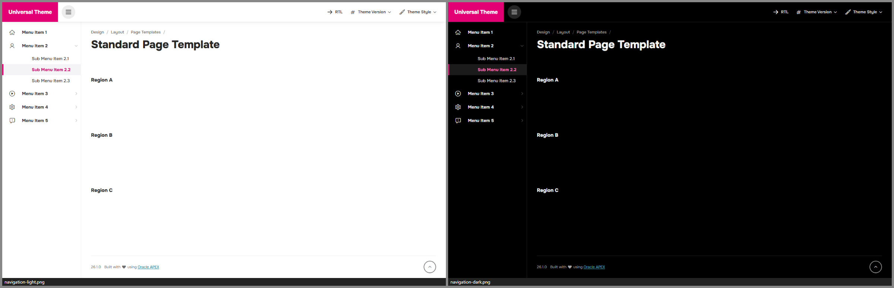

| | |
|---|---|
| 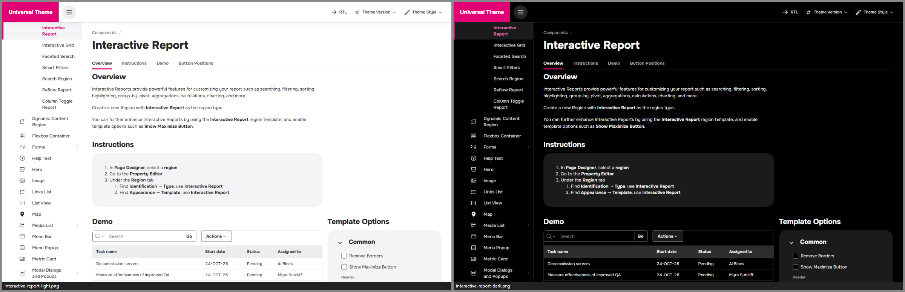 | 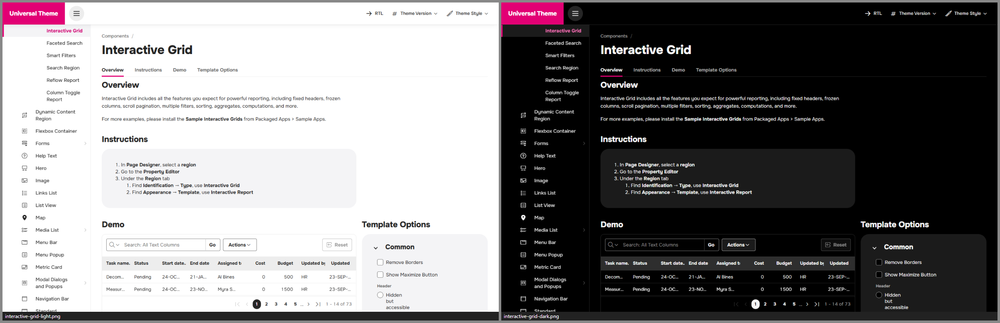 |
| 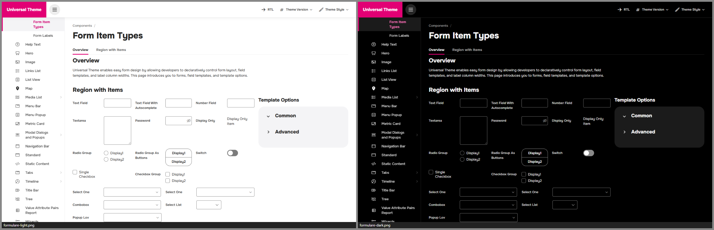 | 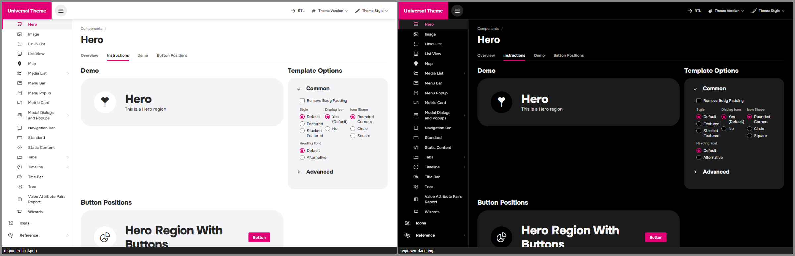 |
| 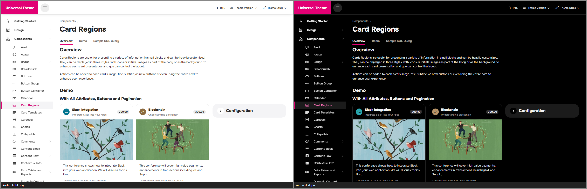 | 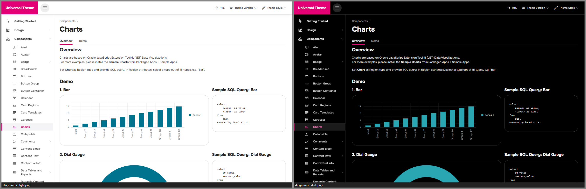 |
| 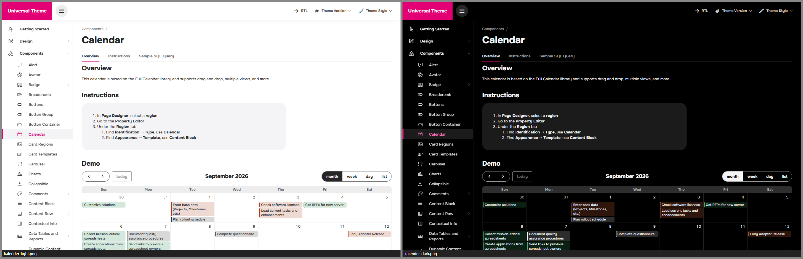 | 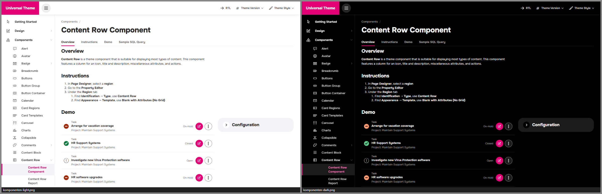 |
| 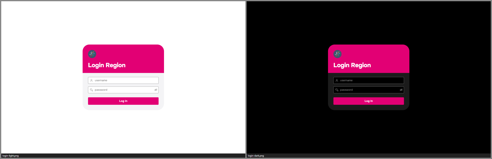 | 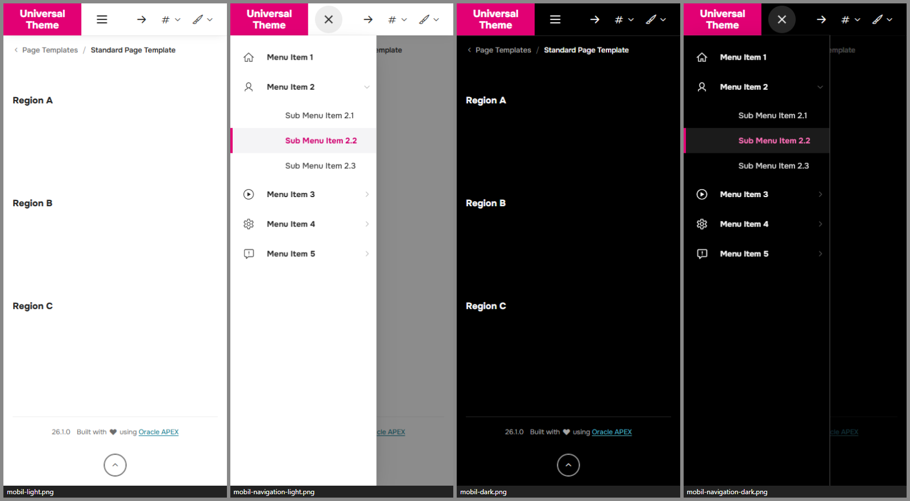 |

*Alle Bilder: Universal Theme Reference App, links Light, rechts Dark.*

| Style | Basis | Wofür |
|---|---|---|
| **Frequenz Light** | Vita | Standard im Büro |
| **Frequenz Dark** | Vita-Dark | dunkle Umgebungen, schwarze Seite wie eine App im Dunkelmodus |
| **Frequenz Auto** | Vita + UT-Delta | folgt der Hell/Dunkel-Einstellung des Betriebssystems – pixelgleich zu Light bzw. Dark |

Getestet mit APEX 26.1 auf UT-Dateiversion **26.1** und **24.2**, Desktop (1440 px) und Smartphone (390 px).
Prüfstand vom 24.09.2026: Laufzeit-Audit aller 111 Seiten der Referenz-App in Light und Dark ohne Oracle-Blau, ohne
Überlauf und ohne JS-Fehler. Es bleiben 198 Kontrastbefunde (vollständig gezählt – `_tools/audit.mjs` listet höchstens
60 je Seite und Style und meldet deshalb 174), alle auf sechs Seiten, deren Seiten-CSS Textfarben fest setzt (6100, 6302,
6303, 6304, 6307, 6400; 22 hell, 176 dunkel). Die Textfarben stammen durchweg aus diesem Demo-CSS. Bei 142 Befunden
(6303, 6304 und 6 auf 6400, dunkel) kommt der Grund bewusst von Frequenz: `.u-Report tr` malt die Zellfläche über den
weißen Doku-Grund der Demo, sonst stünde die helle Schrift aller übrigen Zellen auf Weiß – das für Weiß gewählte Violett
und Grau der Demo steht dadurch auf Schwarz. Einzelheiten in [docs/ARCHITECTURE.md](docs/ARCHITECTURE.md) §7.
Smartphone (Kernseiten) und UT 24.2 (Kernseiten): ohne Befund. Blau-Audit mit Hover-/Fokus-Zuständen und geöffneten
Menüs, Popups und Dialogen (Kern- und Dialogseiten): 0 Treffer. Auto ist auf UT 26.1 und 24.2 (Kernseiten) pixelgleich zu Light
bzw. Dark (0 px Abweichung).

> **Gestaltungsprinzipien:** Magenta-Block oben links, weißer Kopf mit kräftigen Menüpunkten, große hellgraue Flächen
> mit starken Rundungen, Kontur-Buttons, Petrol-Links. Die Akzentfarbe lässt sich über wenige Tokens ersetzen
> (siehe *Anpassen*).

---

## Designsystem in Kürze

| | Hell | Dunkel |
|---|---|---|
| Seite (Kopf, Navigation, Inhalt) | `#FFFFFF` | `#000000` |
| Tafel (Regionen, Hero, Hinweise) | `#F4F4F6` | `#1B1B1B` |
| Schwebend (Menüs, Dialoge) | `#FFFFFF` + Schatten | `#262626` |
| Anthrazit (Überschriften, Text) | `#262626` | `#F5F5F5` |
| Text zweiter Ordnung / Grau | `#383838` / `#6B6B6B` | `#D9D9D9` / `#A6A6A6` |
| Linien (zart · normal · kräftig) | `#EDEDED` · `#D0D0D0` · `#B2B2B2` | `#262626` · `#3D3D3D` · `#5C5C5C` |
| Standard-Button (Fläche · Kontur) | ohne Fläche · `#6B6B6B` | `#1B1B1B` · `#A6A6A6` |
| Magenta (Block, Hot-Button, Primary-Kontur, Auswahl) | `#E20074` | `#E20074` |
| Markenfläche der geteilten Anmeldung | `#E20074` | `#660034` (tiefes Magenta) |
| Magenta als Schrift (aktive Navigation, Typ *Primary*) | `#D0006F` | `#FF6EB8` |
| Petrol (Links, Info) | `#00748F` | `#4FB8C8` |
| Erfolg · Warnung · Fehler | `#0B7A3E` · `#F2A400` · `#A02A08` | `#3FB56F` · `#F2B01E` · `#FF7A45` |

- **Schrift:** Onest (variabel, 100–900, genutzt 400–800), selbst gehostet. Überschriften in 800, Navigation 700,
  Buttons 700, Labels 600, Fließtext 400. Skala 12 · 13 · 14 · 16 · 20 · 24 · 36 px (Hero 44 px), Zahlen tabellarisch.
- **Radien als Hierarchie:** Buttons, Felder 4 · Menüeinträge 6 · Tabellen, Menüs 10 · Karten, Dialoge 16 ·
  Tafeln 24 · Hero, Login 40 · Pillen (Chips, Badges, Tab-Pillen, Icon-Buttons, Avatare) voll rund.
- **Dichte:** Bedienelemente 36 px, Tabellenzeilen 36 px, Köpfe 40 px, Navigation 44 px; auf Touch-Geräten 44 px.
- **Fokus:** ein System für alles – 2-px-Ring in Anthrazit (dunkel fast Weiß) mit 2 px Abstand, überall ≥ 3 : 1,
  unabhängig vom Magenta.
- **Kontraste:** alle Text-Paare ≥ 4,5 : 1; Feld- und Button-Kanten, Magenta-Marken und Fokus ≥ 3 : 1 (automatisch geprüft,
  `tools/check-tokens.mjs`). Bewusst darunter liegt die kräftige Linie `#B2B2B2` (hell 2,1 : 1): die leise Kante der
  *Simple*-Buttons und die Linie unter Tabellenköpfen – Simple-Buttons erkennt man an ihrer Beschriftung.
- **Diagramme:** eigene, farbenblind-geprüfte Kategorie-Palette (Petrol, Sonnengelb, Graphit, Violett, Grün …),
  kein Magenta und keine APEX-Blautöne in den Daten.

Die vollständige Token-Referenz mit allen Kontrastwerten steht in [docs/ARCHITECTURE.md](docs/ARCHITECTURE.md).

### Die Signatur-Elemente

| Element | Wo | Wie |
|---|---|---|
| **Magenta-Block** | Kopf, ganz links | volle Kopfhöhe (64 px, mobil 56 px), App-Name 18/800 in Weiß, bei Platzmangel zweizeilig; mindestens so breit wie hoch – ein Kürzel ergibt ein Quadrat über der Icon-Leiste. Bild-Logos erscheinen weiß. |
| **Magenta-Kante** | aktiver Navigationspunkt, Links-Liste, Mega Menu, ausgewählte Listen-Einträge | 4 px am Zeilenanfang über die volle Höhe, Schrift in Magenta |
| **Tafeln** | Regionen, Hinweisblöcke, Button Container | `#F4F4F6`, 24 px Radius, ohne Rand und Schatten; darin Weiß |
| **Hero** | Hero-Region | die größte Tafel, 40 px Radius, Titel 44/800, rundes Symbol |
| **Unterstrich-Tabs** | Region Display Selector, Tabs, Menüleiste | fette Labels, aktiv mit 3-px-Magenta-Strich |
| **Runde Knöpfe** | Icon-Buttons, Pagination, Carousel-Punkte (aktiv Magenta), Schließen, Schalter der Filterzeile (IR/IG) | voll gerundet, Pfeile als dünne Chevrons |
| **Login** | Login-Seite | große Karte (40 px) mit Magenta-Kopf; geteilte Ansicht: weiße Spalte vor einer Magenta-Fläche (dunkel: schwarze Spalte vor tiefem Magenta, damit die Fläche nicht blendet) |

---

## Installation

### Mit dem Skript (empfohlen)

In SQLcl, SQL*Plus oder SQL Developer, verbunden als **Parsing-Schema der Ziel-App**:

```sql
@install/frequenz-install.sql 100          -- nur installieren
@install/frequenz-install.sql 100 light    -- installieren und Light aktivieren (light | dark | auto)
```

Das Skript

1. prüft, ob die App existiert und das Universal Theme (42) verwendet,
2. legt 10 Dateien als *Static Application Files* unter `frequenz/` an (3 Styles × lesbar/minifiziert, 2 Schriftdateien,
   Schriftlizenz, Drittanbieter-Hinweise),
3. registriert die Theme Styles *Frequenz Light / Dark / Auto*,
4. aktiviert auf Wunsch einen davon.

Mehrfaches Ausführen ist ausdrücklich erlaubt – so wird ein Update eingespielt. Für mehrere Apps einfach je App aufrufen.

**Alle Themes auf einmal:** Das [Style-Pack](../style-pack/README.md) spielt die 15 Styles aller fünf Themes dieses Projekts mit einem Aufruf ein (`@style-pack/style-pack-install.sql 100`).

**Deinstallieren:** `@install/frequenz-uninstall.sql 100` – schaltet auf *Vita* zurück, deaktiviert die Styles und löscht die Dateien.
APEX hat keine API zum Löschen von Theme Styles; die deaktivierten Einträge lassen sich unter
*Shared Components › Themes › Universal Theme › Theme Styles* löschen.

### Von Hand im App Builder

1. *Shared Components › Static Application Files › Create File*: den Inhalt von `dist/` hochladen, Verzeichnis `frequenz`
   (die Schriften unter `frequenz/fonts/`).
2. *Shared Components › Themes › Universal Theme › Theme Styles › Create*, je Style:

   | Name | CSS File URLs |
   |---|---|
   | Frequenz Light | `#THEME_FILES#css/Vita#MIN#.css?v=#APEX_VERSION#`<br>`#APP_FILES#frequenz/frequenz-light#MIN#.css` |
   | Frequenz Dark | `#THEME_FILES#css/Vita-Dark#MIN#.css?v=#APEX_VERSION#`<br>`#APP_FILES#frequenz/frequenz-dark#MIN#.css` |
   | Frequenz Auto | `#THEME_FILES#css/Vita#MIN#.css?v=#APEX_VERSION#`<br>`#APP_FILES#frequenz/frequenz-auto#MIN#.css` |

   *Is Public* = Ja, *Read Only* = Ja, Theme-Roller-Felder leer lassen.
3. Den gewünschten Style als *Current* setzen.

### Varianten für mehrere Apps

- **Workspace-Dateien:** Dateien einmal unter *Workspace Utilities › Static Workspace Files* ablegen und in den Styles
  `#WORKSPACE_FILES#frequenz/…` statt `#APP_FILES#frequenz/…` eintragen.
- **Webserver:** `dist/` z. B. nach `/i/themes/frequenz/` kopieren und `#APEX_FILES#themes/frequenz/…` verwenden.
  Vorteil: Der Webserver kann komprimieren – das Bundle ist ca. 236 KB, gzip-komprimiert ca. 36 KB.

### Benutzer wählen lassen

*Shared Components › Themes › Universal Theme › Styles › „Allow End Users to choose Theme Style“* aktivieren.
Dann können Benutzer im Menü *Anpassen* zwischen Light, Dark und Auto wählen; per PL/SQL geht es mit
`apex_theme.set_user_style` bzw. `apex_theme.set_session_style`.

### Als eigenes Theme (Theme-Variante, APEX 26.1)

Zusätzlich erzeugt der Build Frequenz als eigenständiges Theme **144** (`install/frequenz-theme-install.sql`). Das
Umschalten per *Unsubscribe* und *Switch Theme* hat in APEX 26.1 Nebenwirkungen; die Variante eignet sich vor allem für
neue Apps. Details: [docs/THEME-VARIANTE.md](docs/THEME-VARIANTE.md).

---

## Anpassen

**Für eine eigene Markenfarbe oder Schrift** ist der saubere Weg ein eigenes Theme auf Basis von Frequenz: den Ordner
kopieren (bzw. `node _tools/new-theme.mjs`), Farben in `src/tokens/light.css` + `dark.css`, Maße und Schrift in
`scale.css` ändern, mit `tools/check-tokens.mjs` prüfen und bauen.

**Die Markenfarbe direkt in einer App ersetzen** (App-CSS lädt nach dem Theme Style und gewinnt). Die Brücke löst alle
Tokens auf `:root` auf – Überschreibungen müssen deshalb ebenfalls auf `:root` stehen, nicht auf `body`:

```css
/* User Interface Attributes › CSS › Inline, oder eine eigene App-Datei */
html:has(> body.apex-theme-frequenz-light) {          /* nur im Light-Style */
  --fq-brand: #0F6E5F;   --fq-brand-hover: #0B5A4E;
  --fq-accent: #0F6E5F;  --fq-accent-hover: #0B5A4E;  --fq-accent-press: #08473E;
  --fq-accent-text: #0F6E5F;  --fq-accent-tint: #E3F2EF;  --fq-accent-tint-2: #C8E6E0;
}
```

Für den Dark-Style gilt dasselbe mit `body.apex-theme-frequenz-dark`, für Auto mit
`@media (prefers-color-scheme: dark)`. Welche Tokens es gibt und welche Kontraste einzuhalten sind:
[docs/ARCHITECTURE.md](docs/ARCHITECTURE.md).

**Bild-Logo in Originalfarben** statt weißer Silhouette im Block: `.t-Header-logo-link img { filter: none; }`.

---

## Empfehlungen für Seiten

- **Regionen sind Tafeln.** Für Inhalte, die ohne Fläche stehen sollen (Fließtext, eine einzelne Tabelle, ein Formular
  ohne Rahmen), die Template-Option *Remove UI Decoration* verwenden – dann bleibt nur der Titel.
- **Hero** für Startseiten und Dashboards: die große Tafel mit 44-px-Titel ist das stärkste Element nach dem Block.
- **Primäraktion** als *Hot* (Magenta-Fläche), die zweite Stufe als Typ *Primary* (Magenta-Kontur mit Magenta-Schrift, beim
  Überfahren magenta getönt), alles andere als graue Kontur. Freigeben/Ablehnen: Freigeben *Hot*, Ablehnen *Danger* mit
  *Simple* – so trägt nur eine Fläche Farbe.
- **Radio Group „As Buttons“** erscheint als Segmentleiste mit Kontur und Trennern, die gewählte Option magenta gefüllt –
  auch ohne Auswahl und umbrochen als Bedienelement erkennbar.
- **Akzent-Regionen** (Template-Option *Accent 1–15*) werden zu getönten Tafeln in der jeweiligen Kategoriefarbe –
  gut für Kategorien und Legenden.
- **Tabellen** stehen als weiße Innenfläche mit Kopfband in der Tafel. Zahlen stehen automatisch tabellarisch. Breite
  Classic Reports mit *Stretch Report* scrollen waagerecht in ihrer Fläche, ohne *Stretch* scrollt der Region-Körper
  (Template-Option *Body Overflow: Scroll*, Standard).

---

## Grenzen

- **Ein Theme Style kann kein JavaScript mitbringen.** Im Auto-Style behalten JET-Diagramme beim *Live*-Umschalten
  des Betriebssystems ihre alten Textfarben, bis sie neu gezeichnet werden (Seitenaufruf genügt).
- **Mobile Schublade:** Esc schließt sie nicht – APEX bindet dafür keinen Handler. Schließen per Tippen auf die Abdunklung oder den Schalter.
- **Dialog „Seite anpassen“** (Benutzer-Anpassung von Regionen) lädt in seinem iframe nur APEX-Kern-CSS, nie einen Theme Style.
- **App- und Seiten-CSS gewinnt** (lädt nach dem Theme Style). Fest codierte Farben in Apps (z. B. `background:#fff`)
  wirken also auch im Dark-Style. Standard-Buttons tragen dort deshalb eine eigene, tafelgraue Fläche und bleiben auch auf
  fest weißen App-Flächen lesbar; *Simple*-, *Link*- und *noUI*-Buttons sind wie in Vita ohne Fläche und brauchen auf
  solchen Flächen eigene Farben.
- **Bild-Logos** erscheinen im Magenta-Block als weiße Silhouette (abschaltbar, siehe *Anpassen*). Lange App-Namen
  brechen im Block auf zwei Zeilen um, sobald der Platz nicht reicht (auf dem Smartphone z. B. schon „Universal Theme“);
  erst was auch zweizeilig nicht passt, wird gekürzt.
- **Karten-Kacheln** (MapLibre) sind Bilder und werden nicht eingefärbt; die Bedienelemente schon.
- **Breite Classic Reports auf dem Smartphone:** Steht ein Report ohne *Stretch Report* in einer Region ohne *Body
  Overflow: Scroll*, schneidet das Universal Theme unter 640 px selbst ab (`form#wwvFlowForm { overflow: clip }`, in Vita
  genauso) – Spalten jenseits der Breite sind dann nicht erreichbar. Frequenz ändert das nicht, weil der Wrap sonst ein
  Scroll-Container würde und klebende Tabellenköpfe aus App-CSS nicht mehr an der Seite hafteten. Abhilfe: *Stretch
  Report* oder die Standard-Option *Scroll* der Region.
- **UT-Versionen:** geprüft mit UT 24.2 und 26.1 auf APEX 26.1. Metric Card und Flexbox Container gibt es erst ab UT 26.1.
- **Größe:** 236–251 KB CSS je Style, minifiziert (gzip Stufe 6: 36–39 KB). ORDS liefert Static Application Files unkomprimiert, dank
  versionierter URL aber nur einmal pro Update.
- **Nicht im Testbett vorhanden** und daher nur per Markup-Analyse geprüft: Rich Text Editor (CKEditor 5),
  Markdown-Live-Modus, IG-Bearbeitungsmodus mit echten Daten, Pull-out-Drawer oben/unten.
- **Installation in APEX geprüft (24.09.2026):** Der Style-Installer lief in der UT-Referenz-App (UT 26.1). 28 von 28
  Seitenvergleichen (7 Kernseiten × Light, Dark, Auto hell, Auto dunkel) sind pixelgleich zum Labor-Style; der
  Deinstaller hat Styles deaktiviert, alle Dateien entfernt und Vita wieder aktiviert. Die Theme-Variante (144) wurde
  installiert, geprüft (Dateien per HTTP 200, 3 Styles) und wieder entfernt.
- **Kein Theme-Roller-Addon.** Farbanpassungen über ein eigenes Theme oder App-CSS (siehe *Anpassen*).

---

## Dateien

```
Frequenz/
├── theme.json                 Styles, Basis, Einstiegsdateien, Theme-Variante 144
├── src/
│   ├── frequenz-{light,dark,auto}.css   Einstiegspunkte
│   ├── tokens/                light.css, dark.css (Farben), scale.css (Maße, Schrift, Radien, Dichte), print.css
│   ├── bridge.css             --fq-* → UT-/APEX-/JET-Variablen (inkl. aller Vita-Hex-Kopien der Primärfarbe)
│   ├── base.css, fonts.css
│   └── components/            shell, login, regions, buttons, forms, overlays, reports, search, cards, content, viz, utilities
├── assets/fonts/              Onest (OFL 1.1) + Lizenz
├── assets/THIRD-PARTY-NOTICES.txt  Drittanbieter-Hinweise (MapLibre BSD-3-Clause, UT-Delta)
├── dist/                      gebündelte CSS-Dateien             ← node _tools/build.mjs Frequenz
├── install/                   frequenz-install.sql / -uninstall.sql (Styles)
│                              frequenz-theme-install.sql / -theme-uninstall.sql (Theme 144)
├── docs/ARCHITECTURE.md       Token-Vertrag und Regeln          ← node Frequenz/tools/build-architecture.mjs
├── docs/THEME-VARIANTE.md     Theme-Variante
├── tools/                     check-tokens.mjs (Kontraste, Farbenblindheit, Blau-Abstand), check-refs.mjs,
│                              lint-tokens.mjs, gen-color-text.mjs, screenshots.mjs u. a.
└── screenshots/               Vorschaubilder
```

## Lizenz

Theme-CSS: MIT. Schrift *Onest*: © 2021 The Onest Project Authors, SIL Open Font License 1.1
(`assets/fonts/LICENSE-Onest-OFL.txt`). Ausgewählt wurde Onest
gegen Figtree, Hanken Grotesk, Albert Sans und Red Hat Text/Display wegen ihrer superelliptischen Rundungen, der
kompakten, sehr kräftigen Schnitte (800) und echter Tabellenziffern.
Die Bedien-Symbole der Karten-Region (Zoom, Kompass, Vollbild, Info; `src/components/viz.css`) verwenden die
Pfaddaten der Steuerelement-Symbole von MapLibre GL JS (BSD-3-Clause, © MapLibre contributors, © Mapbox) als Maske
in der Schriftfarbe.
`_shared/ut-dark-delta.css` (im Auto-Style enthalten) ist aus den Universal-Theme-Dateien von Oracle abgeleitet und
unterliegt deren Lizenz – es wird nur zusammen mit Oracle APEX verwendet. Beides nennt der Kopfkommentar jedes Bundles
(er bleibt auch minifiziert erhalten); den vollständigen BSD-Lizenztext liefern `dist/THIRD-PARTY-NOTICES.txt` und der
Installer (`frequenz/THIRD-PARTY-NOTICES.txt`) mit.
