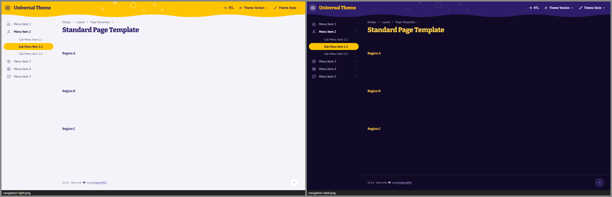
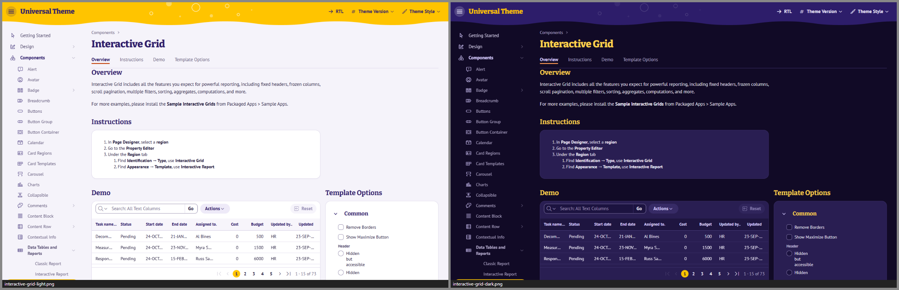
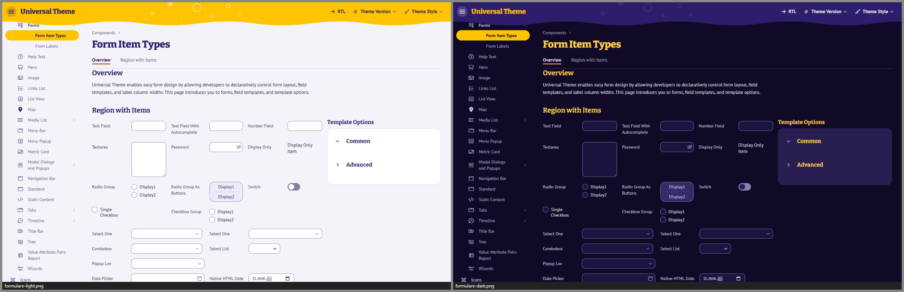
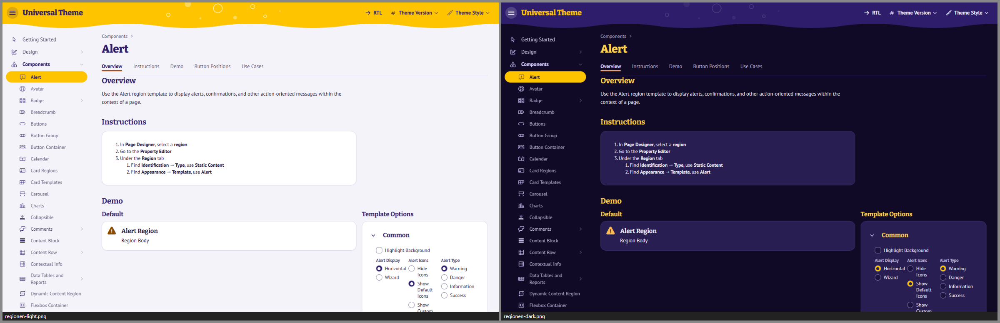
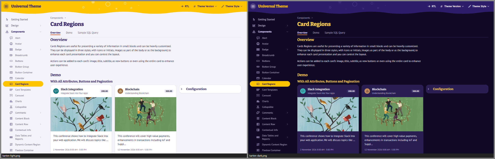
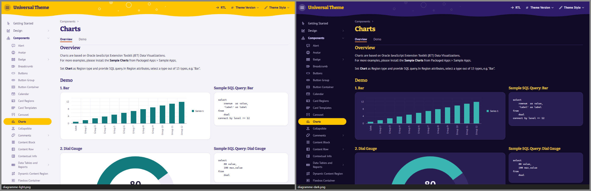
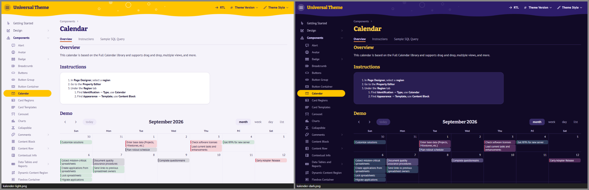
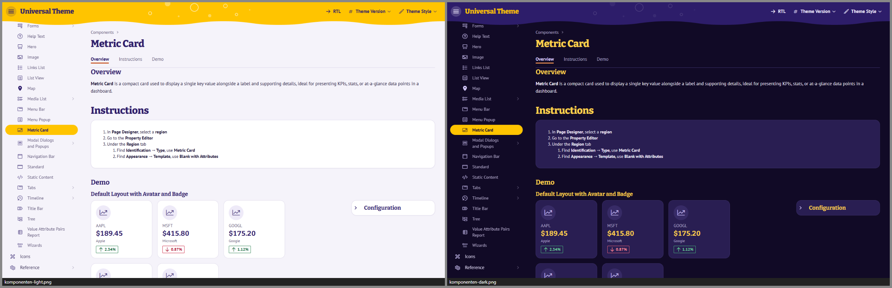
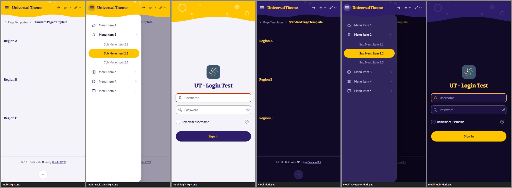

# Kracherl

**Ein Theme für Oracle APEX wie ein Sommernachmittag im Biergarten – sonnig, sprudelnd, und trotzdem zum Arbeiten gemacht.**
Oben leuchtet ein sonnengelbes Band, dessen Unterkante als *eine* weiche Welle ausläuft; ein paar Sprudelblasen
steigen darin auf. Darunter wird es ruhig: weiße Etiketten-Karten auf einem zarten Lavendel-Grund, Überschriften in
kräftigem Etikett-Violett, Fließtext in einer schmalen, gut lesbaren Grotesk. Der aktuelle Navigationseintrag ist ein
kleines gelbes Etikett, die Primäraktion ein violetter Knopf mit gelber Schrift. Nachts wird daraus
„Biergarten bei Nacht“: Violett-Schwarz, Laternengelb, ganz leise Blasen.

*Kracherl* ist das bairische Wort für Limo.



| | |
|---|---|
|  |  |
|  |  |
|  |  |
|  |  |
|  |  |

*Alle Bilder: Universal Theme Reference App, links Light, rechts Dark.*

| Style | Basis | Wofür |
|---|---|---|
| **Kracherl Light** | Vita | Standard im Büro – der Sommer |
| **Kracherl Dark** | Vita-Dark | dunkle Umgebungen, Abendschicht – der Biergarten bei Nacht |
| **Kracherl Auto** | Vita + UT-Delta | folgt der Hell/Dunkel-Einstellung des Betriebssystems – pixelgleich zu Light bzw. Dark |

Getestet mit APEX 26.1 auf UT-Dateiversion **26.1** und **24.2**, Desktop und Smartphone (390 px).

---

## Designsystem in Kürze

| | Hell | Dunkel |
|---|---|---|
| Band (Kopf, Login-Himmel, Welle) | Sonnengelb `#FFC400` | Nachthimmel-Violett `#2D1D6A` |
| Seitengrund (Navigation, Title Bar) | Lavendel-Hell `#F5F3FA` | Violett-Schwarz `#110A26` |
| Region / Karte | `#FFFFFF` | `#291E52` |
| Überschriften | Etikett-Violett `#2D1D6A` | Laternengelb `#FFD24D` |
| Text (Tinte) | `#211A3A` | `#EEEAF8` |
| Sekundärtext | `#5E5578` | `#B4ABCD` |
| Primäraktion (Hot) | Violett `#2D1D6A`, Schrift Gelb `#FFC400` | Gelb `#FFC400`, Schrift `#1A1033` |
| Etikett (aktueller Eintrag) | Gelb `#FFC400`, Schrift Violett | Gelb `#FFC400`, Schrift `#1A1033` |
| Brause-Orange (Fokus, „hier bin ich“) | `#C2410A` | `#FF9B54` |
| Auswahl („Sonnenstrahl“) | `#FFF4CC` / `#FFE88F` | `#463646` / `#5C4548` |
| Status Erfolg · Warnung · Fehler · Info | `#1D7A45` · `#EE9A0A` · `#C8102E` · `#0E6E72` | `#4CC282` · `#F5A524` · `#FF6B7D` · `#4CC3C3` |

- **Schriften:** *Bitter* (Slab-Serif, variabel) für Seitentitel, Region-, Dialog- und Kartentitel, Logo und Login –
  schwer (700/800), leicht gebrochen, wie ein Flaschenetikett. *PT Sans* für alles andere – humanistisch und schmal,
  dichte Tabellen bleiben ruhig. Skala 12,5 · 13 · 14 · 15 · 18 · 22 · 32 px; Zahlen immer tabellarisch.
- **Formen:** Buttons, Badges, Chips, Tabs und das Nav-Etikett sind Pillen; Felder 10 px; Regionen, Karten, Menüs und
  Alerts 16 px; Dialoge, Drawer und Login-Karte 24 px. *Radio Group als Buttons* ist eine Lavendel-Leiste mit
  Feldkante (≥ 3 : 1) und feinen Nähten zwischen den Optionen – auch umbrochen in schmalen Spalten klar getrennt.
- **Dichte:** Bedienelemente 32 px, Tabellenzeilen 36 px; auf Touch-Geräten (`pointer: coarse`) automatisch 40 px.
- **Fokus:** ein System für alles – 2-px-Ring in Brause-Orange mit Abstand, überall ≥ 3 : 1, auch auf dem gelben Band.
  Fehlerhafte Felder behalten mit Fokus ihre rote Kante, der Fokus kommt als abgesetzter Ring dazu – Orange und Rot
  wären bei Rot-Grün- oder Blau-Gelb-Schwäche kaum zu unterscheiden, die Form bleibt es.
- **Kontraste:** alle Text-Paare ≥ 4,5 : 1, Kanten, Marken und Fokus ≥ 3 : 1 – automatisch geprüft (`tools/check-tokens.mjs`).
  Auf Gelb steht immer Violett, nie Weiß (Weiß auf Gelb hätte nur 1,6 : 1).
- **Diagramme:** eigene „Biergarten“-Palette (Petrol, Brause-Orange, Flieder, Colabraun, Himbeere, Blattgrün …),
  die ersten sechs Serien auch bei Rot-Grün-Schwäche unterscheidbar, keine APEX-Blautöne.

### Signatur-Elemente

1. **Die Welle:** Die Unterkante des Kopfbands ist eine einzelne, lange, einfarbige Welle (CSS-Maske, 360 px
   Wellenlänge). Am Desktop hängt sie unter dem Kopf und zählt nicht zu seiner Höhe – `theme42.js` misst weiter die
   echte Kopfhöhe; auf dem Smartphone zählt ein Wellenstreifen mit (siehe *Grenzen*).
2. **Sprudelblasen:** halbtransparente weiße Perlen und Ringe (reine `radial-gradient`s) im Band – nur im freien Raum
   zwischen Logo und Navigation Bar, so dass nie eine Blase hinter Schrift liegt. Wird der Raum knapp (etwa bei
   800 px Fensterbreite mit beschrifteter Navigation Bar), wird die Traube kleiner – bis auf drei Perlen – oder
   entfällt; auf dem Smartphone steigen ein paar Perlen über der Schriftzeile auf. Groß erscheinen sie auf der
   Login-Seite; dort steigen einige langsam auf – der einzige Bewegungsmoment des Themes, abgeschaltet bei
   *Bewegung reduzieren*.
3. **Das Etikett:** Der aktuelle Eintrag der Seitennavigation, die aktive Seite der Pagination (Interactive Grid,
   Cards) und das Hero-Icon sind sonnengelbe Pillen mit violetter Schrift. In der Menüleiste und der Tabs-Navigation im
   Band trägt es das Farbpaar der Primäraktion: hell die violette Pille mit gelber Schrift, dunkel die gelbe Pille.
4. **Etikett-Typografie:** Seitentitel in Bitter 800, 32 px, Violett – dunkel in Laternengelb.
5. **Login unter freiem Himmel:** gelber Himmel mit großen Blasen, der Seitengrund steigt mit einer Welle auf, darauf die
   weiße Anmeldekarte mit großer Slab-Headline. Die geteilte Ansicht (*Split*) füllt auf dem Smartphone die Breite und
   beginnt unter einem schmalen Himmel-Streifen mit Blasen – ihre Oberkante ist dieselbe Welle.

Die vollständige Token-Referenz mit allen Kontrastwerten steht in [docs/ARCHITECTURE.md](docs/ARCHITECTURE.md).

---

## Installation

### Mit dem Skript (empfohlen)

In SQLcl, SQL*Plus oder SQL Developer, verbunden als **Parsing-Schema der Ziel-App**:

```sql
@install/kracherl-install.sql 100          -- nur installieren
@install/kracherl-install.sql 100 light    -- installieren und Light aktivieren (light | dark | auto)
```

Das Skript

1. prüft, ob die App existiert und das Universal Theme (42) verwendet,
2. legt 19 Dateien als *Static Application Files* unter `kracherl/` an (3 Styles × lesbar/minifiziert,
   10 Schriftdateien, 2 Schriftlizenzen, Drittanbieter-Hinweise),
3. registriert die Theme Styles *Kracherl Light / Dark / Auto*,
4. aktiviert auf Wunsch einen davon.

Mehrfaches Ausführen ist ausdrücklich erlaubt – so wird ein Update eingespielt. Für mehrere Apps einfach je App aufrufen.

**Alle Themes auf einmal:** Das [Style-Pack](../style-pack/README.md) spielt die 15 Styles aller fünf Themes dieses Projekts mit einem Aufruf ein (`@style-pack/style-pack-install.sql 100`).

**Deinstallieren:** `@install/kracherl-uninstall.sql 100` – schaltet auf *Vita* zurück, deaktiviert die Styles und löscht die Dateien.
APEX hat keine API zum Löschen von Theme Styles; die deaktivierten Einträge lassen sich unter
*Shared Components › Themes › Universal Theme › Theme Styles* löschen.

### Von Hand im App Builder

1. *Shared Components › Static Application Files › Create File*: den Inhalt von `dist/` hochladen, Verzeichnis `kracherl`
   (die Schriften unter `kracherl/fonts/`).
2. *Shared Components › Themes › Universal Theme › Theme Styles › Create*, je Style:

   | Name | CSS File URLs |
   |---|---|
   | Kracherl Light | `#THEME_FILES#css/Vita#MIN#.css?v=#APEX_VERSION#`<br>`#APP_FILES#kracherl/kracherl-light#MIN#.css` |
   | Kracherl Dark | `#THEME_FILES#css/Vita-Dark#MIN#.css?v=#APEX_VERSION#`<br>`#APP_FILES#kracherl/kracherl-dark#MIN#.css` |
   | Kracherl Auto | `#THEME_FILES#css/Vita#MIN#.css?v=#APEX_VERSION#`<br>`#APP_FILES#kracherl/kracherl-auto#MIN#.css` |

   *Is Public* = Ja, *Read Only* = Ja, Theme-Roller-Felder leer lassen.
3. Den gewünschten Style als *Current* setzen.

### Varianten für mehrere Apps

- **Workspace-Dateien:** Dateien einmal unter *Workspace Utilities › Static Workspace Files* ablegen und in den Styles
  `#WORKSPACE_FILES#kracherl/…` statt `#APP_FILES#kracherl/…` eintragen.
- **Webserver:** `dist/` z. B. nach `/i/themes/kracherl/` kopieren und `#APEX_FILES#themes/kracherl/…` verwenden.
  Vorteil: Der Webserver kann komprimieren. ORDS liefert Static Application Files unkomprimiert, dank versionierter
  URL aber nur einmal pro Update.

### Benutzer wählen lassen

*Shared Components › Themes › Universal Theme › Styles › „Allow End Users to choose Theme Style“* aktivieren.
Dann können Benutzer im Menü *Anpassen* zwischen Light, Dark und Auto wählen; per PL/SQL geht es mit
`apex_theme.set_user_style` bzw. `apex_theme.set_session_style`.

### Als eigenes Theme (Theme-Variante, APEX 26.1)

Zusätzlich zur Style-Variante lässt sich Kracherl als eigenständiges Theme **145** anlegen:

```sql
@install/kracherl-theme-install.sql 100 light     -- legt Theme 145 an, das aktuelle Theme der App bleibt
@install/kracherl-theme-uninstall.sql 100         -- entfernt es wieder (nur vor Unsubscribe/Switch Theme)
```

Aktiviert wird es im App Builder mit *Unsubscribe* und *Switch Theme* – mit harten Nebenwirkungen in APEX 26.1
(Spaltenlayout wird zurückgesetzt, Rückweg nur über ein Backup). Anleitung und Grenzen:
[docs/THEME-VARIANTE.md](docs/THEME-VARIANTE.md).

---

## Anpassen

**Für eine eigene Markenfarbe oder Schrift** ist der saubere Weg ein eigenes Theme auf Basis von Kracherl:

```bash
node _tools/new-theme.mjs Kompass --token ko   # neues Theme mit eigenem Präfix anlegen
# Farben in Kompass/src/tokens/light.css + dark.css, Maße/Schrift in scale.css ändern, dann bauen
```

**Kleine Anpassungen direkt in einer App** (App-CSS lädt nach dem Theme Style und gewinnt):
Die Brücke löst alle Tokens auf `:root` auf – Überschreibungen müssen deshalb ebenfalls auf `:root` stehen, nicht auf `body`.

```css
/* User Interface Attributes › CSS › Inline, oder eine eigene App-Datei */
html:has(> body.apex-theme-kracherl-light) {          /* nur im Light-Style */
  --kr-band: #FFB000;  --kr-sun: #FFB000;              /* ein wärmeres Gelb für Band und Etikett */
  --kr-accent: #1F3B6E;  --kr-accent-hover: #2A4C8A;  --kr-accent-press: #172D55;
  --kr-heading: #1F3B6E;  --kr-accent-text: #1F3B6E;   /* Tinte in Marineblau statt Violett */
}
```

Für den Dark-Style gilt dasselbe mit `body.apex-theme-kracherl-dark`, für Auto mit
`@media (prefers-color-scheme: dark)`. Bei neuen Farben die Kontraste im Blick behalten: Auf dem Band steht
`--kr-band-ink` (≥ 4,5 : 1), auf der Primäraktion `--kr-accent-on`. Welche Tokens es gibt:
[docs/ARCHITECTURE.md](docs/ARCHITECTURE.md). Das Wellenmotiv selbst ist ein Token (`--kr-wave`, `--kr-wave-h`,
`--kr-wave-w`) – `--kr-wave-h: 0px` schaltet die Welle ab.

---

## Empfehlungen für Seiten

- **Regionen** sind weiße Karten. Für Inhalte, die offen auf dem Grund stehen sollen (Einleitungen, Listen), das
  Template *Blank with Attributes* oder die Option *Remove UI Decoration* nehmen. Berichte ohne Region-Karte werden
  selbst zur Karte.
- **Freigeben / Ablehnen nebeneinander:** Freigeben als *Hot* (violettes Etikett), Ablehnen als *Danger* mit
  *Simple* – so trägt nur eine Fläche Farbe.
- **Primary** (`t-Button--primary`) ist ein leiser Sonnenstrahl (hell: hellgelbe Pille mit violetter Schrift,
  dunkel: Colabraun mit Laternengelb) – gut für die zweitwichtigste Aktion.
- **Akzent-Regionen** (Template-Option *Accent 1–15*) zeigen einen farbigen „Kronkorken“-Punkt vor dem Titel statt
  eines Kopfstreifens.
- **Hinweise:** *Alert* ohne „Highlight Background“ ist eine weiße Karte mit farbigem Symbol; mit „Highlight
  Background“ bekommt er die Statustönung.

---

## Grenzen

- **Ein Theme Style kann kein JavaScript mitbringen.** Im Auto-Style behalten JET-Diagramme beim *Live*-Umschalten
  des Betriebssystems ihre alten Textfarben, bis sie neu gezeichnet werden (Seitenaufruf genügt).
- **Die Welle liegt über dem Inhalt.** Sie hängt am Desktop 14 px unter dem Kopf und zählt nicht zu seiner Höhe.
  Title Bar und Navigation halten Abstand, gescrollter Inhalt läuft unter der Welle durch wie unter einem Schatten.
  Auf dem Smartphone (< 640 px) zählt ein 14-px-Wellenstreifen zur Kopfhöhe: Dort ist die Title Bar nicht sticky,
  und APEX scrollt RDS-Regionen, Anker und klebende Tabellenköpfe sonst bündig unter die Bandkante – die Welle
  schnitte deren oberste Zeile an. Am Desktop kann das nur auf Seiten *ohne* Title Bar passieren (klebender
  Tabellenkopf unter der Welle).
- **Breite Classic Reports** scrollen waagerecht in ihrer Karte (mit und ohne *Stretch Report*, auch auf dem Smartphone).
  Der Tabellen-Wrap ist dafür ein Scroll-Container: Ein `position: sticky` im Tabellenkopf aus eigenem App-CSS klebt
  deshalb am Bericht, nicht am Fenster. Der fixierte Kopf von APEX (Marquee-/Master-Detail-Seiten) ist nicht betroffen.
- **App-Logo zwischen 480 und 559 px** (Smartphone quer): UT zeigt dort die Beschriftungen der Navigation Bar,
  das Logo bekommt nur den Rest. Kracherl rückt die Knöpfe unter 768 px enger (zwischen 480 und 639 px mit
  12,5-px-Beschriftung); mit drei beschrifteten Einträgen passen Namen mit 15 Zeichen ab 560 px, darunter kürzt UT
  sie mit „…“ (in Vita ebenso). Unter 480 px zeigt die Navigation Bar nur Icons – 15 Zeichen passen ab 360 px ungekürzt.
- **PT Sans kennt nur zwei Gewichte** (400 und 700). UT-Stellen, die „medium“ (500) oder „semibold“ (600) verlangen,
  zeigen normal bzw. fett – bewusst, damit nie künstlich gefettet wird.
- **Mobile Schublade:** Esc schließt sie nicht – APEX bindet dafür keinen Handler. Schließen per Tippen auf die Abdunklung oder den Schalter.
- **Dialog „Seite anpassen“** (Benutzer-Anpassung von Regionen) lädt in seinem iframe nur APEX-Kern-CSS, nie einen Theme Style.
- **App- und Seiten-CSS gewinnt** (lädt nach dem Theme Style). Fest codierte Farben in Apps (z. B. `background:#fff`)
  wirken also auch im Dark-Style; in der Reference App betrifft das einige Code-Beispiele und Hinweistexte
  (Seiten 6100, 6303, 6304, 6307, 6400). Seite 6302 zeigt `u-opacity-10…90` absichtlich mit abnehmender Deckkraft.
  Das sind die einzigen Kontrast-Befunde des Laufzeit-Audits über alle 111 Seiten der Reference App (hell und dunkel).
- **Karten-Kacheln** (MapLibre) sind Bilder und werden nicht eingefärbt; die Bedienelemente schon.
- **UT-Versionen:** geprüft mit UT 24.2 und 26.1 auf APEX 26.1. Metric Card und Flexbox Container gibt es erst ab UT 26.1.
- **Installation in APEX geprüft (24.09.2026):** Der Style-Installer lief in der UT-Referenz-App (UT 26.1). 28 von 28
  Seitenvergleichen (7 Kernseiten × Light, Dark, Auto hell, Auto dunkel) sind pixelgleich zum Labor-Style; der
  Deinstaller hat Styles deaktiviert, alle Dateien entfernt und Vita wieder aktiviert. Die Theme-Variante (145) wurde
  installiert, geprüft (Dateien per HTTP 200, 3 Styles) und wieder entfernt.
- **Kein Theme-Roller-Addon.** Farbanpassungen über ein eigenes Theme oder App-CSS (siehe *Anpassen*).

---

## Prüfstand

Stand 24.09.2026. Alle Läufe über den Labor-Style der Testbetten (APEX 26.1); die Befehle stehen in
[docs/ARCHITECTURE.md §6](docs/ARCHITECTURE.md#6-test-rezepte).

| Prüfung | Ergebnis |
|---|---|
| Vertrag (`_tools/lint.mjs`) | 0 Fehler, 16 Hinweise: `!important` nur gegen fremdes `!important` (Vita, UT Core, app_ui; 19 Stellen in 5 Dateien) und Farbwerte in Attribut-Selektoren, mit denen `viz.css` die fest eingebauten JET-Farben erkennt |
| Tokens (`tools/check-tokens.mjs`) | alle Prüfungen bestanden – je Modus 119 Tokens, Text ≥ 4,5 : 1, Kanten, Marken und Fokus ≥ 3 : 1, Palette auf Farbfehlsichtigkeit geprüft, keine Wellen-Farbfolge (Gelb–Orange–Rot–Pink–Lila) in den Serien 1–5 |
| Laufzeit-Audit, alle 111 normalen Seiten der UT-Referenz-App, hell und dunkel | 0 × Oracle-Blau, 0 Überlauf, 0 JS-Fehler; 210 Kontrastbefunde, alle aus fest codiertem Demo-CSS (Seiten 6100, 6302–6304, 6307, 6400, siehe *Grenzen*); 22 Texte nicht bewertbar (Schrift auf Fotos der Karten 3110 und auf der Pfeilgrafik zweier Auswahllisten) |
| Laufzeit-Audit Smartphone (390 px, Touch) auf UT 26.1 und 24.2: Kernseiten, Anmeldung (9999, 1114), breiter Classic Report (1401) und Shell-Seiten (1102, 1107, 1122), hell und dunkel | 0 Kontrast, 0 Überlauf, 0 JS-Fehler, 0 × Oracle-Blau |
| Oracle-Blau mit erzwungenem Hover/Fokus und geöffneten Menüs, Date Picker, Popup-LOV und Dialogen (Kernseiten, hell und dunkel) | 0 Treffer |
| Auto-Äquivalenz, Kernseiten auf UT 26.1 und 24.2 | 28 von 28 Vergleichen ohne einen abweichenden Pixel |
| Gezielte Nachprüfungen (Tastatur und Breiten), hell und dunkel | Fokusring auf „Go“ in Interactive Grid und Interactive Report sichtbar; breite Classic Reports mit und ohne *Stretch Report* bis zur letzten Spalte scrollbar (1440 und 390 px); Logo mit 15 Zeichen ungekürzt ab 360 px (Navigation Bar nur Icons) bzw. ab 560 px (beschriftet); Band zwischen 480 und 767 px ohne Überlauf und ohne Überlappung |

---

## Schriften und Lizenzen

| Schrift | Verwendung | Lizenz | Datei |
|---|---|---|---|
| **Bitter** (variabel, 100–900), © 2011 The Bitter Project Authors | Überschriften, Logo, Login, Kennzahlen | SIL Open Font License 1.1 | `assets/fonts/LICENSE-Bitter-OFL.txt` |
| **PT Sans** (Regular, Italic, Bold, Bold Italic), © 2010 ParaType Ltd. | Text, Bedienelemente, Tabellen | SIL Open Font License 1.1 | `assets/fonts/LICENSE-PTSans-OFL.txt` |

Beide selbst gehostet (Teilmengen latin und latin-ext aus Google Fonts, sonst unverändert), keine Anfrage an fremde
Server. Im CSS heißen sie *Kracherl Slab* und *Kracherl Text* – so tritt nie eine lokal installierte Version an ihre
Stelle, und die reservierten Schriftnamen der OFL bleiben unberührt.

**Warum Bitter?** Verglichen wurden Bitter, Zilla Slab, Roboto Slab und Arvo in 700–900 auf Gelb und Weiß.
Bitter 800 kommt einer schweren, kompakten Etikett-Slab am nächsten: kräftige, leicht gerundete Serifen, schmaler Lauf,
für Bildschirme gezeichnet und als variable Schrift mit einer einzigen Datei je Zeichensatz. Arvo läuft zu breit und
geometrisch, Roboto Slab wirkt wie ein Systemstandard, Zilla Slab ist in 700 zu leicht und eigenwillig.
**Warum PT Sans?** Eine humanistische Grotesk mit freundlichem, leicht handschriftlichem Duktus, die zur Slab passt,
schmal genug für dichte Tabellen und mit sehr vollständiger Latin-Ext-Abdeckung; die fehlenden Zwischengewichte
gleicht die Slab für alle Titel aus.

---

## Gestaltungsregel: eine Welle

Kracherl hat genau eine einfarbige Wellenkante (die Unterkante des Bands bzw. die Oberkante des Login-Grunds), keine
gestapelten, mehrfarbigen Wellenbänder. Die Diagrammpalette vermeidet die Farbfolge Gelb–Orange–Rot–Pink–Lila
(`tools/check-tokens.mjs` prüft das für die ersten fünf Serien). Wer das Theme anpasst, bleibt am besten bei dieser Regel.

---

## Dateien

```
Kracherl/
├── theme.json                 Styles, Basis, Einstiegsdateien, Theme-Variante (Nummer 145)
├── src/
│   ├── kracherl-{light,dark,auto}.css   Einstiegspunkte
│   ├── tokens/                light.css, dark.css (Farben), scale.css (Maße, Schrift, Welle, Dichte), print.css
│   ├── bridge.css             --kr-* → UT-/APEX-/JET-Variablen (inkl. aller Vita-Hex-Kopien der Primärfarbe)
│   ├── base.css, fonts.css
│   └── components/            shell, login, regions, buttons, forms, overlays, reports, search, cards, content, viz, utilities
├── assets/                    THIRD-PARTY-NOTICES.txt (MapLibre-Symbole, UT-Delta)
│   └── fonts/                 Bitter + PT Sans (OFL 1.1) + Lizenzen
├── dist/                      gebündelte CSS-Dateien             ← node _tools/build.mjs Kracherl
├── install/                   kracherl-install.sql / -uninstall.sql (Styles)
│                              kracherl-theme-install.sql / -theme-uninstall.sql (Theme 145)
├── docs/ARCHITECTURE.md       Token-Vertrag und Regeln          ← node Kracherl/tools/build-architecture.mjs
├── docs/THEME-VARIANTE.md     Anleitung Theme-Variante
├── tools/                     check-tokens.mjs (Kontraste, Farbenblindheit, Wellen-Farbfolge, Blau-Abstand) u. a.
└── screenshots/               Vorschaubilder                     ← node Kracherl/tools/screenshots.mjs
```

## Lizenz

Theme-CSS: MIT. Schriften *Bitter* und *PT Sans*: SIL Open Font License 1.1 (`assets/fonts/`).
Die Bedien-Symbole der Karten-Region (Zoom, Kompass, Vollbild, Info; `src/components/viz.css`) verwenden die
Pfaddaten aus MapLibre GL JS (© MapLibre contributors und Mapbox, BSD-3-Clause) als Maske in der Schriftfarbe.
`_shared/ut-dark-delta.css` (im Auto-Style enthalten) ist aus den Universal-Theme-Dateien von Oracle abgeleitet und
unterliegt deren Lizenz – es wird nur zusammen mit Oracle APEX verwendet. Beides nennt der Kopfkommentar jedes Bundles
(er bleibt auch minifiziert erhalten); den vollständigen BSD-Lizenztext liefern `assets/THIRD-PARTY-NOTICES.txt` –
per Build in `dist/THIRD-PARTY-NOTICES.txt` und im Installer als `kracherl/THIRD-PARTY-NOTICES.txt` – mit. Die
Übersicht für alle Themes des Projekts steht in [THIRD-PARTY-NOTICES.md](../THIRD-PARTY-NOTICES.md).
