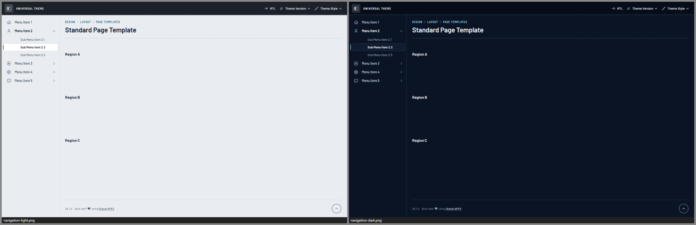
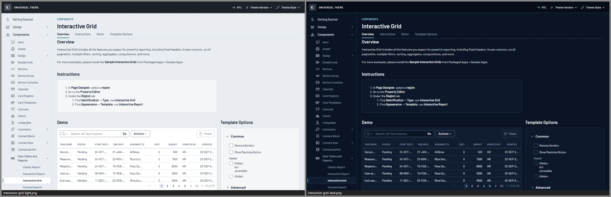
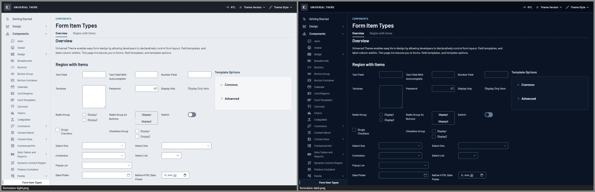
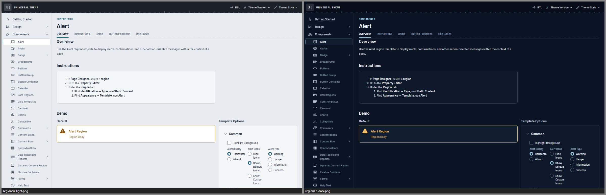
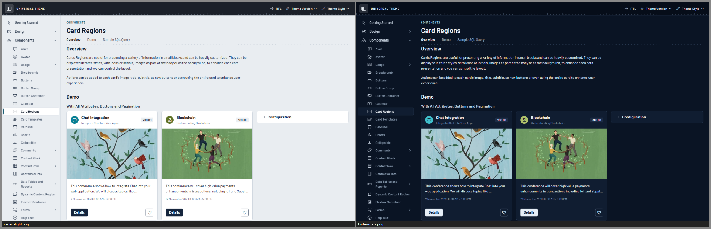
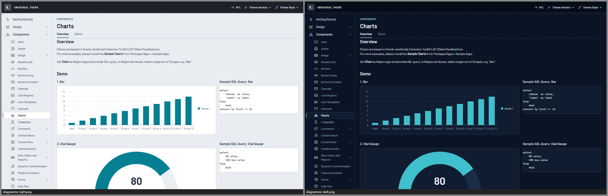
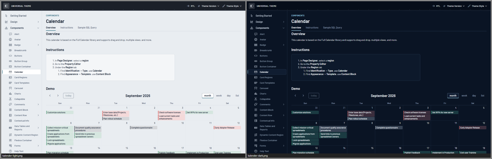
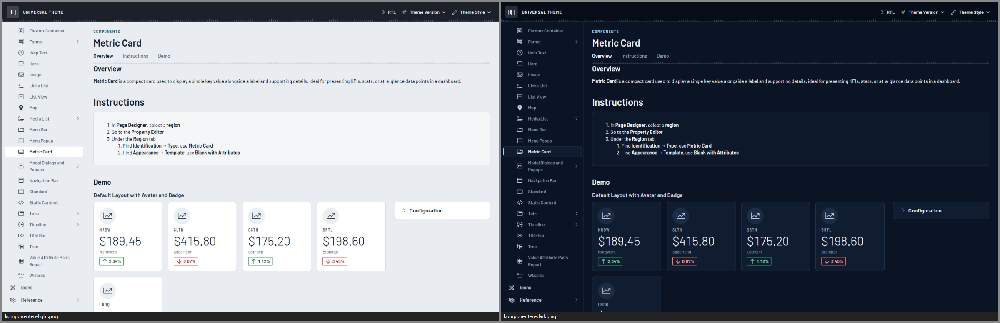
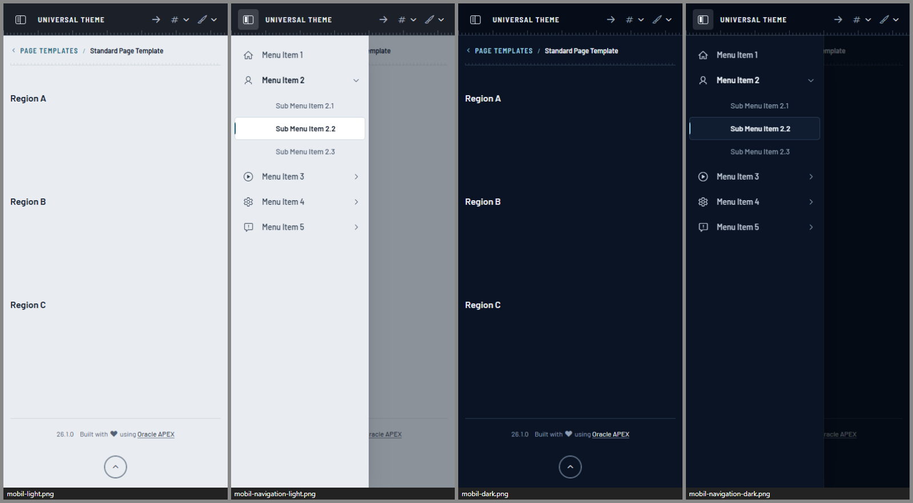

# Orbit

**Ein Theme für Oracle APEX: die Bedienkonsole eines Raumschiffs.**
Oben liegt ein dunkles Bedienfeld mit einer feinen Skala aus Teilstrichen an der Unterkante. Links läuft eine schmale
Instrumentenleiste, der aktive Eintrag trägt eine eisblaue Kante. Regionen sind Anzeige-Panels mit einer hellen
Haarlinie. Über jedem Seitentitel steht der Pfad als kleines Abschnitts-Label in gesperrten Versalien, darunter eine
Messleiste. Kennzahlen erscheinen groß und leicht wie Telemetrie. Alle Tasten sind umrandet, nur die Hauptaktion ist
gefüllt. Warnungen stehen im „Caution“-Kasten mit Bernstein-Rahmen, die Gefahr-Taste hat eine rote Kontur.

Die Idee: Bedienkonsole eines Raumschiffs, Instrumente und Telemetrie einer Missionskontrolle – tiefes Navy,
weiße klare Schrift, feine Ringe und Teilstriche. Im Arbeitsalltag bleibt es ruhig.
Die Instrumenten-Anmutung sitzt in wenigen Details, Tabellen und Formulare bleiben dicht und gut lesbar.



| | |
|---|---|
|  |  |
|  |  |
|  |  |
|  |  |
|  |  |

*Alle Bilder: Universal Theme Reference App, links Light, rechts Dark.*

| Style | Basis | Wofür |
|---|---|---|
| **Orbit Light** „Kabine“ | Vita | Weiß und helles Kabinengrau, graphitgrauer Kopf, Navy-Tinte – für helle Büros |
| **Orbit Dark** „Konsole“ | Vita-Dark | tiefes Navy, Panels eine Stufe heller, weiße Schrift, Eisblau – für Leitstände und lange Schichten |
| **Orbit Auto** | Vita + UT-Delta | folgt der Hell/Dunkel-Einstellung des Betriebssystems – pixelgleich zu Light bzw. Dark |

Getestet mit APEX 26.1 auf UT-Dateiversion **26.1** und **24.2**, Desktop (1440 px) und Smartphone (390 px).

---

## Designsystem in Kürze

| | Hell „Kabine“ | Dunkel „Konsole“ |
|---|---|---|
| Grund (Seite, Navigation, Title Bar) | `#E9EDF1` Kabinengrau | `#0A1424` tiefes Navy |
| Panel (Regionen, Karten, Reports) | `#FFFFFF` | `#101D31` |
| Haarlinie der Panels | `#D0D7DF` | `#2A3B53` |
| Kopf (Bedienfeld) | `#1B2029` Graphit | `#060D19` |
| Text | `#0F1A2A` Navy-Tinte | `#EEF3F8` |
| Sekundärtext, Tabellenköpfe | `#526074` | `#8C9FB4` Stahlgrau |
| Marke (Abschnitts-Labels, Fokus, Auswahl) | `#1B6076` Stahlpetrol | `#9FD3E8` Eisblau |
| Hauptaktion (einzige gefüllte Taste) | `#15253D` Navy, Schrift weiß | `#E6EEF6` Weiß, Schrift Navy |
| Kante von Tasten und Feldern | `#737F8F` | `#687891` |
| Nominal · Vorsicht · Halt (Text) | `#146840` · `#85500A` · `#B3261E` | `#6FD6A5` · `#F4BF5C` · `#FF9A94` |

- **Schrift:** [Barlow](https://github.com/jpt/barlow) für alles (300 für Kennzahlen, 400 Fließtext, 500 Bedienelemente,
  600 Titel) und Barlow Semi Condensed 600 für die Versal-Labels. Beide selbst gehostet, SIL Open Font License.
  Skala 12 · 13 · 14 · 16 · 20 · 28 px, Kennzahlen 36 px. Zahlen in Tabellen, Badges und Metric Cards stehen tabellarisch.
- **Warum Barlow?** Verglichen wurden vier offene technische Schriften, jeweils mit Abschnitts-Label, Titel,
  Telemetrie-Zeile (drei frei gewählte Messwerte mit Einheit), Fließtext und einer Tabelle bei 13 px. *Exo 2* wirkt mit
  seinen Keilformen wie ein Spiel-Interface. *Saira* ist eckig und weit geschnitten, dichte Tabellen werden deutlich
  breiter und höher. *Archivo* ist eine gute Grotesk, trägt aber kaum technischen Charakter. **Barlow** ist eine leicht
  gerundete, DIN-nahe Grotesk: schmal genug für dichte Tabellen, mit echten Tabellenziffern, einem leichten 300er
  Schnitt für große Messwerte und einer halbschmalen Schwester für gesperrte Versalien.
- **Formen:** Panels, Menüs und Alerts 8 px Radius, Tasten und Felder 5 px, Checkboxen und Badges 3 px, Dialoge 10 px.
  Panels ohne Schatten, nur die Haarlinie; nur Schwebendes (Menüs, Dialoge) wirft einen Schatten.
- **Dichte:** Bedienelemente 32 px, Tabellenzeilen 34 px, Tabellenköpfe 36 px; auf Touch-Geräten automatisch 40 px.
- **Signatur-Elemente:** Bedienfeld mit Teilstrich-Skala an der Kopfkante · App-Name in gesperrten Versalien ·
  Abschnitts-Label über dem Seitentitel und Messleiste darunter · Konsolen-Leiste mit Eiskante am aktiven Eintrag ·
  Anzeige-Panels mit Haarlinie · Tabellenköpfe als Versal-Labels · Kennzahlen als Telemetrie (Metric Card, Badge List) ·
  Tankanzeigen statt dicker Balken (Prozentgrafik) · Missionsfortschritt (Wizard) als Punkte auf einer Linie ·
  Statuslampe vor dem Titel von Akzent-Regionen · „Caution“-Kasten · umrandete Tasten mit roter Halt-Taste ·
  Anmeldung vor einem Rundinstrument mit gebogener Zeitleiste.
- **Das Login-Instrument** besteht nur aus CSS-Verläufen und Masken: Außenring, Teilstriche alle 3° und 30°, Innenringe,
  Fadenkreuz, ein Bogen in der Marke mit Punkt an der Spitze und am unteren Rand eine gebogene Zeitleiste mit
  Ereignispunkten. Es zeigt keine Zahlen und keinen Text. Beim Laden läuft der Bogen einmal ein (1,6 s); bei
  „Bewegung reduzieren“ steht er sofort.
- **Fokus:** ein System – 2-px-Ring mit 2 px Abstand in der Marke, auf dem Bedienfeld in Eisblau; überall ≥ 3 : 1,
  auch auf dem „Go“-Knopf von Interactive Report und Grid.
- **Kontraste:** alle Text-Paare ≥ 4,5 : 1, Kanten von Feldern und Tasten, Fokus und Marken ≥ 3 : 1
  (automatisch geprüft, siehe `tools/check-tokens.mjs`).
- **Diagramme:** kühle, auf Farbfehlsichtigkeit geprüfte Palette (Eiscyan, Bernstein, Lila, Nominalgrün, Koralle, Stahl,
  Sand, Weinrot …); keine Farbe in der Nähe des Oracle-Blaus, alle 15 Kategorien hell ≥ 3,08 : 1 und dunkel ≥ 4,78 : 1
  gegen das Panel.

Die vollständige Token-Referenz mit allen Kontrastwerten steht in [docs/ARCHITECTURE.md](docs/ARCHITECTURE.md).

---

## Installation

### Mit dem Skript (empfohlen)

In SQLcl, SQL*Plus oder SQL Developer, verbunden als **Parsing-Schema der Ziel-App**:

```sql
@install/orbit-install.sql 100          -- nur installieren
@install/orbit-install.sql 100 dark     -- installieren und Dark aktivieren (light | dark | auto)
```

Das Skript

1. prüft, ob die App existiert und das Universal Theme (42) verwendet,
2. legt 18 Dateien als *Static Application Files* unter `orbit/` an (3 Styles × lesbar/minifiziert, 10 Schriftdateien,
   Schriftlizenz, `THIRD-PARTY-NOTICES.txt`),
3. registriert die Theme Styles *Orbit Light / Dark / Auto*,
4. aktiviert auf Wunsch einen davon.

Mehrfaches Ausführen ist ausdrücklich erlaubt – so wird ein Update eingespielt. Für mehrere Apps einfach je App aufrufen.

**Alle Themes auf einmal:** Das [Style-Pack](../style-pack/README.md) spielt die Styles aller Themes dieses Projekts mit
einem Aufruf ein. Orbit wird beim nächsten Bau des Pakets (`node _tools/build.mjs --pack`) automatisch aufgenommen;
bis dahin gilt der Einzel-Installer oben.

**Deinstallieren:** `@install/orbit-uninstall.sql 100` – schaltet auf *Vita* zurück, deaktiviert die Styles und löscht die
Dateien. APEX hat keine API zum Löschen von Theme Styles; die deaktivierten Einträge lassen sich unter
*Shared Components › Themes › Universal Theme › Theme Styles* löschen.

### Von Hand im App Builder

1. *Shared Components › Static Application Files › Create File*: den Inhalt von `dist/` hochladen, Verzeichnis `orbit`
   (die Schriften unter `orbit/fonts/`).
2. *Shared Components › Themes › Universal Theme › Theme Styles › Create*, je Style:

   | Name | CSS File URLs |
   |---|---|
   | Orbit Light | `#THEME_FILES#css/Vita#MIN#.css?v=#APEX_VERSION#`<br>`#APP_FILES#orbit/orbit-light#MIN#.css` |
   | Orbit Dark | `#THEME_FILES#css/Vita-Dark#MIN#.css?v=#APEX_VERSION#`<br>`#APP_FILES#orbit/orbit-dark#MIN#.css` |
   | Orbit Auto | `#THEME_FILES#css/Vita#MIN#.css?v=#APEX_VERSION#`<br>`#APP_FILES#orbit/orbit-auto#MIN#.css` |

   *Is Public* = Ja, *Read Only* = Ja, Theme-Roller-Felder leer lassen.
3. Den gewünschten Style als *Current* setzen.

### Varianten für mehrere Apps

- **Workspace-Dateien:** Dateien einmal unter *Workspace Utilities › Static Workspace Files* ablegen und in den Styles
  `#WORKSPACE_FILES#orbit/…` statt `#APP_FILES#orbit/…` eintragen.
- **Webserver:** `dist/` z. B. nach `/i/themes/orbit/` kopieren und `#APEX_FILES#themes/orbit/…` verwenden.
  Vorteil: Der Webserver kann komprimieren – das Bundle ist ca. 245–260 KB, gzip-komprimiert ca. 37–40 KB.

### Benutzer wählen lassen

*Shared Components › Themes › Universal Theme › Styles › „Allow End Users to choose Theme Style“* aktivieren.
Dann können Benutzer im Menü *Anpassen* zwischen Light, Dark und Auto wählen; per PL/SQL geht es mit
`apex_theme.set_user_style` bzw. `apex_theme.set_session_style`.

### Als eigenes Theme (Theme-Variante, APEX 26.1)

Zusätzlich gibt es Orbit als eigenständiges Theme **147** (`install/orbit-theme-install.sql`). Das Umschalten per
*Switch Theme* hat in APEX 26.1 harte Nebenwirkungen (Spaltenlayout wird zurückgesetzt, Rückweg nur über ein Backup).
Die Theme-Variante eignet sich deshalb vor allem für neue Apps; Einzelheiten in [docs/THEME-VARIANTE.md](docs/THEME-VARIANTE.md).

---

## Anpassen

**Für eine eigene Markenfarbe oder Schrift** ist der saubere Weg ein eigenes Theme auf Basis von Orbit:
Ordner kopieren, Präfix ändern, Farben in `src/tokens/light.css` + `dark.css`, Maße und Schrift in `scale.css`
anpassen, dann `node Orbit/tools/check-tokens.mjs` und `node _tools/build.mjs <Theme>`.

**Kleine Anpassungen direkt in einer App** (App-CSS lädt nach dem Theme Style und gewinnt):
Die Brücke löst alle Tokens auf `:root` auf – Überschreibungen müssen deshalb ebenfalls auf `:root` stehen, nicht auf `body`.

```css
/* User Interface Attributes › CSS › Inline, oder eine eigene App-Datei */
html:has(> body.apex-theme-orbit-dark) {        /* nur im Dark-Style */
  --ob-accent-text: #A6E3C9;                     /* Marke: Mintgrün statt Eisblau */
  --ob-focus-ring-color: #A6E3C9;
  --ob-link-underline-hover: #A6E3C9;
}
```

Für den Light-Style gilt dasselbe mit `body.apex-theme-orbit-light`, für Auto mit
`@media (prefers-color-scheme: dark)`. Welche Tokens es gibt und welche Kontraste einzuhalten sind:
[docs/ARCHITECTURE.md](docs/ARCHITECTURE.md).

**Die Skala abschalten:** Wer die Teilstriche an der Kopfkante und unter dem Seitentitel nicht möchte, setzt
`.t-Header::after, .t-Body-title::after { display: none; }` ins App-CSS.

---

## Empfehlungen für Seiten

- **Genau eine Hauptaktion je Bereich** als *Hot* – sie ist die einzige gefüllte Taste. Alle anderen Buttons bleiben
  *Normal* (umrandet).
- **Freigeben / Ablehnen nebeneinander:** Freigeben als *Hot*, Ablehnen als *Danger* – Danger ist eine rote Kontur wie
  eine Halt-Taste und wird beim Überfahren rot getönt.
- **Standard-Regionen** sind Panels. Für Abschnitte, die frei auf dem Grund stehen sollen, *Remove UI Decoration*
  wählen – ein Interactive Report oder Grid darin bleibt selbst ein Panel.
- **Kennzahlen** mit der *Metric Card* (UT 26.1) oder der *Badge List* zeigen: Werte groß und leicht, Titel als
  Versal-Label.
- **Warnungen** mit dem *Alert* vom Typ *Warning*: Er erscheint als „Caution“-Kasten. *Highlight Background* tönt die
  Fläche zusätzlich.
- **Akzent-Regionen** (Template-Option *Accent 1–15*) bekommen eine kleine Statuslampe in der Kategoriefarbe vor dem Titel.
- **Fortschritt** mit der Prozentgrafik (Item oder Report-Spalte `PCT_GRAPH`): Sie erscheint als dünne Tankanzeige mit
  dem Wert darüber.
- **Seitentitel kurz halten;** der Pfad darüber steht in Versalien und wird mit vielen Ebenen schnell lang.

---

## Grenzen

- **Ein Theme Style kann kein JavaScript mitbringen.** Im Auto-Style behalten JET-Diagramme beim *Live*-Umschalten
  des Betriebssystems ihre alten Textfarben, bis sie neu gezeichnet werden (Seitenaufruf genügt).
- **Das Login-Instrument** braucht CSS-Trigonometrie (`sin()`/`cos()`) und `@property`. Ältere Browser zeigen Ringe,
  Skala und Bogen ohne den Punkt an der Bogenspitze und ohne Ereignispunkte; ohne `@property` läuft der Bogen nicht ein.
- **Hintergrundbilder der Login-Seite** (Template-Option *Background 1–3*) ersetzt Orbit durch das Instrument. Eine
  Image Region im Login-Hintergrund liegt weiter darüber.
- **Mobile Schublade:** Esc schließt sie nicht – APEX bindet dafür keinen Handler. Schließen per Tippen auf die Abdunklung
  oder den Schalter.
- **Dialog „Seite anpassen“** (Benutzer-Anpassung von Regionen) lädt in seinem iframe nur APEX-Kern-CSS, nie einen Theme Style.
- **App- und Seiten-CSS gewinnt** (lädt nach dem Theme Style). Fest codierte Farben in Apps (z. B. `background:#fff`)
  wirken also auch im Dark-Style.
- **Karten-Kacheln** (MapLibre) sind Bilder und werden nicht eingefärbt; die Bedienelemente schon.
- **Schriften:** Barlow liegt in statischen Schnitten vor (300/400/500/600, je latin und latin-ext). Kursiv stellt der
  Browser schräg, Fett zeigt den 600er-Schnitt.
- **UT-Versionen:** geprüft mit UT 24.2 und 26.1 auf APEX 26.1. Metric Card und Flexbox Container gibt es erst ab UT 26.1.
- **Größe:** ca. 245–260 KB CSS je Style, dazu rund 110 KB Schrift für lateinische Texte (latin-ext lädt nur bei Bedarf).
- **Installation in APEX geprüft (25.09.2026):** Der Style-Installer lief in der UT-Referenz-App (UT 26.1). 28 von 28
  Seitenvergleichen (7 Kernseiten × Light, Dark, Auto hell, Auto dunkel) sind pixelgleich zum Labor-Style; der
  Deinstaller hat Styles deaktiviert, alle Dateien entfernt und Vita wieder aktiviert. Die Theme-Variante (147) wurde
  auf UT 26.1 und 24.2 installiert, geprüft (Dateien per HTTP 200, 3 Styles) und wieder entfernt.
- **Kein Theme-Roller-Addon.** Farbanpassungen über ein eigenes Theme oder App-CSS (siehe *Anpassen*).

---

## Prüfstand

Stand 25.09.2026. Alle Läufe außer der Installation über den Labor-Style der Testbetten (APEX 26.1); die Befehle stehen in
[docs/ARCHITECTURE.md §7](docs/ARCHITECTURE.md#7-test-rezepte).

| Prüfung | Ergebnis |
|---|---|
| Vertrag (`_tools/lint.mjs`) | 0 Fehler, 16 Hinweise: `!important` nur gegen fremdes `!important` (Vita, UT Core, app_ui) und Farbwerte in Attribut-Selektoren, mit denen `viz.css` die fest eingebauten JET-Farben erkennt |
| Tokens (`tools/check-tokens.mjs`) | alle Prüfungen bestanden – je Modus 116 Tokens, Text ≥ 4,5 : 1, Kanten, Fokus und Marken ≥ 3 : 1 (auch auf dem Bedienfeld), Palette auf Farbfehlsichtigkeit geprüft (erste 6 Serien bei Protanopie und Deuteranopie min. ΔE00 hell 9,9, dunkel 6,8), kein Farbwert näher als ΔE00 12 am Oracle-Blau |
| Laufzeit-Audit, alle Seiten der UT-Referenz-App, hell und dunkel | 0 Überlauf, 0 JS-Fehler, 0 Oracle-Blau; 210 Kontrastbefunde, alle aus fest codiertem Demo-CSS der Referenz-App (Seiten 6100, 6303, 6304, 6307, 6400: Farben wie `rgb(156,39,176)`, `#767676`, `red` oder eine weiße Demo-Fläche) bzw. absichtlich transparenter Text der `u-opacity-*`-Vorführung (6302) |
| Laufzeit-Audit Smartphone (390 px, Touch) und UT 24.2 | 0 Kontrast, 0 Überlauf, 0 JS-Fehler (Smartphone: Kernseiten und 1403, 1411, 1412, 1720, 1800, 3110, 3810, 1114, 9999; UT 24.2: Kernseiten, 1800, 3810) |
| Oracle-Blau (Kernseiten mit Hover, Fokus und geöffneten Menüs, Popups und Dialogen) | 0 Treffer, hell und dunkel |
| Buttons aller Typen (Normal, Hot, Primary, Success, Warning, Danger) × Stil (Normal, Simple, Remove UI, Link), Ruhe und Hover | Schrift ≥ 4,5 : 1 – hell min. 6,54 (Ruhe) / 5,66 (Hover), dunkel min. 8,29 / 7,11 |
| Tastatur-Fokus (19 Stichproben: Sprunglink (auf dem Bedienfeld mit Eis-Ring), Navigations-Schalter, Menüleiste, Tabs-Navigation, Breadcrumb, RDS, IR/IG „Go“ und „Actions“, Spaltenkopf, Suchfeld, Button, Textfeld, Checkbox, Radio, Switch, Login) | Ring überall sichtbar, genau einer, hell und dunkel |
| Druck (Dark-Style, 1101 und 1402) | hell, ohne Bedienfeld, Skalen und Schatten |
| Auto-Äquivalenz, Kernseiten auf UT 26.1 und 24.2 | 28 von 28 Vergleichen ohne einen abweichenden Pixel (7 Kernseiten × hell/dunkel × UT 26.1 und 24.2), dazu Login (1114, 9999), Alert (1202), Metric Card (3007), Kalender (1800) und Breadcrumb (3810) auf UT 26.1: ebenfalls 0 Pixel |
| Installation in APEX (UT-Referenz-App, UT 26.1) | Style-Installer: 18 von 18 Dateien, 28 von 28 Seitenvergleichen (7 Kernseiten × Light, Dark, Auto hell, Auto dunkel) pixelgleich zum Labor-Style; Deinstaller: Dateien entfernt (HTTP 404), Vita wieder aktiv. Theme-Variante 147 auf UT 26.1 und 24.2: 18 Theme-Dateien per HTTP 200, byte-gleich mit `dist/`, 3 Styles, danach restlos entfernt |

---

## Dateien

```
Orbit/
├── theme.json                 Styles, Basis, Einstiegsdateien, Theme-Variante 147
├── src/
│   ├── orbit-{light,dark,auto}.css    Einstiegspunkte
│   ├── tokens/                light.css („Kabine“), dark.css („Konsole“), scale.css (Maße, Schrift, Skala), print.css
│   ├── bridge.css             --ob-* → UT-/APEX-/JET-Variablen (inkl. aller Vita-Hex-Kopien der Primärfarbe)
│   ├── base.css, fonts.css
│   └── components/            shell, login, regions, buttons, forms, overlays, reports, search, cards, content, viz, utilities
├── assets/fonts/              Barlow + Barlow Semi Condensed (OFL 1.1) + Lizenz
├── assets/THIRD-PARTY-NOTICES.txt  Drittanbieter-Hinweise (Kartensymbole, UT-Delta)
├── dist/                      gebündelte CSS-Dateien             ← node _tools/build.mjs Orbit
├── install/                   orbit-install.sql / -uninstall.sql (Styles)
│                              orbit-theme-install.sql / -theme-uninstall.sql (Theme 147)
├── docs/ARCHITECTURE.md       Token-Vertrag und Regeln          ← node Orbit/tools/build-architecture.mjs
├── docs/THEME-VARIANTE.md     Theme-Variante 147
├── tools/                     check-tokens.mjs (Kontraste, Farbfehlsichtigkeit, Oracle-Blau), screenshots.mjs u. a.
└── screenshots/               Vorschaubilder                     ← node Orbit/tools/screenshots.mjs
```

## Lizenz

Theme-CSS: MIT. Schriften *Barlow* und *Barlow Semi Condensed* (© 2017 The Barlow Project Authors): SIL Open Font
License 1.1 (`assets/fonts/LICENSE-Barlow-OFL.txt`). Die Bedien-Symbole der Karten-Region (Zoom, Kompass, Vollbild;
`src/components/viz.css`) verwenden die Pfaddaten aus MapLibre GL JS (© MapLibre contributors und Mapbox, BSD-3-Clause)
als Maske in der Schriftfarbe. `_shared/ut-dark-delta.css` (im Auto-Style enthalten) ist aus den
Universal-Theme-Dateien von Oracle abgeleitet und unterliegt deren Lizenz – es wird nur zusammen mit Oracle APEX verwendet.
Beides nennt der Kopfkommentar jedes Bundles (er bleibt auch minifiziert erhalten); den vollständigen BSD-Lizenztext
liefern `assets/THIRD-PARTY-NOTICES.txt` → `dist/THIRD-PARTY-NOTICES.txt` und der Installer (`orbit/THIRD-PARTY-NOTICES.txt`)
mit. Die Übersicht für alle Themes des Projekts steht in [THIRD-PARTY-NOTICES.md](../THIRD-PARTY-NOTICES.md).
