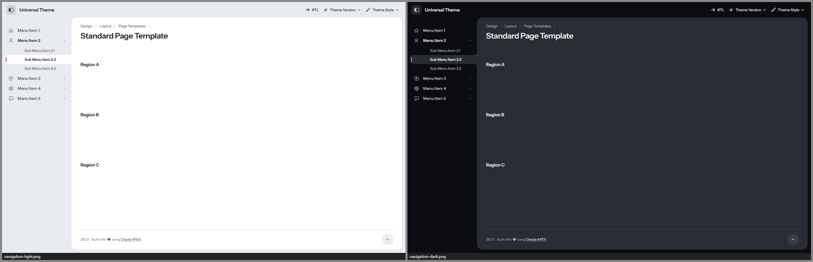
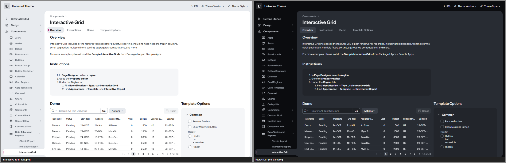
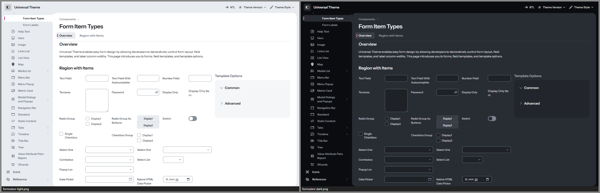
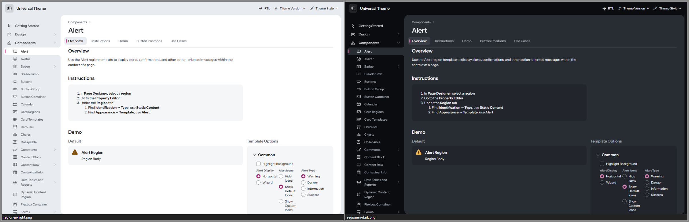
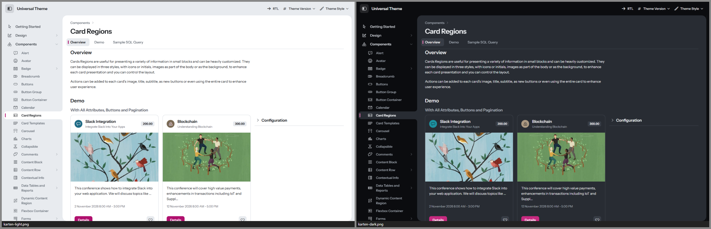
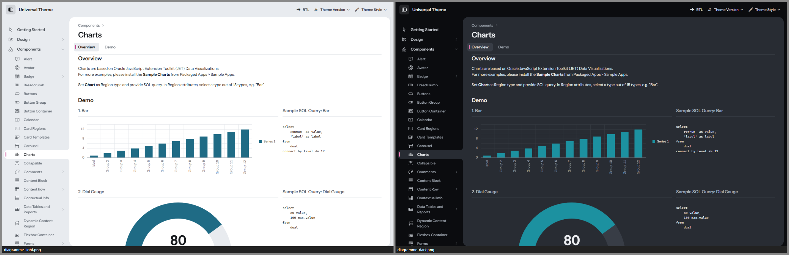
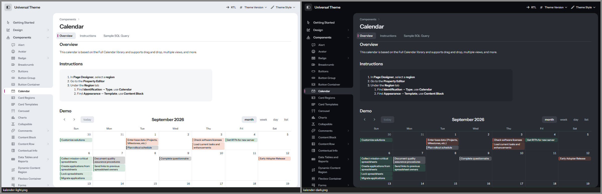
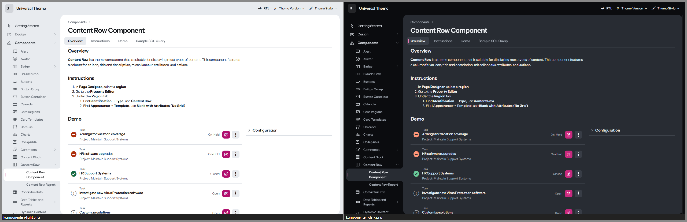
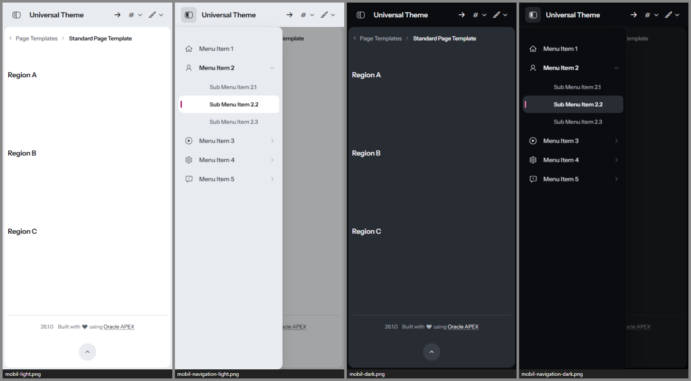

# Passepartout

**Ein Theme für Oracle APEX, das nicht nach APEX aussieht.**
Kopf und Navigation bilden ein einziges, ruhiges *Passepartout* – den Rahmen. Darin liegt die Arbeit auf einer
eingesetzten, gerundeten *Leinwand*. Innerhalb der Leinwand ordnen Weißraum, Typografie und Haarlinien den Inhalt, keine Kästen
mit Kopfstreifen. Es gibt genau einen Akzent – *Kartenmagenta* – und der ist reserviert für Primäraktion, Auswahl, Fokus
und die *Lasche*: Der aktive Navigationseintrag ist ein Stück Leinwand, das in den Rahmen greift.



| | |
|---|---|
|  |  |
|  |  |
|  |  |
|  |  |
|  |  |

*Alle Bilder: Universal Theme Reference App, links Light, rechts Dark.*

| Style | Basis | Wofür |
|---|---|---|
| **Passepartout Light** | Vita | Standard im Büro |
| **Passepartout Dark** | Vita-Dark | dunkle Umgebungen, Nachtschicht, Außendienst |
| **Passepartout Auto** | Vita + UT-Delta | folgt der Hell/Dunkel-Einstellung des Betriebssystems – pixelgleich zu Light bzw. Dark |

Getestet mit APEX 26.1 auf UT-Dateiversion **26.1** und **24.2**, Desktop, Tablet (820 px) und Smartphone (390 px).

---

## Designsystem in Kürze

| | Hell | Dunkel |
|---|---|---|
| Rahmen (Kopf, Navigation, Seitengrund) | `#E8EBEF` | `#0B0C0F` |
| Leinwand (Arbeitsfläche) | `#FFFFFF` | `#282C33` |
| Tusche (Text) | `#15181C` | `#EDEFF2` |
| Graphit (Sekundärtext) | `#59616B` | `#A7AFB9` |
| Kartenmagenta (Akzent) | `#B0106E` | Fläche `#C72A80`, Text/Marken `#F07AB8` |
| Danger (bewusst orange-rot, klar von Magenta getrennt) | `#D2410F` | `#EE6A48` |

- **Schrift:** Instrument Sans (variabel, Gewicht 400–700, Breite 75–100 %), selbst gehostet. Tabellenköpfe im Schmalschnitt,
  Zahlen immer tabellarisch. Skala 12 · 13 · 14 · 16 · 20 · 28 px (Vita: 12 px Grundschrift, Passepartout: 14 px).
- **Dichte:** Bedienelemente 32 px, Tabellenzeilen 34 px; auf Touch-Geräten (`pointer: coarse`) automatisch 40 px.
- **Radien:** Leinwand 18 · Container 12 · Controls 8 · Checkbox 5 px.
- **Fokus:** ein System für alles – 2-px-Ring mit Abstand, überall ≥ 3:1 (dunkel in hellem Magenta).
- **Kontraste:** alle Text-Paare ≥ 4,5:1, Kanten und Zustände ≥ 3:1 (188 Paare automatisch geprüft, siehe `tools/check-tokens.mjs`).
- **Diagramme:** eigene, farbenblind-geprüfte Kategorie-Palette (`--u-color-1…45`), keine APEX-Blautöne.

Die vollständige Token-Referenz mit allen Kontrastwerten steht in [docs/ARCHITECTURE.md](docs/ARCHITECTURE.md).

---

## Installation

### Mit dem Skript (empfohlen)

In SQLcl, SQL*Plus oder SQL Developer, verbunden als **Parsing-Schema der Ziel-App**:

```sql
@install/passepartout-install.sql 100          -- nur installieren
@install/passepartout-install.sql 100 light    -- installieren und Light aktivieren (light | dark | auto)
```

Das Skript

1. prüft, ob die App existiert und das Universal Theme (42) verwendet,
2. legt 10 Dateien als *Static Application Files* unter `passepartout/` an (3 Styles × lesbar/minifiziert, 2 Schriftdateien,
   Schriftlizenz, Drittanbieter-Hinweise),
3. registriert die Theme Styles *Passepartout Light / Dark / Auto*,
4. aktiviert auf Wunsch einen davon.

Mehrfaches Ausführen ist ausdrücklich erlaubt – so wird ein Update eingespielt. Für mehrere Apps einfach je App aufrufen.

**Alle Themes auf einmal:** Das [Style-Pack](../style-pack/README.md) spielt die 15 Styles aller fünf Themes dieses Projekts mit einem Aufruf ein (`@style-pack/style-pack-install.sql 100`).

**Deinstallieren:** `@install/passepartout-uninstall.sql 100` – schaltet auf *Vita* zurück, deaktiviert die Styles und löscht die Dateien.
APEX hat keine API zum Löschen von Theme Styles; die deaktivierten Einträge lassen sich unter
*Shared Components › Themes › Universal Theme › Theme Styles* löschen.

### Von Hand im App Builder

1. *Shared Components › Static Application Files › Create File*: den Inhalt von `dist/` hochladen, Verzeichnis `passepartout`
   (die Schriften unter `passepartout/fonts/`).
2. *Shared Components › Themes › Universal Theme › Theme Styles › Create*, je Style:

   | Name | CSS File URLs |
   |---|---|
   | Passepartout Light | `#THEME_FILES#css/Vita#MIN#.css?v=#APEX_VERSION#`<br>`#APP_FILES#passepartout/passepartout-light#MIN#.css` |
   | Passepartout Dark | `#THEME_FILES#css/Vita-Dark#MIN#.css?v=#APEX_VERSION#`<br>`#APP_FILES#passepartout/passepartout-dark#MIN#.css` |
   | Passepartout Auto | `#THEME_FILES#css/Vita#MIN#.css?v=#APEX_VERSION#`<br>`#APP_FILES#passepartout/passepartout-auto#MIN#.css` |

   *Is Public* = Ja, *Read Only* = Ja, Theme-Roller-Felder leer lassen.
3. Den gewünschten Style als *Current* setzen.

### Varianten für mehrere Apps

- **Workspace-Dateien:** Dateien einmal unter *Workspace Utilities › Static Workspace Files* ablegen und in den Styles
  `#WORKSPACE_FILES#passepartout/…` statt `#APP_FILES#passepartout/…` eintragen.
- **Webserver:** `dist/` z. B. nach `/i/themes/passepartout/` kopieren und `#APEX_FILES#themes/passepartout/…` verwenden.
  Vorteil: Der Webserver kann komprimieren – das Bundle ist ca. 240 KB, gzip-komprimiert ca. 35 KB. ORDS liefert Static Application
  Files unkomprimiert, dank versionierter URL aber nur einmal pro Update.

### Benutzer wählen lassen

*Shared Components › Themes › Universal Theme › Styles › „Allow End Users to choose Theme Style“* aktivieren.
Dann können Benutzer im Menü *Anpassen* zwischen Light, Dark und Auto wählen; per PL/SQL geht es mit
`apex_theme.set_user_style` bzw. `apex_theme.set_session_style`.

### Als eigenes Theme (Theme-Variante, APEX 26.1)

Zusätzlich zur Style-Variante gibt es Passepartout als eigenständiges Theme 142. Es steht unter *Shared Components ›
Themes* und lässt sich im App Builder exportieren und importieren:

```sql
@install/passepartout-theme-install.sql 100 light     -- legt Theme 142 an, das aktuelle Theme der App bleibt
@install/passepartout-theme-uninstall.sql 100         -- entfernt es wieder (nur vor Unsubscribe/Switch Theme)
```

Solange Theme 142 nur installiert ist und noch den UT-Master abonniert, zeigen die Template-Views jedes Template
doppelt. Eigener Code mit `SELECT … INTO` auf `apex_application_temp_*` bricht dann ab. Installiere das Theme deshalb
erst kurz vor dem Umschalten.

Aktiviert wird das Theme im App Builder mit *Unsubscribe* und *Switch Theme*. In APEX 26.1 hat das Nebenwirkungen:
Das Spaltenlayout aller Regionen wird zurückgesetzt, und zurück geht es nur über ein Backup. Deshalb eignet sich die
Theme-Variante vor allem für neue Apps. Die bebilderte Anleitung mit allen Grenzen steht in
[docs/THEME-VARIANTE.md](docs/THEME-VARIANTE.md).

---

## Anpassen

**Für eine eigene Markenfarbe oder Schrift** ist der saubere Weg ein eigenes Theme auf Basis von Passepartout:

```bash
node _tools/new-theme.mjs Kompass --token ko   # Kopie mit eigenem Präfix
# Farben in Kompass/src/tokens/light.css + dark.css, Maße/Schrift in scale.css ändern, dann bauen
```

**Kleine Anpassungen direkt in einer App** (App-CSS lädt nach dem Theme Style und gewinnt):
Die Brücke löst alle Tokens auf `:root` auf – Überschreibungen müssen deshalb ebenfalls auf `:root` stehen, nicht auf `body`.

```css
/* User Interface Attributes › CSS › Inline, oder eine eigene App-Datei */
html:has(> body.apex-theme-passepartout-light) {       /* nur im Light-Style */
  --pp-accent: #0F6E5F;  --pp-accent-hover: #0B5A4E;  --pp-accent-press: #08473E;
  --pp-accent-text: #0F6E5F;  --pp-accent-tint: #E3F2EF;  --pp-accent-tint-2: #C8E6E0;
  --pp-focus-ring-color: #0F6E5F;
}
```

Für den Dark-Style gilt dasselbe mit `body.apex-theme-passepartout-dark`, für Auto mit
`@media (prefers-color-scheme: dark)`. Welche Tokens es gibt und welche Kontraste einzuhalten sind:
[docs/ARCHITECTURE.md](docs/ARCHITECTURE.md).

---

## Empfehlungen für Seiten

- **Freigeben / Ablehnen nebeneinander:** Freigeben als *Hot*, Ablehnen als *Danger* mit *Simple* – so trägt nur eine Fläche Farbe.
- **Akzent-Regionen** (Template-Option *Accent 1–15*) zeigen ein kleines Farbfeld vor dem Titel statt eines farbigen Kopfstreifens –
  gut für Legenden, Kategorien und Status.
- **Hinweise:** *Alert* ohne „Highlight Background“ ist eine ruhige, abgesenkte Fläche; mit „Highlight Background“ bekommt er die Statustönung.
- **Tabellen** sind offen (keine Außenrahmen). Für Kennzahlen *Classic Report* mit *Stretch* nutzen; Zahlen stehen automatisch tabellarisch.

---

## Grenzen

- **Ein Theme Style kann kein JavaScript mitbringen.** Im Auto-Style behalten JET-Diagramme beim *Live*-Umschalten
  des Betriebssystems ihre alten Textfarben, bis sie neu gezeichnet werden (Seitenaufruf genügt).
- **Mobile Schublade:** Esc schließt sie nicht – APEX bindet dafür keinen Handler. Schließen per Tippen auf die Abdunklung oder den Schalter.
- **Dialog „Seite anpassen“** (Benutzer-Anpassung von Regionen) lädt in seinem iframe nur APEX-Kern-CSS, nie einen Theme Style – er bleibt im Vita-Look.
- **App- und Seiten-CSS gewinnt** (lädt nach dem Theme Style). Fest codierte Farben in Apps (z. B. `background:#fff`) wirken also auch im Dark-Style.
- **Karten-Kacheln** (MapLibre) sind Bilder und werden nicht eingefärbt; die Bedienelemente schon.
- **UT-Versionen:** geprüft mit UT 24.2 und 26.1 auf APEX 26.1. Metric Card und Flexbox Container gibt es erst ab UT 26.1.
- **Größe:** 237–252 KB CSS je Style (gzip 34–37 KB). ORDS liefert Static Application Files unkomprimiert, dank versionierter
  URL aber nur einmal pro Update – oder über einen Webserver mit Kompression ausliefern (siehe oben).
- **Nicht im Testbett vorhanden** und daher nur per nachgebautem Markup bzw. CSS geprüft: Rich Text Editor (CKEditor 5),
  Markdown-Live-Modus, Pflichtfeld-Label-Template, IG-Bearbeitungsmodus mit echten Daten, Pull-out-Drawer oben/unten.
- **Kein Theme-Roller-Addon.** Farbanpassungen über ein eigenes Theme oder App-CSS (siehe *Anpassen*).

---

## Dateien

```
Passepartout/
├── theme.json                 Styles, Basis, Einstiegsdateien
├── src/
│   ├── passepartout-{light,dark,auto}.css   Einstiegspunkte
│   ├── tokens/                light.css, dark.css (Farben), scale.css (Maße, Schrift, Dichte), print.css
│   ├── bridge.css             --pp-* → UT-/APEX-/JET-Variablen (inkl. aller Vita-Hex-Kopien der Primärfarbe)
│   ├── base.css, fonts.css
│   └── components/            shell, login, regions, buttons, forms, overlays, reports, search, cards, content, viz, utilities
├── assets/fonts/              Instrument Sans (OFL 1.1) + Lizenz
├── assets/THIRD-PARTY-NOTICES.txt  Drittanbieter-Hinweise (MapLibre BSD-3-Clause, UT-Delta)
├── dist/                      gebündelte CSS-Dateien             ← node _tools/build.mjs Passepartout
├── install/                   passepartout-install.sql / -uninstall.sql (Styles)
│                              passepartout-theme-install.sql / -theme-uninstall.sql (Theme 142)
├── docs/ARCHITECTURE.md       Token-Vertrag und Regeln          ← node Passepartout/tools/build-architecture.mjs
├── docs/THEME-VARIANTE.md     Anleitung Theme-Variante (Bilder in docs/img/)
├── tools/                     check-tokens.mjs (Kontraste, Farbenblindheit, Blau-Abstand) u. a.
└── screenshots/               Vorschaubilder
```

## Lizenz

Theme-CSS: MIT. Schrift *Instrument Sans*: SIL Open Font License 1.1 (`assets/fonts/LICENSE-InstrumentSans-OFL.txt`).
`_shared/ut-dark-delta.css` (im Auto-Style enthalten) ist aus den Universal-Theme-Dateien von Oracle abgeleitet und
unterliegt deren Lizenz – es wird nur zusammen mit Oracle APEX verwendet. Die Bedien-Symbole der Karten-Region
(`src/components/viz.css`) verwenden Pfaddaten aus MapLibre GL JS (© MapLibre contributors und Mapbox, BSD-3-Clause).
Beides nennt der Kopfkommentar jedes Bundles; den vollständigen BSD-Lizenztext liefern `assets/THIRD-PARTY-NOTICES.txt`
→ `dist/THIRD-PARTY-NOTICES.txt` und der Installer (`passepartout/THIRD-PARTY-NOTICES.txt`) mit. Die Übersicht für alle
Themes des Projekts steht in [THIRD-PARTY-NOTICES.md](../THIRD-PARTY-NOTICES.md).
