# Passepartout als eigenes Theme (Theme-Variante)

Stand: 23.09.2026, getestet mit APEX 26.1 in den Wegwerf-Apps 9142 (UT 26.1), 9143 (UT 24.2) und 9144 (UT 26.1).
Alle Screenshots stammen aus diesen Tests.

Die **Style-Variante** (`install/passepartout-install.sql`) bleibt der empfohlene Weg für bestehende Apps. Die
Theme-Variante legt Passepartout **zusätzlich** als eigenes Theme an: Nummer 142, Name *Passepartout*, sichtbar unter
*Shared Components › Themes*. Eine App nutzt es erst, wenn du im App Builder auf dieses Theme umschaltest.

> **Kurzfassung.** Das Theme selbst funktioniert: CSS und Schriften kommen aus den Theme-Dateien und sehen
> pixelgenau aus wie die Style-Variante. Das Umschalten per *Switch Theme* hat in APEX 26.1 aber harte Nebenwirkungen.
> Es klappt nur nach einem *Unsubscribe*, setzt das Spaltenlayout aller Regionen und Items zurück und lässt sich per
> *Switch Theme* nicht rückgängig machen. Nimm die Theme-Variante deshalb nur für **neue Apps** oder für Apps, deren
> Layout du danach prüfst. Mache vorher immer ein Backup.

## Inhalt

1. [Theme oder Style: Vor- und Nachteile](#1-theme-oder-style-vor--und-nachteile)
2. [Installation per Skript](#2-installation-per-skript)
3. [Aktivieren: Backup, Unsubscribe, Switch Theme](#3-aktivieren-backup-unsubscribe-switch-theme)
4. [Style wechseln](#4-style-wechseln)
5. [Ergebnis prüfen](#5-ergebnis-prüfen)
6. [Export und Import über den App Builder](#6-export-und-import-über-den-app-builder)
7. [Zurück zum Universal Theme](#7-zurück-zum-universal-theme)
8. [Aktualisieren und Deinstallieren](#8-aktualisieren-und-deinstallieren)
9. [Bekannte Grenzen (APEX 26.1)](#9-bekannte-grenzen-apex-261)
10. [Testnachweise](#10-testnachweise)

---

## 1. Theme oder Style: Vor- und Nachteile

| | Style-Variante (empfohlen) | Theme-Variante |
|---|---|---|
| Wo sichtbar | *Themes › Universal Theme › Styles* | eigenes Theme *Passepartout (142)* unter *Themes* |
| Installation | `passepartout-install.sql` | `passepartout-theme-install.sql` oder Theme-Import im App Builder |
| Aktivieren | Style auswählen, sofort und jederzeit umkehrbar | *Unsubscribe* und *Switch Theme*, umkehrbar nur über ein Backup |
| Templates | bleiben im Universal Theme und bekommen UT-Updates von Oracle | werden beim *Unsubscribe* eingefroren, keine UT-Updates mehr |
| Layout der App | unverändert | *Switch Theme* setzt *Column Span* und *Start New Column* aller Regionen und Items zurück |
| Template Components (Avatar, Badge …) | unverändert | laufen nach dem Umschalten über die Kopien im Theme 142 |
| Verteilen ohne SQL-Werkzeug | nein (Skript oder Handarbeit) | Import im App Builder möglich, *Switch Theme* scheitert danach aber (siehe 6) |
| Aussehen | Referenz | pixelgleich zur Style-Variante (siehe 10) |

**Wofür sich die Theme-Variante eignet:** für eine neue App, die du von Anfang an mit Passepartout baust. Dort gibt es
noch kein Layout, das verloren gehen kann. Außerdem, wenn du im App Builder ein Theme mit eigenem Namen sehen willst.

---

## 2. Installation per Skript

Voraussetzung ist APEX 26.1. Die App braucht das Universal Theme 42 (UT 24.2 oder 26.1). Ausführen in SQLcl,
SQL*Plus oder SQL Developer, verbunden als Parsing-Schema der App:

```sql
@Passepartout/install/passepartout-theme-install.sql <APP_ID> light     -- light | dark | auto
```

Das Skript legt Theme 142 *Passepartout* an. Es übernimmt die Einstellungen des Universal Themes der App, legt die
10 Dateien als Theme-Dateien ab (3 Styles, lesbar und minifiziert, 2 Schriften, Schriftlizenz, Drittanbieter-Hinweise
`THIRD-PARTY-NOTICES.txt`) und registriert die Styles
*Passepartout Light / Dark / Auto*. **An der App selbst ändert es nichts.** Am Ende stehen die nächsten Schritte:

```
Nächste Schritte (nur im App Builder möglich, Anleitung: docs/THEME-VARIANTE.md):
  1. App exportieren (Backup) – der Rückweg zum Universal Theme geht nur über dieses Backup.
  2. Shared Components > Themes > Passepartout > Theme Subscription > Unsubscribe
  3. Shared Components > Themes > Switch Theme: Universal Theme (42) -> Passepartout (142)
```

Danach steht das Theme im App Builder neben dem Universal Theme:

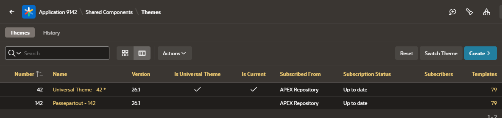

Die Dateien findest du unter *Themes › Passepartout › Files*. Die Styles verweisen mit `#THEME_DB_FILES#` darauf:

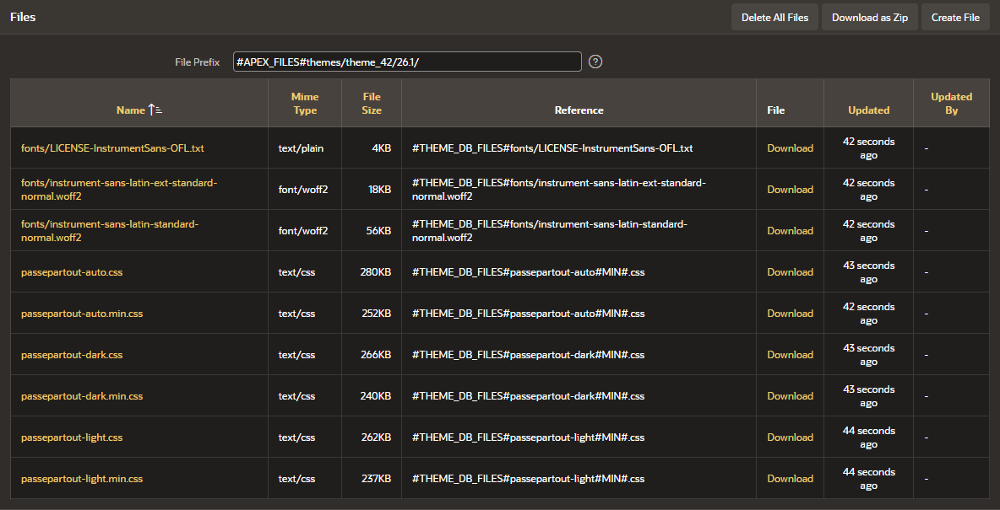

Das Skript bricht ab, **bevor es etwas ändert**, wenn:

- die Nummer 142 schon ein fremdes Theme hat (ORA-20003),
- die Static ID `passepartout` bei einem Theme mit anderer Nummer liegt (ORA-20004), etwa nach einem Import über den App Builder,
- APEX älter als 26.1 ist (ORA-20005) oder der Style-Parameter unbekannt ist (ORA-20002).

> **Wichtig:** Solange Theme 142 den UT-Master abonniert, also direkt nach der Installation, listen die APEX-Views
> `apex_application_templates` und `apex_application_temp_*` jedes Template **zweimal**. Code, der dort per
> `SELECT … INTO` ein Template über seine ID sucht, bricht dann mit *TOO_MANY_ROWS* ab. In der UT-Referenz-App
> betrifft das die Plug-in-Region *Preview Template Options* auf den Seiten 1201, 1402 und 1601: Die ganze Seite zeigt
> dann „Error in PLSQL code raised during plug-in processing“. Nach dem *Unsubscribe* (Abschnitt 3.2) oder der
> Deinstallation ist das behoben. Installiere das Theme deshalb erst kurz bevor du umschaltest.

---

## 3. Aktivieren: Backup, Unsubscribe, Switch Theme

### 3.1 Backup

*App Builder › App › Export / Import › Export* (oder `apex export -applicationid <APP_ID>` in SQLcl). **Dieses Backup ist
der einzige Rückweg** (siehe Abschnitt 7).

### 3.2 Unsubscribe

*Shared Components › Themes › Passepartout*, Bereich *Theme Subscription*. Der Bereich zeigt, dass das Theme
das Universal Theme abonniert:

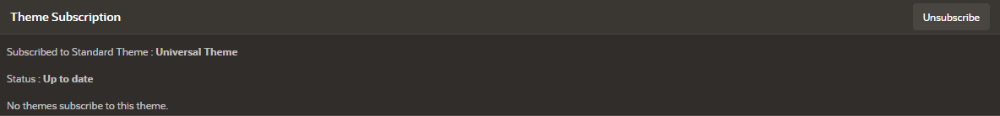

*Unsubscribe* klicken und bestätigen:

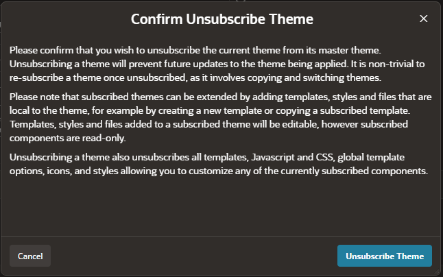

Danach ist Theme 142 eine eigene Kopie mit 69 Templates und 10 Template Components:

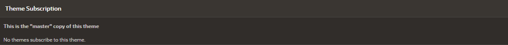

Was dabei passiert, auch wenn es der Dialog nicht sagt:

- APEX hängt **alle Template-Bezüge der App** auf die Kopien in Theme 142 um. Das gilt für Regionen, Buttons, Labels,
  Listen, Berichte und Navigation, obwohl das Universal Theme noch aktiv ist. In der Referenz-App waren es 1372 Bezüge.
  Theme 142 lässt sich danach nicht mehr einfach löschen.
- Der aktuelle Style von Theme 142 springt auf *Iris*. Setze ihn wieder auf Passepartout (Abschnitt 4), oder führe das
  Installationsskript noch einmal aus. Es setzt dann *Passepartout Light*.
- Der interne Name wird zu `UNIVERSAL_THEME`, *Is Universal Theme* erscheint mit Haken. Die Static ID `passepartout`
  bleibt erhalten, daran erkennt das Skript das Theme weiter.

**Warum der Schritt nötig ist:** Ohne *Unsubscribe* bricht *Switch Theme* mit dieser Meldung ab. Das gilt für UT 26.1
und UT 24.2 gleichermaßen, und auch für ein Theme, das APEX selbst mit *Copy Theme* angelegt hat:

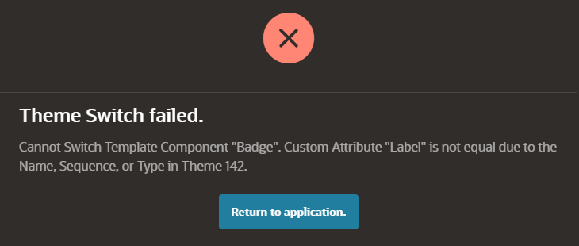

### 3.3 Switch Theme

*Shared Components › Themes › Switch Theme*.

**Schritt 1:** *Switch to Theme* = *142. Passepartout*.

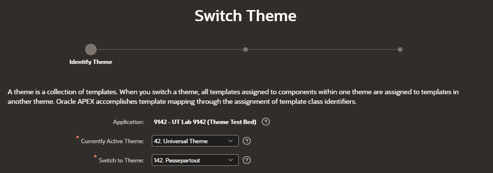

**Schritt 2:** Weil die Templates Kopien sind, ordnet APEX sie selbst zu. Es bleiben nur die Seiten-Templates *Standard*
und *Login*, beide mit Haken. Nichts ändern, *Next*.

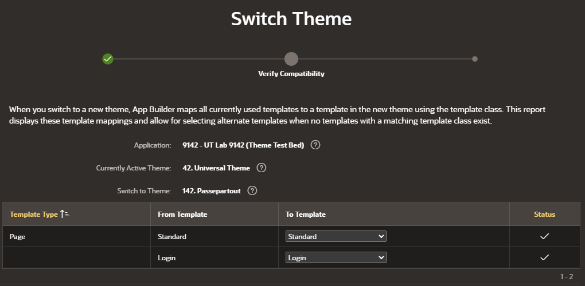

**Schritt 3:** *Switch Theme*.

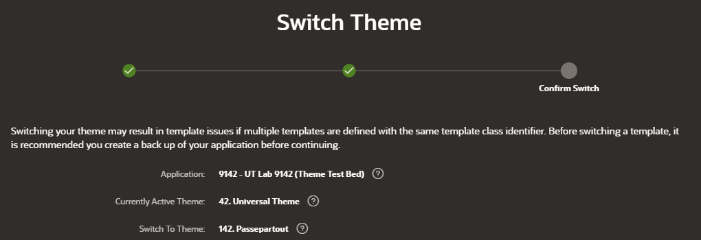

Ergebnis: *Passepartout – 142* ist das aktuelle Theme (Stern und Haken bei *Is Current*).

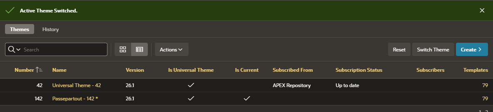

Nachgeprüft wurden alle Template-Namen und Template-Optionen von Seiten, Regionen, Items und Buttons: Sie sind vorher
und nachher gleich. Template Components wie Avatar, Comments oder Timeline funktionieren.

> **Achtung, Layout:** *Switch Theme* setzt in APEX 26.1 bei **allen** Regionen und Items *Start New Column* auf *Ja*
> und leert *Column Span*. In der Referenz-App betraf das 987 Regionen und 79 Items. Nebeneinander stehende Regionen
> rutschen dadurch untereinander. Beispiel Seite 1201, vorher:
>
> 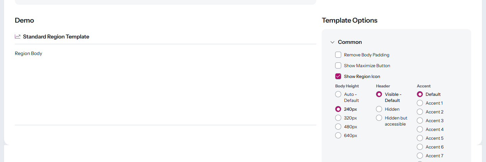
>
> Nachher steht *Template Options* unter der Demo statt daneben:
>
> 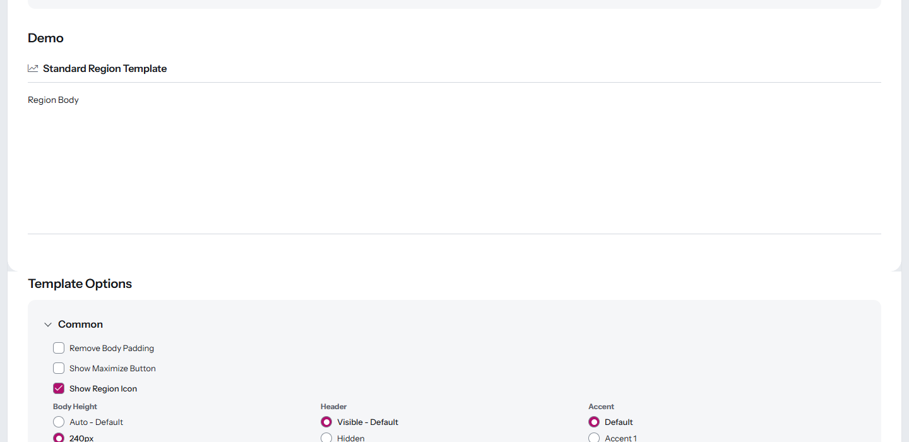
>
> Die Grid-Einstellungen der Seiten-Templates sind in beiden Themes gleich (FIXED, 12 Spalten). Das Zurücksetzen passiert
> auch mit einer von APEX selbst kopierten UT-Kopie, es liegt also nicht an Passepartout. Das Layout musst du danach von
> Hand wiederherstellen oder aus dem Backup nachziehen.

---

## 4. Style wechseln

Im App Builder: *Shared Components › Themes › Passepartout*, Bereich *Styles*, *Current Theme Style* wählen,
*Apply Changes*.

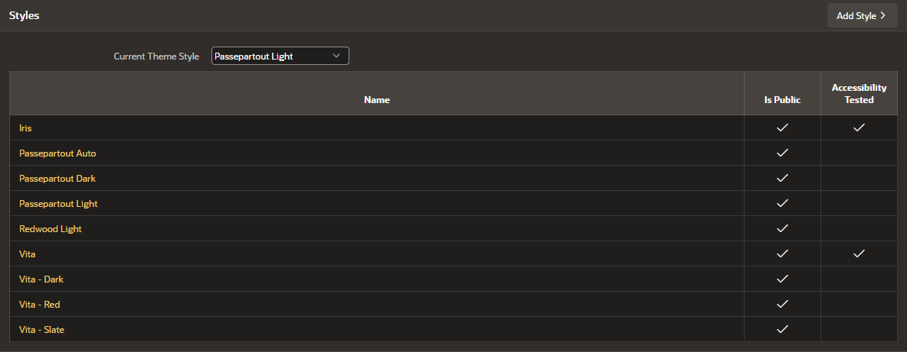

Oder per Skript. Es aktualisiert dabei nur Dateien und Styles:

```sql
@Passepartout/install/passepartout-theme-install.sql <APP_ID> dark     -- light | dark | auto
```

Die Liste zeigt neben den drei Passepartout-Styles auch die kopierten UT-Styles (Iris, Vita …). Sie stören nicht.

---

## 5. Ergebnis prüfen

Seite 1402 (Interactive Report) mit *Passepartout Light*:

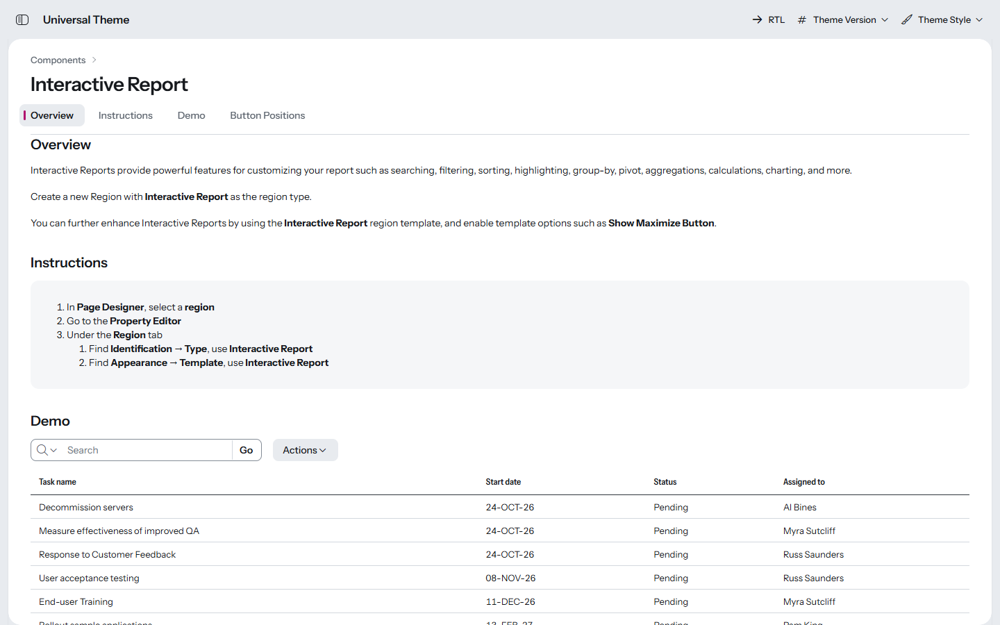

Mit *Passepartout Dark*:

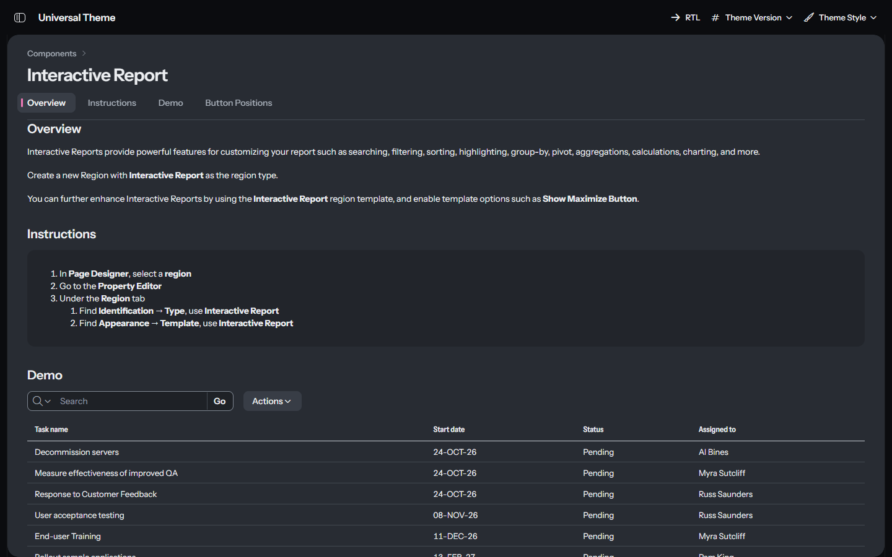

In der gerenderten Seite lädt der Style:

```html
<link rel="stylesheet" href="/i/themes/theme_42/26.1/css/Vita.min.css?v=26.1.0">
<link rel="stylesheet" href="r/hr_dev/9142/files/theme/142/v64/passepartout-light.min.css?v=1.0.0">
```

Das CSS und die Schrift `fonts/instrument-sans-latin-standard-normal.woff2` kommen mit HTTP 200.
`document.fonts` meldet *Passepartout Sans 400 700* als geladen, der Body hat die Klasse `apex-theme-passepartout-light`.
Bei *Dark* ist die Basis `Vita-Dark.min.css`. Bei *Auto* bleibt die Basis `Vita.min.css`, und das Farbschema folgt dem
Betriebssystem.

---

## 6. Export und Import über den App Builder

### Export

*Shared Components › Themes › Export Theme*, Theme *142. Passepartout*, *Export*:

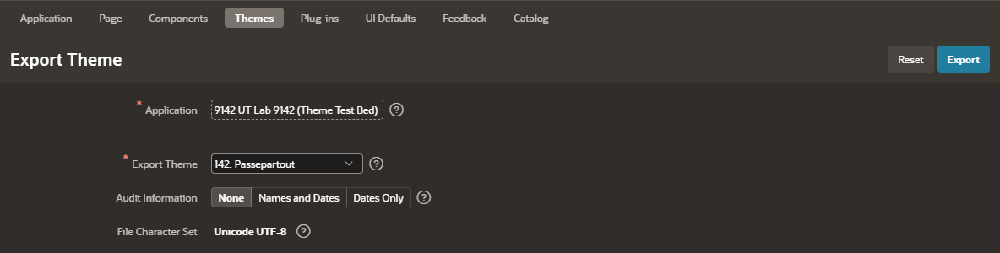

Das Ergebnis (im Test 4,6 MB, exportiert nach dem *Unsubscribe*) ist eine normale APEX-Exportdatei. Sie liegt nicht im
Repository, weil sie Kopien der Oracle-Templates enthält; erzeuge sie bei Bedarf selbst wie oben beschrieben. Inhalt:

- `delete_theme` und `create_theme` für Theme 142 *Passepartout*, ohne Abo-Referenz, also eine eigenständige Kopie,
- allen 69 Templates des Universal Themes 26.1 (11 Seite, 21 Region, 12 Bericht, 13 Liste, 7 Label, 3 Button,
  1 Breadcrumb, 1 Popup-LOV) mit Display Points,
- den 10 Template Components (Avatar, Badge, Button, Comments, Content Row, Flexbox Container, Media List, Metric Card,
  Timeline, Actions),
- 113 Template-Option-Gruppen und 539 Template-Optionen,
- 9 Theme Styles (Passepartout Light/Dark/Auto und die kopierten UT-Styles) mit *Passepartout Light* als aktuellem Style,
- den 9 Theme-Dateien (CSS, Schriften, Lizenz). `THIRD-PARTY-NOTICES.txt` fehlt: Der Schnappschuss ist älter als
  diese Datei. Ein neuer Export nach `passepartout-theme-install.sql` enthält alle 10 Dateien.

Die Theme-Static-ID `passepartout` fehlt im Theme-Export. Beim Import leitet APEX sie aus dem Namen ab, und sie kam
im Test wieder als `passepartout` heraus.

Die Datei ist ein **Schnappschuss**. `node _tools/build.mjs` erzeugt sie nicht neu. Nach einer Änderung am CSS musst
du sie deshalb erneut aus dem App Builder exportieren. Sie enthält außerdem die Templates von UT **26.1**
(`#APEX_FILES#themes/theme_42/26.1/`), auch wenn die Ziel-App noch UT 24.2 nutzt.

### Import

*App Builder › Import*, Datei wählen, *File Type* = *Theme Export*, *Next*:

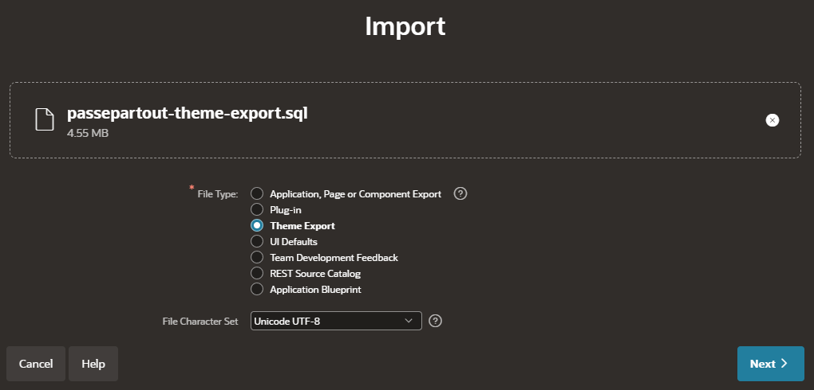

Nach *Next* die Ziel-App wählen und *Import Theme* klicken:

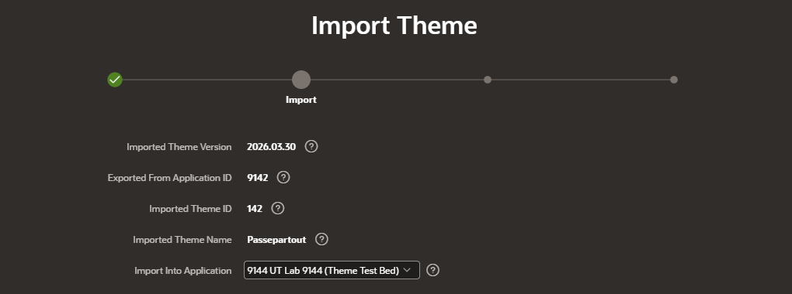

Das Theme ist danach da, allerdings unter einer **neuen Nummer**: 101 statt 142. APEX vergibt beim Theme-Import die
nächste freie Nummer.

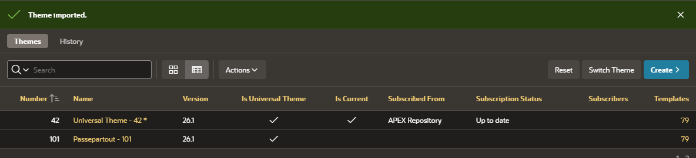

### Umschalten nach dem Import: scheitert

- Die Zuordnung in *Switch Theme* stimmt nicht mehr von selbst. In der Referenz-App standen 31 von 55 Zeilen mit
  *Multiple matches* auf einem falschen Template, meist *Standard*:

  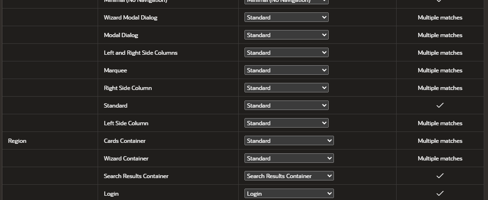

  In jeder solchen Zeile muss man von Hand das **gleichnamige** Template wählen:

  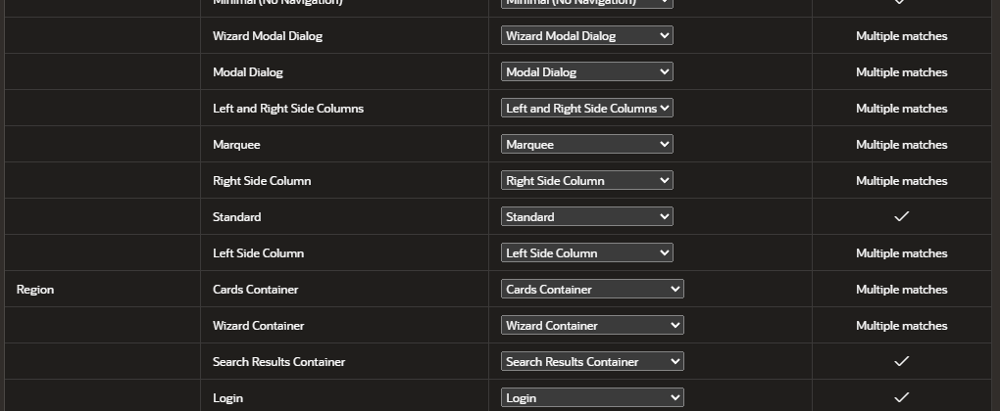

- Auch mit korrekter Zuordnung bricht *Switch Theme* an der Prüfung der Template Components ab. Die App bleibt
  dabei unverändert:

  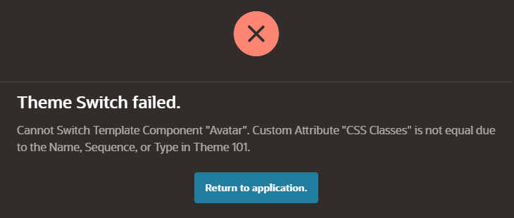

**Fazit:** Der Import über den App Builder bringt das Theme mit allen Dateien und Styles in eine andere App. Aktivieren
lässt es sich dort aber nicht, sobald die App Template Components verwendet. Für eine App ohne Template Components
wurde das nicht getestet. Der zuverlässige Weg bleibt das Skript (Abschnitt 2) mit anschließendem *Unsubscribe* und
*Switch Theme* in der Ziel-App.

---

## 7. Zurück zum Universal Theme

*Switch Theme* von *Passepartout (142)* zurück auf *Universal Theme (42)* **scheitert** ebenfalls an den Template
Components. Die App bleibt dabei unverändert:


Der Rückweg ist das Backup aus Schritt 3.1:

- App Builder: *Import*, Backup-Datei, *Reuse Application ID*.
- SQLcl: `@f<APP_ID>.sql` als Parsing-Schema.

Getestet in 9142: Nach dem Einspielen ist das Universal Theme wieder aktuell und alle 1066 Grid-Einstellungen
stehen wie vorher.

---

## 8. Aktualisieren und Deinstallieren

**Neue Passepartout-Version:** `node _tools/build.mjs Passepartout` und dann das Skript erneut ausführen. Es erkennt,
wenn Theme 142 schon entkoppelt ist (*Unsubscribe* oder Import). Dann aktualisiert es **nur Theme-Dateien und Styles**,
Templates, Template Components und Einstellungen bleiben unverändert:

```
Theme 142 ist eine entkoppelte Kopie (Unsubscribe/Import): nur Theme-Dateien und Styles werden aktualisiert, ...
```

Vor dieser Korrektur hat das Skript ein entkoppeltes Theme wieder an den UT-Master gehängt. Das Ergebnis waren
138 Templates und 20 Template Components im selben Theme. Browser holen das neue CSS über den Parameter
`?v=<Version>` aus `theme.json`. Erhöhe dort also bei jeder Änderung die Version.

**Deinstallieren:** `@Passepartout/install/passepartout-theme-uninstall.sql <APP_ID>`

| Zustand der App | Ergebnis |
|---|---|
| Theme 142 abonniert noch (nur installiert) | Theme, Dateien und Styles werden entfernt, das Universal Theme bleibt unberührt |
| Passepartout ist das aktuelle Theme | Abbruch **ORA-20006**: erst das Backup einspielen |
| nach *Unsubscribe*, Universal Theme noch aktuell | Abbruch **ORA-20007**: Die App nutzt die Template-Kopien (Beispiel: 1372 Bezüge). Erst das Backup von vor dem *Unsubscribe* einspielen |
| kein Theme 142 vorhanden | „nichts zu tun“ |

---

## 9. Bekannte Grenzen (APEX 26.1)

1. **Switch Theme auf ein abonniertes UT-Theme scheitert** („Cannot Switch Template Component …“). Das gilt auch für
   *Copy Theme* von APEX selbst. Abhilfe: *Unsubscribe* vor dem Umschalten.
2. **Unsubscribe hängt alle Template-Bezüge der App um** auf die Kopien im entkoppelten Theme. Danach lässt sich das
   Theme nicht mehr löschen (ORA-02292 bzw. ORA-20007 im Deinstaller).
3. **Switch Theme setzt das Grid-Layout zurück** (*Column Span*, *Start New Column*) bei allen Regionen und Items.
4. **Kein Rückweg per Switch Theme.** Zurück geht es nur über das Backup.
5. **Import über den App Builder:** Das Theme bekommt eine neue Nummer. Die Template-Zuordnung muss man von Hand
   korrigieren, und *Switch Theme* scheitert bei Apps mit Template Components.
6. **Doppelte Zeilen in den Template-Views**, solange Theme 142 abonniert. Das betrifft eigenen Code mit
   `SELECT … INTO` auf `apex_application_temp_*`.
7. **Keine UT-Updates** für das entkoppelte Theme. Kommt ein neues Universal Theme mit einem APEX-Upgrade, bleibt
   Passepartout auf dem Stand des *Unsubscribe*. Aktualisieren heißt dann: App aus dem Backup einspielen, das Theme neu
   installieren, *Unsubscribe*, *Switch Theme*.
8. **`files_version` nach Unsubscribe:** APEX setzt sie auf den Wert des Universal Themes zurück, im Test 64. Das
   Skript kann sie bei entkoppelten Themes nicht erhöhen. Für frisches CSS sorgt `?v=<Version>`.
9. Mit UT 24.2 verhält sich alles genauso (9143). Das entkoppelte Theme hat dann die 24.2-Templates, die Styles laden
   `…/theme_42/24.2/css/Vita.min.css`. Einzige Abweichung: Das alte Kalender-Template *Calendar* (Typ Calendar) wird
   beim *Unsubscribe* nicht mitkopiert. Das sind 68 statt 69 Templates. Die Kalender-Region auf Seite 1800 läuft trotzdem
   fehlerfrei, weil nur alte Legacy-Kalender dieses Template brauchen.

---

## 10. Testnachweise

| Test | App | Ergebnis |
|---|---|---|
| *Switch Theme* auf abonniertes Theme 142 | 9142 (26.1), 9143 (24.2) | Abbruch *Template Component „Badge“*, App unverändert |
| *Copy Theme* (APEX) → *Switch Theme* | 9144 | gleicher Abbruch |
| *Unsubscribe* → *Switch Theme* | 9142 (zweimal), 9143, 9144 (Copy Theme) | erfolgreich, Template-Namen und -Optionen gleich, Grid zurückgesetzt |
| Rückweg 142 → 42 per *Switch Theme* | 9142 | Abbruch *Template Component „Avatar“* |
| Rückweg per Backup-Import | 9142 | UT aktuell, Grid-Einstellungen 1066/1066 wie vorher |
| Theme-Export → Import im App Builder | 9142 → 9144 | Import als Theme 101 mit 9 Dateien (Stand vor `THIRD-PARTY-NOTICES.txt`) und 9 Styles; *Switch Theme* scheitert (Template Component „Avatar“) |
| Pixelvergleich Theme-Variante gegen Style-Variante in **derselben** App (Seiten 1101, 1201, 1402, 1601, 1902) | 9142: Light, Dark, Auto hell und dunkel | 20 von 20 Bildern pixelgleich (0 px) |
| dasselbe mit UT 24.2 | 9143: Light, Dark | 10 von 10 pixelgleich |
| Theme-Variante gegen Style-Variante im Testbett 9042/9242 | 9142, 9143 | 1101 gleich (0 px). Die übrigen Seiten weichen nur durch das zurückgesetzte Grid ab (0,5–6,9 % der Pixel) |
| `<link>`-URLs, HTTP-Status, Schrift | 9142, 9143 (Light, Dark, Auto) | `…/files/theme/142/v64/passepartout-*.min.css`, CSS und woff2 mit 200, *Passepartout Sans* geladen |
| Skript bei entkoppeltem Theme (aktuell und nicht aktuell) | 9142 | nur Dateien und Styles, `reference_id` bleibt leer, 69 Templates |
| Deinstaller bei aktuellem bzw. entkoppeltem Theme | 9142 | ORA-20006 bzw. ORA-20007, nichts geändert |
| Unabhängige Prüfung: Skript zweimal auf abonniertes Theme | 9144 | IDs von Theme, Styles und Dateien gleich, nur `files_version` +1; Deinstaller entfernt es, danach laufen die Seiten 1201/1402/1601 wieder |
| Unabhängige Prüfung: Theme-Variante gegen *Theme Lab* in derselben App | 9143: Light, Dark (1101, 1402, 1601) | 6 von 6 pixelgleich; ausgelieferte Theme-Dateien byte-gleich mit `dist/`, keine 404 |
| Unabhängige Prüfung: Style- und Theme-Variante nebeneinander | 9144 | Style-Installer und -Deinstaller lassen Theme 142 unberührt |

Für den Pixelvergleich in derselben App lag an Theme 142 zusätzlich der Labor-Style *Theme Lab*. Der Test-Harness
liefert dafür das CSS live aus `src/`. So unterscheidet sich nur die Auslieferung des CSS, nicht das Layout.
