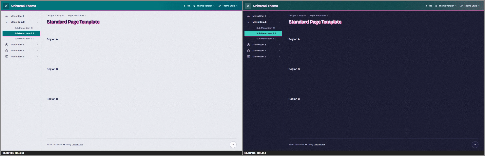
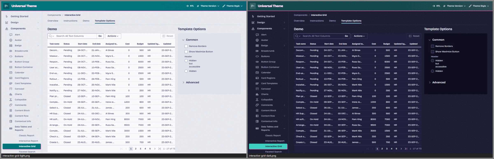
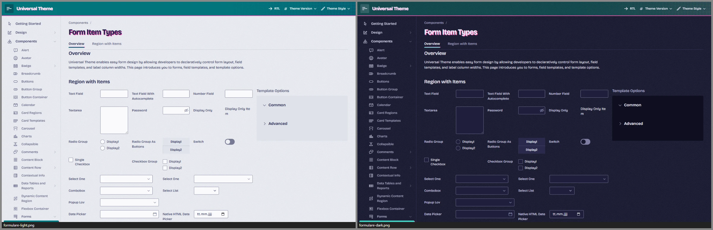
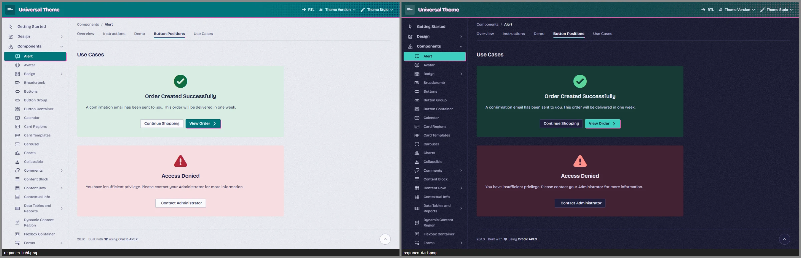
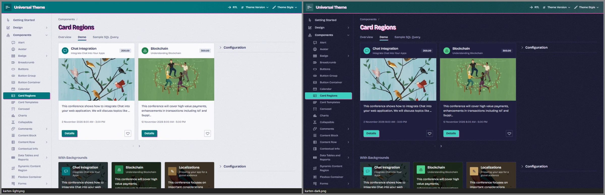
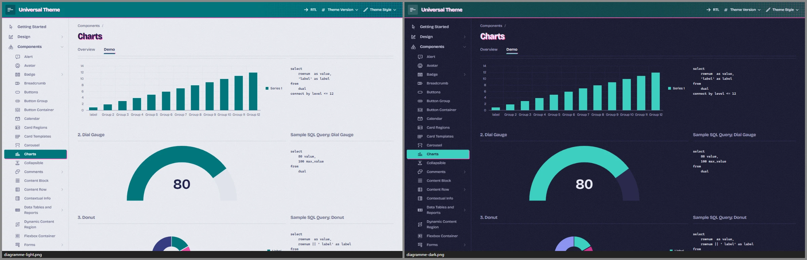
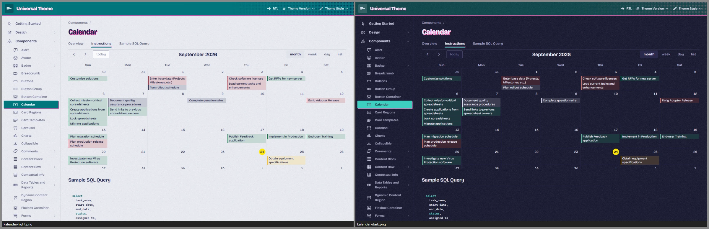
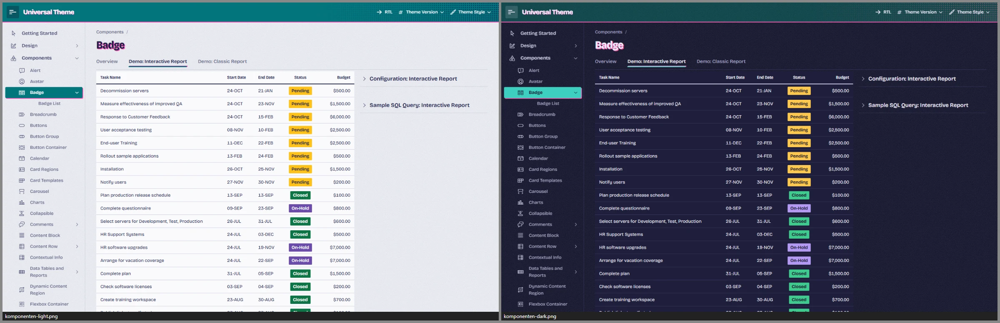
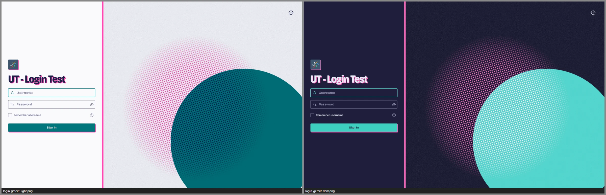
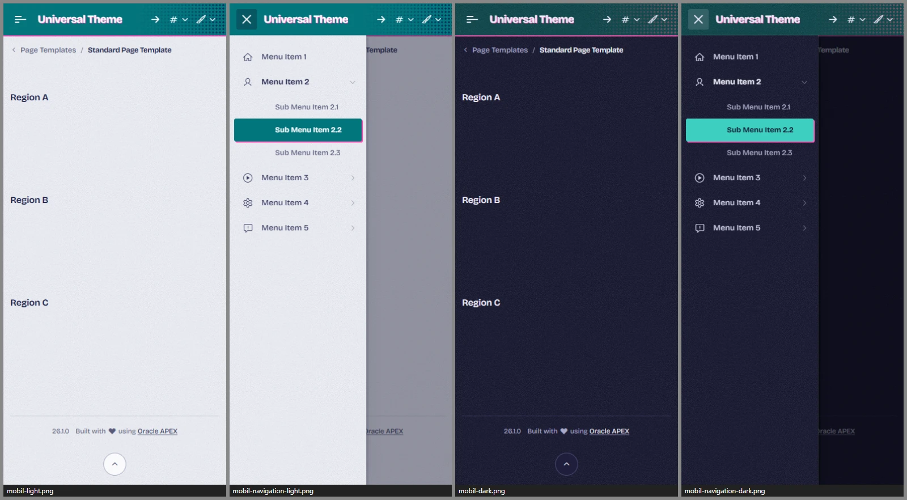

# Passer

**Ein Theme für Oracle APEX, das aussieht wie gedruckt.**
Passer übersetzt den Schablonendruck mit wenigen Neon-Schmuckfarben auf Papier in eine Arbeitsoberfläche. Der Name kommt
vom Passer, der Druckpassung zweier Farbauszüge.
Die App ist in **zwei Farben gedruckt**: Teal für alles, was man bedient, und Fluoreszenz-Pink als zweiter Farbauszug,
der ein kleines Stück verrutscht darunter liegt. Dieser **Passerversatz** ist das eine kühne Element; er sitzt nur an
Seitentitel, Logo, Hot-Buttons, Volltonbadges, aktivem Reiter und aktivem Navigationseintrag. Alles andere bleibt ruhig, dicht und gut lesbar:
Text in der Überdruck-Tusche (einem tiefen Indigo), Daten auf hellen Bögen, ein kaum sichtbares Papierkorn.



| | |
|---|---|
|  |  |
|  |  |
|  |  |
|  |  |
|  |  |



*Alle Bilder: Universal Theme Reference App, links Light, rechts Dark.*

| Style | Basis | Wofür |
|---|---|---|
| **Passer Light** („Tagdruck“) | Vita | Standard im Büro |
| **Passer Dark** („Nachtdruck“) | Vita-Dark | dunkle Umgebungen, Nachtschicht, Leitstand |
| **Passer Auto** | Vita + UT-Delta | folgt der Hell/Dunkel-Einstellung des Betriebssystems – pixelgleich zu Light bzw. Dark |

Getestet mit APEX 26.1 auf UT-Dateiversion **26.1** und **24.2**, Desktop (1440 px) und Smartphone (390 px, Touch).

---

## Die Idee

**Zwei Druckfarben, eine dritte zum Markieren.** Teal (`#00767C`) ist die Arbeitsfarbe: Primäraktion, Auswahl, Fokus,
aktive Navigation. Fluoreszenz-Pink (`#FF48B0`) trägt nie Bedeutung und nie Schrift – es ist die zweite Platte, die beim
Druck nicht ganz passt. Wo sich beide übereinander legen, entsteht ein tiefes Indigo: die Schriftfarbe. Gelb (`#FFE800`)
ist der Textmarker für Auswahl und „heute“.

**Passerversatz, der sich bewegt.** Ein Hot-Button ist ein Teal-Feld mit der Pink-Platte 2 px darunter. Beim Überfahren
driftet die Platte auf 3 px, beim Drücken rasten beide Platten ein – der Button rückt 1 px nach und steht in Passung.
Seitentitel und Logo tragen denselben Versatz als zweiten Farbauszug der Schrift, der aktive Navigationseintrag ist eine
gestempelte Druckmarke, und unter dem Teal-Kopf blitzt eine 2-px-Kante Pink hervor.

**Papier und Bögen.** Seitengrund, Navigation und Regionen liegen auf einem kühlen, leicht getönten Papier mit feinem Korn.
Tabellen, Karten, Felder, Menüs und Dialoge sind hellere Bögen darauf; schwebende Bögen werfen einen harten Versatzschatten
wie ein Blatt auf dem Stapel. Halbton-Raster erscheinen am Ende des Kopfes, im Login und in leeren Zuständen.

**Nachtdruck.** Im Dunkeln leuchten die Neonfarben auf tief indigo gefärbtem Papier (`#17172E`), die Druckfarben mischen
sich additiv statt multiplikativ. Der Text bleibt hell und kontrastreich (14,9 : 1). Das Halbton-Raster am Kopf-Ende mischt sich
nachts rosa ins Teal und ist so gedeckt, dass die Navbar-Schrift auch über einem vollen Rasterpunkt lesbar bleibt
(≥ 4,9 : 1 gemessen, mit Papierkorn); beim Überfahren deckt die Taste das Raster ab.

**Das Login ist das Plakat:** zwei Scheiben im Überdruck – Teal im Vollton, Pink im Halbton-Raster mit echtem 15°-Rasterwinkel –,
ein Titel im schmalen Plakatschnitt, der Anmeldebogen mit Schnittmarken an den Ecken. Beim Laden rastet die Passung ein
(einziger orchestrierter Moment des Themes, bei `prefers-reduced-motion` abgeschaltet).

---

## Designsystem in Kürze

| | Hell („Tagdruck“) | Dunkel („Nachtdruck“) |
|---|---|---|
| Papier (Seitengrund, Navigation, Regionen) | `#ECEEF3` | `#17172E` |
| Bogen (Tabellen, Karten, Felder, Menüs) | `#FAFAFD` | `#1E1E3A` |
| Überdruck-Tusche (Text) | `#1E2049` | `#ECEBF8` |
| Nebenschrift | `#585B7C` | `#A9A8C8` |
| Teal (Arbeitsfarbe) | Fläche `#00767C`, Text `#00696F` | Fläche `#3CCFC0`, Text `#5ADCCD` |
| Kopf | Teal `#00767C` | tiefes Teal `#0D4448` |
| Kopf-Raster (Halbtonpunkte im Überdruck) | `#FF48B0`, multipliziert → Indigo | `#84122A`, addiert → Rosa `#7E5063` |
| Fluoreszenz-Pink (Passer-Platte) | `#FF48B0` | `#FF5CB8` |
| Gelb (Marker) | `#FFE800` | `#FFE600` |
| Danger (rot, klar getrennt von Pink und Teal) | `#A91F33` | `#F46A4E` |

- **Schrift:** Bricolage Grotesque (variabel: optische Größe 12–96, Gewicht 200–800, Breite 75–100 %), selbst gehostet.
  Die optische Größe folgt der Schriftgröße: Seitentitel eng und kräftig im schmalen Plakatschnitt, Tabellenzellen offen.
  Skala 12 · 13 · 14 · 16 · 20 · 32 px, Zahlen in Tabellen, Feldern und Zählern tabellarisch. Monospace nur für Code.
- **Dichte (gemessen):** Kopfzeile 56 px, Bedienelemente 32 px, Tabellenzeilen 34 px, Tabellenköpfe 35–37 px (Classic Report 35,
  IG 36, IR 37 – jeweils mit 2-px-Grundlinie); auf Touch-Geräten (`pointer: coarse`) Bedienelemente, Zeilen und IG-Köpfe 40 px.
  Auf dem Telefon (< 640 px) stehen die Zellen von Classic Report und IR im schmalen Schnitt mit 8 px Polster:
  zweizeilige Zeilen 53 px statt 60–80 px, einzeilige bleiben 40 px (Referenz-App bei 390 px: Datum zwei- statt dreizeilig).
- **Radien:** gestanzt statt weich – Bögen 4 · Controls 3 · Checkbox und Badges 2 px, Dialoge 6 px,
  Zähler und runde Avatare als Pille.
- **Fokus:** ein System – 2-px-Ring in Teal mit Abstand, überall ≥ 3 : 1; auf dem Teal-Kopf in Papierfarbe.
- **Kontraste:** alle Text-Paare ≥ 4,5 : 1, Kanten und Zustände ≥ 3 : 1 – 81 Text- und 19 Kanten-/Fokuspaare je Modus
  (darunter die Kopfschrift über einem vollen Rasterpunkt, auch bei Hover und gedrückt),
  automatisch geprüft (`tools/check-tokens.mjs`).
- **Diagramme:** Die Druckfarben sind die Datenfarben – Teal, Pink, Überdruck-Indigo, Sonnengelb, Violett … –,
  in einer auf Farbfehlsichtigkeit optimierten Reihenfolge, keine APEX-Blautöne.

Die vollständige Token-Referenz mit allen Kontrastwerten steht in [docs/ARCHITECTURE.md](docs/ARCHITECTURE.md).

### Prüfstand (24.09.2026)

| Prüfung | Ergebnis |
|---|---|
| Vertrag: `_tools/lint.mjs Passer`, `tools/lint-tokens.mjs` | 0 Fehler (15 Hinweise: JET-Standardfarben als Attribut-Selektoren, begründete `!important`); `lint-tokens` meldet auch tote Tokens und gelesene, aber nie deklarierte Tokens – keine |
| Token-Kontraste, Palette, Farbfehlsichtigkeit: `tools/check-tokens.mjs` | alle Prüfungen bestanden, auch Kopfschrift über einem vollen Rasterpunkt (hell 13,7 : 1, dunkel 5,5 : 1; Hover/gedrückt ≥ 5,9 : 1) |
| Laufzeit-Audit, 111 Seiten der Referenz-App × hell/dunkel (UT 26.1) | 0 Oracle-Blau, 0 Überlauf, 0 JS-Fehler; die 302 Kontrast-Befunde liegen alle in fest eingefärbten Demo-Inhalten der App (Seiten 6100, 6302–6304, 6307, 6400 – siehe [Architektur §7](docs/ARCHITECTURE.md)); nach dem Feinschliff Seite für Seite unverändert |
| Core-Seiten auf dem Smartphone (390 px, Touch) und mit UT 24.2 | 0 Befunde |
| Oracle-Blau auf den Core- und Dialog-Seiten inkl. Hover, Tastatur-Fokus und geöffneter Menüs, Date Picker, Popup-LOV und Dialoge | 0 Treffer |
| Auto-Style gegen Light bzw. Dark (Core-Seiten, UT 26.1 und 24.2) | pixelgleich (0 px Abweichung) |
| Navbar-Schrift im dunklen Kopf über dem Halbton-Raster, pixelgenau (1440 und 1024 px, Telefon, UT 26.1 und 24.2, Auto) | ≥ 4,97 : 1, beim Überfahren 7,1 : 1 |
| Breite Classic Reports (12 Zusatzspalten, Standard und *Stretch Report*, 1440 und 390 px, UT 26.1 und 24.2) | letzte Spalte in Regionen mit *Body Overflow: Scroll* erreichbar – wie Vita (siehe *Grenzen*); der helle Tabellenbogen reicht bis zur letzten Spalte, passende Tabellen pixelgleich |

---

## Installation

### Mit dem Skript (empfohlen)

In SQLcl, SQL*Plus oder SQL Developer, verbunden als **Parsing-Schema der Ziel-App**:

```sql
@install/passer-install.sql 100          -- nur installieren
@install/passer-install.sql 100 light    -- installieren und Light aktivieren (light | dark | auto)
```

Das Skript

1. prüft, ob die App existiert und das Universal Theme (42) verwendet,
2. legt 10 Dateien als *Static Application Files* unter `passer/` an (3 Styles × lesbar/minifiziert, 2 Schriftdateien,
   Schriftlizenz, Drittanbieter-Hinweise),
3. registriert die Theme Styles *Passer Light / Dark / Auto*,
4. aktiviert auf Wunsch einen davon.

Mehrfaches Ausführen ist erlaubt – so wird ein Update eingespielt. Für mehrere Apps einfach je App aufrufen.

**Alle Themes auf einmal:** Das [Style-Pack](../style-pack/README.md) spielt die 15 Styles aller fünf Themes dieses Projekts mit einem Aufruf ein (`@style-pack/style-pack-install.sql 100`).

**Deinstallieren:** `@install/passer-uninstall.sql 100` – schaltet auf *Vita* zurück, deaktiviert die Styles und löscht die Dateien.
APEX hat keine API zum Löschen von Theme Styles; die deaktivierten Einträge lassen sich unter
*Shared Components › Themes › Universal Theme › Theme Styles* löschen.

### Von Hand im App Builder

1. *Shared Components › Static Application Files › Create File*: den Inhalt von `dist/` hochladen, Verzeichnis `passer`
   (die Schriften unter `passer/fonts/`).
2. *Shared Components › Themes › Universal Theme › Theme Styles › Create*, je Style:

   | Name | CSS File URLs |
   |---|---|
   | Passer Light | `#THEME_FILES#css/Vita#MIN#.css?v=#APEX_VERSION#`<br>`#APP_FILES#passer/passer-light#MIN#.css` |
   | Passer Dark | `#THEME_FILES#css/Vita-Dark#MIN#.css?v=#APEX_VERSION#`<br>`#APP_FILES#passer/passer-dark#MIN#.css` |
   | Passer Auto | `#THEME_FILES#css/Vita#MIN#.css?v=#APEX_VERSION#`<br>`#APP_FILES#passer/passer-auto#MIN#.css` |

   *Is Public* = Ja, *Read Only* = Ja, Theme-Roller-Felder leer lassen.
3. Den gewünschten Style als *Current* setzen.

### Varianten für mehrere Apps

- **Workspace-Dateien:** Dateien einmal unter *Workspace Utilities › Static Workspace Files* ablegen und in den Styles
  `#WORKSPACE_FILES#passer/…` statt `#APP_FILES#passer/…` eintragen.
- **Webserver:** `dist/` z. B. nach `/i/themes/passer/` kopieren und `#APEX_FILES#themes/passer/…` verwenden – der Webserver
  kann dann komprimieren (Bundle minifiziert 235–251 KB, gzip-komprimiert 36–39 KB).

### Benutzer wählen lassen

*Shared Components › Themes › Universal Theme › Styles › „Allow End Users to choose Theme Style“* aktivieren.
Dann können Benutzer zwischen Light, Dark und Auto wählen; per PL/SQL mit `apex_theme.set_user_style` bzw.
`apex_theme.set_session_style`.

### Als eigenes Theme (Theme-Variante, APEX 26.1)

Zusätzlich gibt es Passer als eigenständiges Theme **146** (`install/passer-theme-install.sql`). Aktiviert wird es im App Builder
mit *Unsubscribe* und *Switch Theme*; das setzt in APEX 26.1 das Spaltenlayout aller Regionen zurück und ist nur über ein
Backup umkehrbar. Ablauf und Grenzen: [docs/THEME-VARIANTE.md](docs/THEME-VARIANTE.md).

---

## Anpassen

**Für eigene Druckfarben oder eine andere Schrift** ist der saubere Weg ein eigenes Theme auf Basis von Passer:
Farben in `src/tokens/light.css` + `dark.css`, Maße, Passerversatz und Schrift in `scale.css` ändern, dann prüfen und bauen.

**Kleine Anpassungen direkt in einer App** (App-CSS lädt nach dem Theme Style und gewinnt). Die Brücke löst alle Tokens auf
`:root` auf – Überschreibungen müssen deshalb ebenfalls auf `:root` stehen:

```css
/* User Interface Attributes › CSS › Inline */
html:has(> body.apex-theme-passer-light) {      /* nur im Light-Style */
  --pa-plate: #FFE800;                        /* Gelb statt Pink als zweite Platte */
  --pa-header-plate: #FFE800;
  --pa-passer: 3px;                           /* kräftigerer Versatz */
}
:root { --pa-grain: none; }                   /* ohne Papierkorn */
.t-Header { box-shadow: none; }               /* ohne Pink-Kante unter dem Kopf */
```

Für den Dark-Style gilt dasselbe mit `body.apex-theme-passer-dark`, für Auto mit `@media (prefers-color-scheme: dark)`.
Welche Tokens es gibt und welche Kontraste einzuhalten sind: [docs/ARCHITECTURE.md](docs/ARCHITECTURE.md).

---

## Empfehlungen für Seiten

- **Eine Hauptaktion je Bereich.** Der Hot-Button mit Pink-Platte ist die lauteste Stelle der Seite; stehen mehrere davon
  nebeneinander, verliert der Passer seine Wirkung. Weitere Aktionen als normale Buttons (Bogen mit Kontur) oder *Primary*.
- **Freigeben / Ablehnen nebeneinander:** Freigeben als *Hot*, Ablehnen als *Danger* mit *Simple*.
- **Badges:** Volltonbadges tragen die Platte; in Berichten, Grids und Karten-Listen erscheinen sie automatisch ohne –
  für ruhige Statusanzeigen *Subtle* verwenden.
- **Hinweise:** *Alert* ohne „Highlight Background“ ist eine ruhige Rastertönung; mit „Highlight Background“ bekommt er die Statustönung.

---

## Grenzen

- **Ein Theme Style kann kein JavaScript mitbringen.** Im Auto-Style behalten JET-Diagramme beim *Live*-Umschalten
  des Betriebssystems ihre alten Textfarben, bis sie neu gezeichnet werden (Seitenaufruf genügt).
- **Mobile Schublade:** Esc schließt sie nicht – APEX bindet dafür keinen Handler.
- **Breite Classic Reports** scrollen waagerecht dort, wo das Universal Theme einen Scroll-Container vorsieht: in Regionen
  mit *Body Overflow: Scroll* (Standard der Region-Vorlage). Geprüft mit 12 zusätzlichen Spalten, Standard und
  *Stretch Report*, Desktop und Telefon, UT 26.1 und 24.2: die letzte Spalte ist erreichbar; Passer setzt an Tabelle,
  Tabellen-Wrapper und Region-Körper kein `overflow: clip/hidden`. Der helle Tabellenbogen wächst mit der Tabelle mit –
  auch die hineingescrollten Spalten liegen auf dem Bogen, nicht auf dem Papier. Mit *Body Overflow: Hide* und in einem *Content Block*
  (z. B. Seite 1401 der Referenz-App) gibt es – wie in Vita – keinen Scroll-Container: auf dem Desktop scrollt dann die
  ganze Seite, auf dem Telefon bleiben Spalten jenseits der Bildschirmbreite unerreichbar (UT schneidet dort am Formular ab,
  `form#wwvFlowForm { overflow: clip }`). Das bleibt bewusst beim UT-Verhalten; für breite Berichte *Body Overflow: Scroll* verwenden.
- **Telefon-Tabellen:** Zellen mit Datumswerten wie `24-OCT-26` brechen in schmalen Spalten am Bindestrich um
  (Zeilenumbruch-Regel des Browsers) – Zeilen mit vier Textspalten bleiben daher bei 390 px zweizeilig (53 px).
- **Aktiver Navigationseintrag am unteren Rand:** Die APEX-TreeView scrollt ihn nur ins Bild, wenn seine Oberkante
  unterhalb der Leiste liegt. Steht er knapp am unteren Rand (z. B. *Form Item Types* bei 900 px Fensterhöhe), bleibt er
  angeschnitten – Verhalten des APEX-Widgets, unabhängig vom Style.
- **App- und Seiten-CSS gewinnt** (lädt nach dem Theme Style). Fest codierte Farben in Apps wirken also auch im Dark-Style.
- **Tritanopie:** Das Danger-Rot der Nacht und die Pink-Platte liegen für Tritanope nah beieinander. Die Platte trägt deshalb nie
  Bedeutung; Fehler zeigen immer Symbol und Text.
- **Karten-Kacheln** (MapLibre) und Bilder werden nicht eingefärbt; die Bedienelemente schon.
- **UT-Versionen:** geprüft mit UT 24.2 und 26.1 auf APEX 26.1. Metric Card und Flexbox Container gibt es erst ab UT 26.1.
- **Größe:** 235–251 KB CSS je Style, minifiziert (Light 235, Dark 238, Auto 251 KB; gzip Stufe 6: 36,1 / 36,9 / 39,1 KB,
  also höchstens 39 KB; Brotli 29–32 KB) plus 181 KB Schrift. ORDS liefert Static Application Files unkomprimiert,
  dank versionierter URL aber nur einmal pro Update.
- **Installation in APEX geprüft (24.09.2026):** Der Style-Installer lief in der UT-Referenz-App (UT 26.1). 28 von 28
  Seitenvergleichen (7 Kernseiten × Light, Dark, Auto hell, Auto dunkel) sind pixelgleich zum Labor-Style; der
  Deinstaller hat Styles deaktiviert, alle Dateien entfernt und Vita wieder aktiviert. Die Theme-Variante (146) wurde
  installiert, geprüft (Dateien per HTTP 200, 3 Styles) und wieder entfernt.
- **Kein Theme-Roller-Addon.** Farbanpassungen über ein eigenes Theme oder App-CSS (siehe *Anpassen*).

---

## Dateien

```
Passer/
├── theme.json                 Styles, Basis, Einstiegsdateien, Theme-Variante 146
├── src/
│   ├── passer-{light,dark,auto}.css   Einstiegspunkte
│   ├── tokens/                light.css, dark.css (Farben, Korn), scale.css (Maße, Schrift, Passer, Dichte), print.css
│   ├── bridge.css             --pa-* → UT-/APEX-/JET-Variablen (inkl. aller Vita-Hex-Kopien der Primärfarbe)
│   ├── base.css, fonts.css
│   └── components/            shell, login, regions, buttons, forms, overlays, reports, search, cards, content, viz, utilities
├── assets/fonts/              Bricolage Grotesque (OFL 1.1) + Lizenz
├── assets/THIRD-PARTY-NOTICES.txt  Drittanbieter-Hinweise (Schrift, MapLibre BSD-3-Clause, UT-Delta, Marken)
├── dist/                      gebündelte CSS-Dateien             ← node _tools/build.mjs Passer
├── install/                   passer-install.sql / -uninstall.sql (Styles)
│                              passer-theme-install.sql / -theme-uninstall.sql (Theme 146)
├── docs/ARCHITECTURE.md       Token-Vertrag und Regeln          ← node Passer/tools/build-architecture.mjs
├── docs/THEME-VARIANTE.md     Theme-Variante: Ablauf und Grenzen
├── tools/                     check-tokens.mjs (Kontraste, Farbfehlsichtigkeit, Blau-Abstand), lint-tokens.mjs,
│                              screenshots.mjs, gen-token-tables.mjs, build-architecture.mjs
└── screenshots/               Vorschaubilder
```

## Lizenz

Theme-CSS: MIT. Schrift *Bricolage Grotesque* © 2022 The Bricolage Grotesque Project Authors (Mathieu Triay),
SIL Open Font License 1.1 (`assets/fonts/LICENSE-BricolageGrotesque-OFL.txt`); eingebunden unter dem eigenen
Familiennamen „Passer Grotesk“, unverändert als WOFF2 aus `@fontsource-variable/bricolage-grotesque` 5.3.0.
`_shared/ut-dark-delta.css` (im Auto-Style enthalten) ist aus den Universal-Theme-Dateien von Oracle abgeleitet und
unterliegt deren Lizenz – es wird nur zusammen mit Oracle APEX verwendet.
Die Masken der Karten-Steuerelemente (`components/viz.css`) zeichnen die Symbolformen von MapLibre GL JS nach
(BSD-3-Clause, © MapLibre contributors, © Mapbox), das APEX für Karten-Regionen mitliefert.
Beides nennt der Kopfkommentar jedes Bundles (er bleibt auch minifiziert erhalten). Die vollständigen Hinweise mit dem
BSD-Lizenztext stehen in [`assets/THIRD-PARTY-NOTICES.txt`](assets/THIRD-PARTY-NOTICES.txt); die Datei wird mit ausgeliefert
(`dist/THIRD-PARTY-NOTICES.txt`, im Installer als `passer/THIRD-PARTY-NOTICES.txt`). Die Übersicht für alle Themes des
Projekts: [`THIRD-PARTY-NOTICES.md`](../THIRD-PARTY-NOTICES.md) im Projektwurzelordner.

