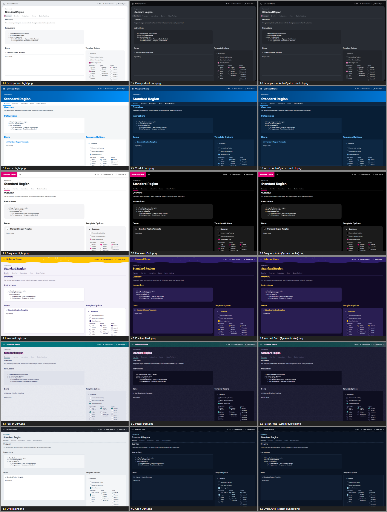
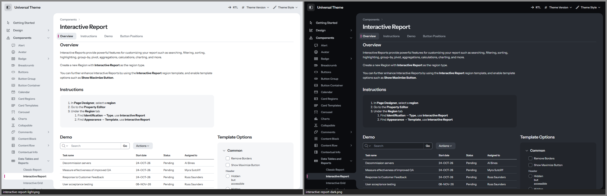
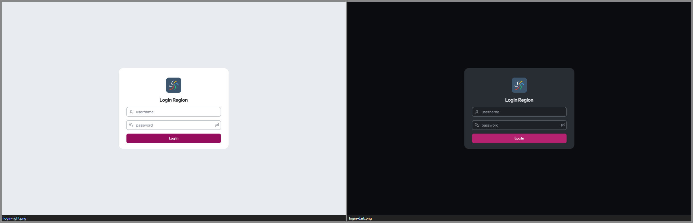
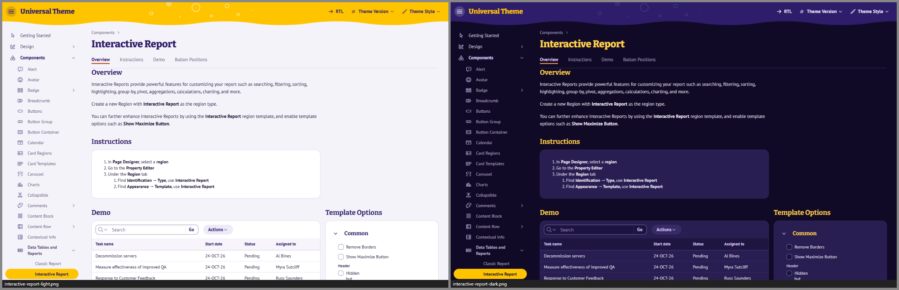
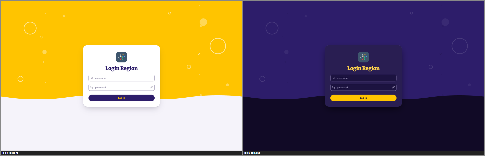
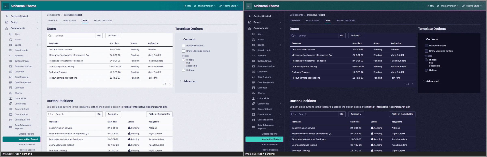
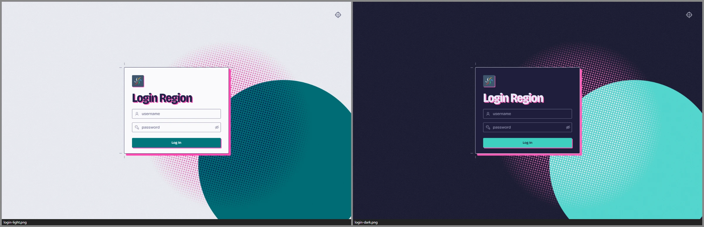
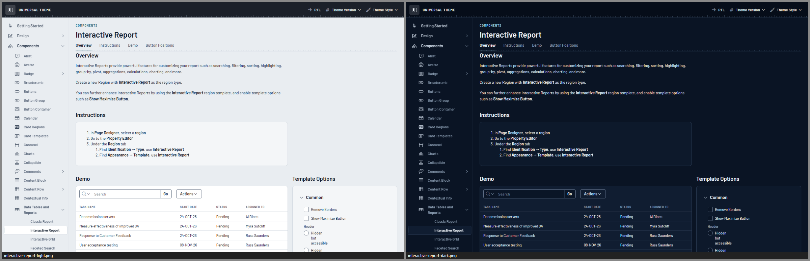
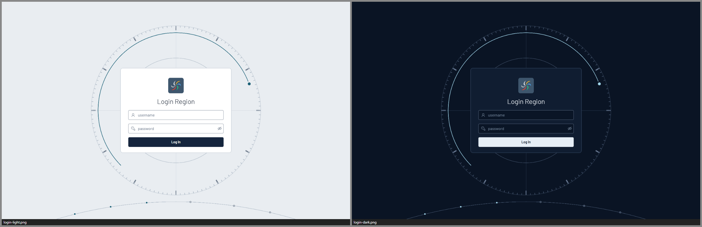

# Oracle APEX UT42 Styles

Sechs eigenständige Designs für Oracle APEX, gebaut als **Theme Styles für das Universal Theme (Theme 42)**.
Jedes Design bringt einen hellen, einen dunklen und einen automatischen Style mit (Auto folgt der Hell/Dunkel-Einstellung
des Betriebssystems) und lässt sich per SQL-Skript in jede bestehende UT-App einspielen – ohne eine einzige Seite zu ändern.

| Theme | Charakter | Schrift | Styles |
|---|---|---|---|
| [**Passepartout**](Passepartout/README.md) | Kopf und Navigation bilden einen ruhigen Rahmen, der Inhalt liegt auf einer eingesetzten, gerundeten Leinwand; einziger Akzent ist ein Kartenmagenta. | Instrument Sans | Light · Dark · Auto |
| [**Veedel**](Veedel/README.md) | Kopfband in tiefem Blau, der Seitentitel groß und weiß auf einem Blauverlauf, weiße eckige Flächen, Signalrot nur für die Hauptaktion. | Figtree | Light · Dark · Auto |
| [**Frequenz**](Frequenz/README.md) | Weiße Seite, hellgraue Tafeln mit großen Radien, ein Magenta-Block mit dem App-Namen oben links, Kontur-Buttons und runde Icon-Buttons. | Onest | Light · Dark · Auto |
| [**Kracherl**](Kracherl/README.md) | Sonniges Biergarten-Theme: gelbes Kopfband mit Wellenkante und Sprudelblasen, weiße Etiketten-Karten auf Lavendel, Überschriften in Violett. | Bitter, PT Sans | Light · Dark · Auto |
| [**Passer**](Passer/README.md) | Zweifarbendruck auf kühlem Papier: Teal und Fluoreszenz-Pink mit leichtem Passerversatz, Text in Indigo-Tusche, dezentes Papierkorn. | Bricolage Grotesque | Light · Dark · Auto |
| [**Orbit**](Orbit/README.md) | Bedienkonsole eines Raumschiffs: Navy-Panels mit feinen Haarlinien, gesperrte Versal-Labels, Telemetrie-Zahlen, Warnungen im Bernstein-Rahmen; hell als weiße Kabine. | Barlow | Light · Dark · Auto |

Alle Schriften stehen unter der SIL Open Font License und werden selbst gehostet; es werden keine externen Dienste geladen.

---

## Screenshots

Alle 18 Styles auf der Seite *Standard Region* der Universal Theme Reference App – je Zeile ein Theme, von links
Light, Dark und Auto bei dunklem Betriebssystem:



Die Anmeldeseiten aller Styles: [style-pack/alle-logins.png](style-pack/alle-logins.png).
Jede Theme-README zeigt weitere Bilder (Navigation, Formulare, Interactive Report und Grid, Karten, Diagramme,
Kalender, Template Components, Smartphone).

### Passepartout




### Veedel


### Frequenz


### Kracherl




### Passer




### Orbit




---

## Installation

### Voraussetzungen

- Oracle APEX **24.2 oder neuer** (getestet mit APEX 26.1) und eine App mit dem **Universal Theme 42**
  in der Dateiversion 24.2 oder 26.1.
- **SQLcl**, **SQL*Plus** oder **SQL Developer** (Skript ausführen mit F5), verbunden als **Parsing-Schema der Ziel-App**
  (oder mit der Rolle `APEX_ADMINISTRATOR_ROLE`).
- Dieses Repository lokal – per `git clone` oder als ZIP. Die Skripte werden aus dem Projektordner aufgerufen;
  die fertigen Installer liegen bereits in `<Theme>/install/` und `style-pack/`, ein eigener Build ist nicht nötig.

```bash
git clone https://github.com/Hustenreizjuengling/Oracle-Apex-UT42-Styles.git
cd Oracle-Apex-UT42-Styles
sql <benutzer>@<datenbank>        # als Parsing-Schema der App anmelden
```

### Alle Styles auf einmal (Style-Pack)

Das Style-Pack spielt alle 18 Styles mit einem Aufruf in eine App ein:

```sql
-- Aufbau: @style-pack/style-pack-install.sql <APP_ID> [<präfix>-<style>] [user]
@style-pack/style-pack-install.sql 100                          -- alle Styles anlegen, nichts umschalten
@style-pack/style-pack-install.sql 100 passer-dark              -- anlegen und Passer Dark aktivieren
@style-pack/style-pack-install.sql 100 veedel-auto user         -- zusätzlich Nutzerwahl einschalten
```

- **Parameter 2** aktiviert einen Style. Möglich sind `passepartout-`, `veedel-`, `frequenz-`, `kracherl-`,
  `passer-` und `orbit-` jeweils mit `light`, `dark` oder `auto`. Ohne Angabe (oder mit `-`) bleibt der aktive Style unverändert.
  Ein unbekannter Wert bricht ab, bevor etwas geändert wird.
- **Parameter 3** `user` schaltet *Allow End Users to choose Theme Style* ein; dann wählt jeder Benutzer seinen Style selbst.

Einzelheiten und die Tabelle aller Styles: [style-pack/README.md](style-pack/README.md).

### Ein einzelnes Theme

Jedes Theme hat einen eigenen Installer mit derselben Logik:

```sql
-- Aufbau: @<Theme>/install/<präfix>-install.sql <APP_ID> [light|dark|auto]
@Passepartout/install/passepartout-install.sql 100              -- nur installieren
@Veedel/install/veedel-install.sql 100 light                   -- installieren und Light aktivieren
@Frequenz/install/frequenz-install.sql 100 dark
@Kracherl/install/kracherl-install.sql 100 auto
@Passer/install/passer-install.sql 100 light
@Orbit/install/orbit-install.sql 100 dark
```

Das Skript prüft die Parameter und die Ziel-App, legt die CSS-, Schrift- und Lizenzdateien als *Static Application Files*
unter `#APP_FILES#<präfix>/` ab und registriert die drei Theme Styles. An Seiten, Regionen und Templates ändert es nichts.

### Style auswählen

- **Im App Builder:** *Shared Components › Themes › Universal Theme › Theme Styles* – den gewünschten Style auf
  *Current* setzen.
- **Pro Benutzer:** *Allow End Users to choose Theme Style* einschalten (oder Parameter `user` des Style-Packs); per PL/SQL
  geht es mit `apex_theme.set_user_style` bzw. `apex_theme.set_session_style`.

### Update

Denselben Aufruf noch einmal ausführen – Dateien und Styles werden ersetzt, der aktive Style bleibt. Jede Style-URL trägt
einen Inhalts-Hash (`…/<präfix>-light.min.css?v=<hash>`); Browser laden nach einem Update deshalb sofort das neue CSS,
obwohl APEX App-Dateien mit langer Cache-Dauer ausliefert.

### Deinstallation

```sql
@style-pack/style-pack-uninstall.sql 100                        -- alle Themes
@Veedel/install/veedel-uninstall.sql 100                        -- ein einzelnes Theme
```

Ist einer der Styles aktiv, schaltet der Deinstaller auf *Vita* zurück. Er deaktiviert die Styles und löscht die Dateien.
APEX bietet keine API zum Löschen von Theme Styles; die deaktivierten Einträge lassen sich im App Builder unter
*Theme Styles* entfernen.

### Ohne SQL-Skript: von Hand im App Builder

1. *Shared Components › Static Application Files › Create File*: den Inhalt von `<Theme>/dist/` hochladen, Verzeichnis
   `<präfix>/` (die Schriften unter `<präfix>/fonts/`).
2. *Shared Components › Themes › Universal Theme › Theme Styles › Create*, je Style mit zwei *CSS File URLs*, z. B. für
   Veedel Light:
   ```
   #THEME_FILES#css/Vita#MIN#.css?v=#APEX_VERSION#
   #APP_FILES#veedel/veedel-light#MIN#.css
   ```
   Für Dark lautet die erste Zeile `…/Vita-Dark#MIN#.css…`, für Auto wieder `…/Vita#MIN#.css…`.
3. Den Style auf *Current* setzen.

Die genaue Tabelle steht im Abschnitt *Installation* der jeweiligen Theme-README, z. B.
[Passepartout/README.md](Passepartout/README.md#installation).

### Optional: als eigenes Theme (Theme-Variante)

Jedes Design gibt es zusätzlich als eigenständiges Theme (ab APEX 26.1; Passepartout 142, Veedel 143, Frequenz 144,
Kracherl 145, Passer 146, Orbit 147): `@<Theme>/install/<präfix>-theme-install.sql <APP_ID>`. Es erscheint unter
*Shared Components › Themes*. Das Umschalten per *Switch Theme* hat in APEX 26.1 aber deutliche Nebenwirkungen
(unter anderem wird das Spaltenlayout zurückgesetzt). Für bestehende Apps sind die Theme Styles der empfohlene Weg;
Details in [Passepartout/docs/THEME-VARIANTE.md](Passepartout/docs/THEME-VARIANTE.md).

---

## Alle Styles ausprobieren

Am schnellsten geht das mit der *Universal Theme Reference App* von Oracle (122 Seiten, praktisch jede UT-Komponente):

```bash
node _tools/setup-testbed.mjs                 # lädt die Exportdatei nach _tmp/testbed/ (Node.js ≥ 20)
```

```sql
-- aus dem Projektordner, als Parsing-Schema; <WORKSPACE>/<SCHEMA> anpassen
@_tools/sql/install-showcase-app.sql _tmp/testbed/ut-26.1.sql 9000 THEME-SHOWCASE "Theme Showcase" <WORKSPACE> <SCHEMA> AUTO
@style-pack/style-pack-install.sql 9000 passepartout-light
```

In der App schaltet das Menü **Theme Style** oben rechts für die eigene Sitzung zwischen allen 18 Styles und den
Standard-Styles des Universal Themes um.

---

## Wie es funktioniert

APEX kennt zwei Ebenen:

- **Theme** – die Templates (Seiten, Regionen, Buttons, Listen …) samt HTML. Ein eigenes Theme hieße: jede App müsste
  per „Switch Theme“ umgestellt werden; Template-Optionen, Template Components und Layout-Einstellungen würden brechen.
- **Theme Style** – eine Liste von CSS-Dateien, die *auf* das Universal Theme geladen werden. Umschalten geht per Klick
  (oder pro Benutzer), jede UT-App funktioniert sofort, und ein Update des Universal Themes bricht nichts.

Deshalb ist jedes Design hier ein Satz Theme Styles – so, wie auch *Vita*, *Vita – Dark*, *Redwood Light* und *Iris*
aufgebaut sind.

```
app_ui Core.css · Theme-Standard.css · Font APEX        ← APEX-Laufzeit
#THEME_FILES#css/Core.css                                ← Universal Theme (24.2 bzw. 26.1)
#THEME_FILES#css/Vita.css  bzw.  Vita-Dark.css           ← Basis: vollständiger Satz UT-Variablen
#APP_FILES#<präfix>/<präfix>-<style>.min.css            ← Bundle des Themes: Tokens + Komponenten
```

Das Bundle wird nach Vita geladen und überschreibt die UT-Variablen (`--ut-*`, `--a-*`) mit eigenen Tokens. Wo Vita Farben
fest in Selektoren schreibt (z. B. Hot-Buttons, Tree-Navigation), deklarieren die Themes dieselben Selektoren neu. Weil die
Basis über `#THEME_FILES#` kommt, nimmt jede App automatisch die zu ihrer UT-Version passende Datei – ein Bundle
funktioniert für **UT 24.2 und 26.1** gleichermaßen.

**Auto-Style:** Ein Theme Style kann nur eine Basisdatei laden. Der Auto-Style lädt deshalb Vita und bringt das Delta
*Vita → Vita-Dark* (178 Variablen, 38 Regeln) selbst mit – eingebettet in `@media (prefers-color-scheme: dark)`.
Auto ist damit pixelgleich zu Light bzw. Dark.

**Geprüft** wurde jedes Theme gegen alle Seiten der Reference App mit UT 26.1 und 24.2: WCAG-Kontraste (Text ≥ 4,5 : 1,
Bedienelemente und Fokus ≥ 3 : 1), keine Reste der Vita-Farben, kein Überlauf, keine Skriptfehler, Auto pixelgleich zu
Light/Dark, Smartphone-Ansicht; die SQL-Installer wurden in APEX eingespielt und pixelgenau gegen den Entwicklungsstand
verglichen. Die Zahlen stehen im Abschnitt *Prüfstand* bzw. *Grenzen* jeder Theme-README.

---

## Selbst bauen und weiterentwickeln

Voraussetzungen: Node.js ≥ 20, Google Chrome (für Screenshots), SQLcl mit gespeicherter Verbindung, `npm install`.
Die Verbindungsdaten (ORDS-Adresse, Workspace, SQLcl-Verbindung) stehen in [`_tools/config.mjs`](_tools/config.mjs)
und lassen sich per Umgebungsvariable überschreiben.

```bash
node _tools/build.mjs Veedel          # Bundles + Installer eines Themes
node _tools/build.mjs --all --pack    # alle Themes und das Style-Pack
node _tools/lint.mjs Veedel           # Regeln des Token-Vertrags prüfen
```

**Testbett:** Entwickelt wird gegen zwei Kopien der Reference App (UT 26.1 als App 9042, UT 24.2 als App 9242) mit dem
Labor-Style *Theme Lab*. Dessen CSS-Anfragen fängt ein Test-Harness im Browser ab und liefert das Theme live aus
`src/` – ohne Build und ohne Upload nach APEX:

```bash
node _tools/setup-testbed.mjs --run                              # Reference Apps laden und als 9042/9242 installieren
sql -name <verbindung> @_tools/sql/setup-testbed-lab-style.sql   # Labor-Style "Theme Lab" registrieren und aktivieren
```

| Befehl | Zweck |
|---|---|
| `node _tools/shoot.mjs --theme Veedel --style light,dark --pages core --out <ordner>` | Screenshots (auch `--mobile`, `--app 9242`, `--click`, `--hover`, `--full`, `--mask-images`) |
| `node _tools/audit.mjs --theme Veedel --style light,dark --pages all --out <ordner>` | Laufzeit-Audit: Vita-Blau, WCAG-Kontrast, Überlauf, Skriptfehler |
| `node _tools/audit-blue.mjs --theme Veedel --pages core --states --overlays --out <datei>` | strenges Blau-Audit inkl. Hover/Fokus und geöffneter Menüs/Dialoge |
| `THEME=Veedel VERIFY_OUT=<ordner> bash _tools/verify-auto.sh core` | Auto-Style pixelgleich zu Light/Dark? |
| `node _tools/pixel-diff.mjs a.png b.png` | pixelgenauer Bildvergleich |
| `node _tools/contact-sheet.mjs --out x.png --dir <ordner>` | Kontaktbogen aus Screenshots |
| `node _tools/gen-dark-delta.mjs` | `_shared/ut-dark-delta.css` aus den UT-Dateien neu erzeugen |
| `node _tools/new-theme.mjs Kompass --token ko` | neues Theme als Kopie anlegen (Präfix, Tokens, Dateien umbenannt) |

Seiten für `--pages`: Seiten-IDs/Aliase und die Sets `core`, `shell`, `regions`, `lists`, `reports`, `components`,
`forms`, `dialogs`, `misc`, `all` – als Kommaliste auch gemischt (siehe [`_tools/testbed-pages.json`](_tools/testbed-pages.json)).
Wie weit ein Theme über die Tokens hinausgeht (Shell, Regionen, Tabellen …), beschreibt `<Theme>/docs/ARCHITECTURE.md`.
Hintergrundwissen zum Universal Theme (alle CSS-Variablen, Shell, Komponenten, Reports, Aufbau der Styles) steht in
[`_docs/`](_docs/); weitere Design-Prototypen liegen in [`_concepts/`](_concepts/).

---

## Projektstruktur

```
├── Passepartout/ Veedel/ Frequenz/ Kracherl/ Passer/ Orbit/
│   ├── README.md            Bilder, Designsystem, Installation, Anpassen, Grenzen
│   ├── theme.json           Name, Präfix, Version, Styles, Theme-Variante
│   ├── src/                 Quell-CSS: tokens/, bridge.css, base.css, components/*.css
│   ├── assets/              Schriften (OFL) und THIRD-PARTY-NOTICES.txt
│   ├── dist/                gebündeltes CSS (lesbar + .min), Schriften, Hinweise
│   ├── install/             SQL-Installer und -Deinstaller (Styles und Theme-Variante)
│   ├── docs/                ARCHITECTURE.md (Token-Vertrag), THEME-VARIANTE.md
│   ├── screenshots/         Bilder für die README
│   └── tools/               theme-eigene Prüfskripte
├── style-pack/              alle 18 Styles in einem Aufruf, Übersichtsbilder
├── _concepts/               Design-Prototypen
├── _docs/                   Anatomie des Universal Themes
├── _shared/                 theme-übergreifend: ut-dark-delta.css (für Auto-Styles)
├── _tools/                  Build, Style-Pack, Test-Harness, Audits, Installer-Generator, Testbett-Setup
└── THIRD-PARTY-NOTICES.md   Hinweise zu Drittanbieter-Inhalten
```

---

## Grenzen

- Getestet auf **APEX 26.1** mit der UT-Dateiversion **24.2** und **26.1**. Die Installer nutzen dieselben Import-APIs wie
  APEX-Exporte und sind für APEX ≥ 24.2 geschrieben; auf einer echten 24.2-Instanz sind sie ungetestet.
- APEX bietet keine API zum Löschen von Theme Styles. Die Deinstallation deaktiviert sie; löschen geht im App Builder.
- Ein Theme Style kann kein JavaScript mitbringen. Was nur mit JS ginge (z. B. JET-Charts beim Live-Umschalten im
  Auto-Style neu einfärben), bleibt eine Grenze.
- App- und Seiten-CSS laden nach dem Theme Style und gewinnen – fest eingefärbte Inhalte einer App übernimmt kein Style.

---

## Lizenzen

Die Themes stehen unter der [MIT-Lizenz](LICENSE), die Schriften unter der SIL Open Font License 1.1 (Lizenzdatei jeweils
in `<Theme>/assets/fonts/` und `<Theme>/dist/fonts/`). Zwei Bestandteile stammen von Dritten; Einzelheiten und die
vollständigen Lizenztexte stehen in [THIRD-PARTY-NOTICES.md](THIRD-PARTY-NOTICES.md):

- **Kartensymbole:** Die Bedienelemente von Karten-Regionen werden als CSS-Masken neu eingefärbt. Die Maskenformen
  verwenden Pfaddaten der Symbole von MapLibre GL JS (BSD-3-Clause).
- **UT-Delta im Auto-Style:** `_shared/ut-dark-delta.css` ist aus den Universal-Theme-Dateien von Oracle abgeleitet
  und nur zur Verwendung mit Oracle APEX gedacht.

Oracle und APEX sind Marken der Oracle Corporation. Dieses Projekt ist unabhängig und steht in keiner Verbindung zu Oracle.
