# Veedel

**Ein Theme für Oracle APEX: kräftiges Blau, klare Kanten, eine rote Hauptaktion.**
Oben ein Kopfband in tiefem Markenblau. Darunter steht der Seitentitel groß und weiß in Figtree Black auf einem
*Verlaufsband*, das von Tiefblau nach Leuchtazur läuft. Die Arbeit liegt auf weißen, eckigen Flächen über
einem kühlen Hellgrau. Die Navigation ist weiß, ihre Einträge sind fett, und der aktive Eintrag ist ein blauer Block.
Rot gibt es genau einmal: für die Hauptaktion. Gefahr zeigt ein tieferes Karminrot als Kontur, damit „Löschen“
nie wie „Speichern“ aussieht.

Der Name ist kölsch für *Viertel*. Die Gestaltungsprinzipien: Blauverlauf mit riesiger weißer Headline, rote
Call-to-Action-Buttons, eckige weiße Flächen auf `#F4F6F7`, fette geometrische Schrift.

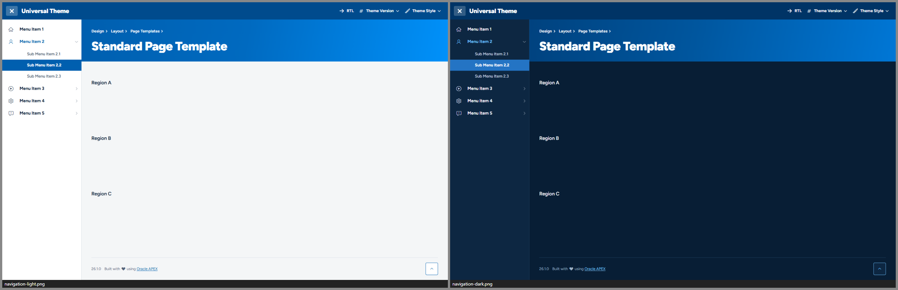

| | |
|---|---|
| 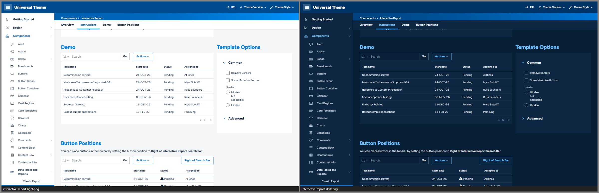 | 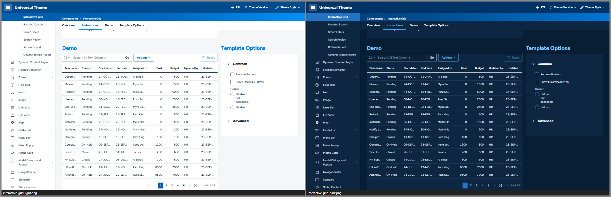 |
| 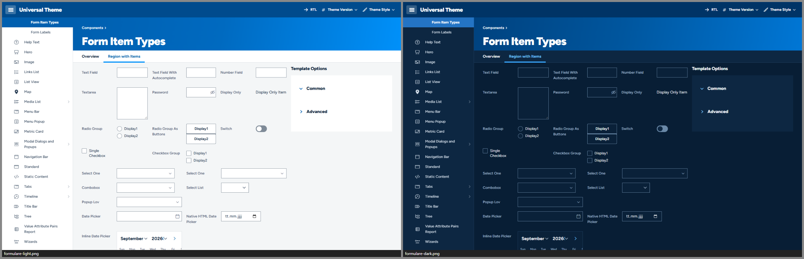 | 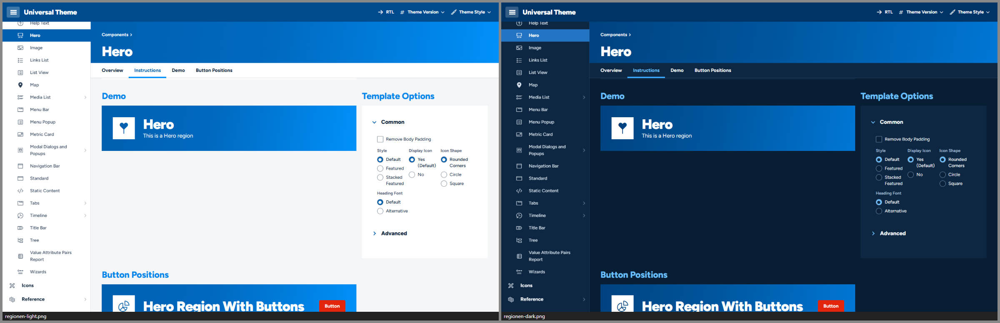 |
| 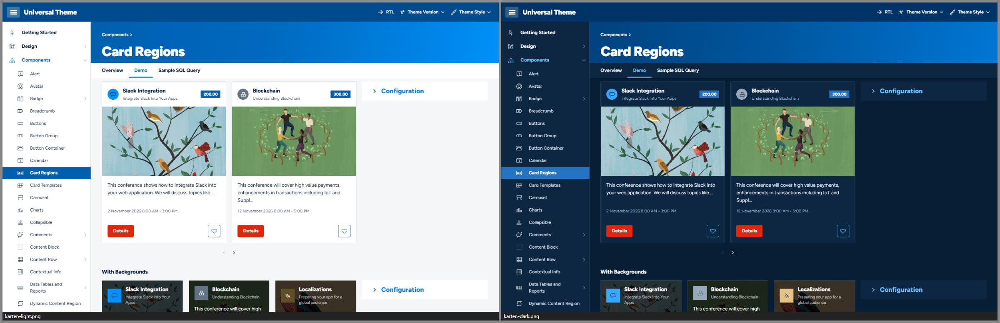 | 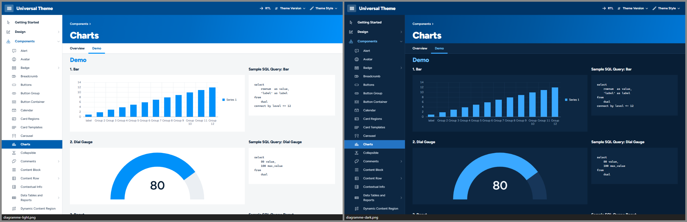 |
| 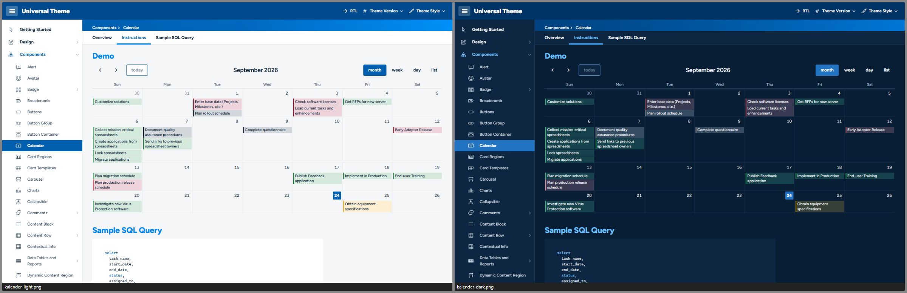 | 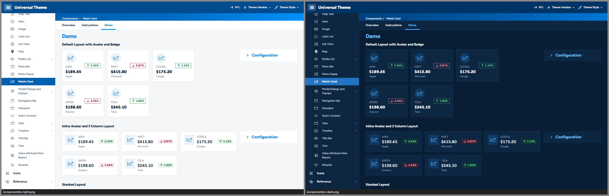 |
| 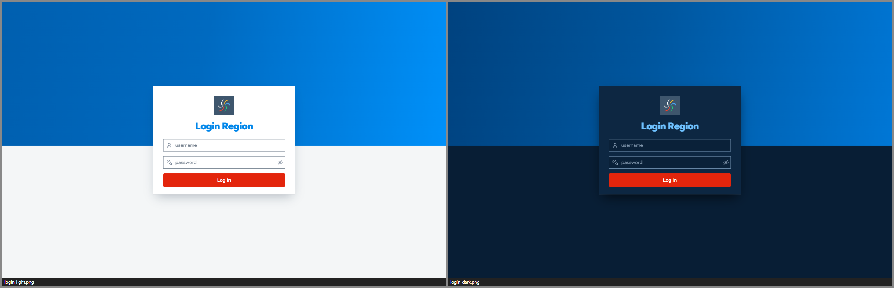 | 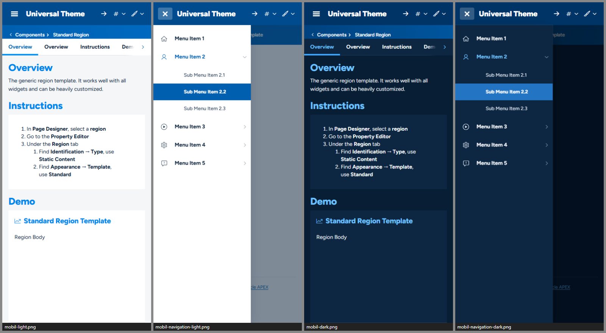 |

*Alle Bilder: Universal Theme Reference App, links Light, rechts Dark.*

| Style | Basis | Wofür |
|---|---|---|
| **Veedel Light** | Vita | Standard im Büro |
| **Veedel Dark** | Vita-Dark | Nachtblau statt Schwarz – für dunkle Umgebungen und lange Schichten |
| **Veedel Auto** | Vita + UT-Delta | folgt der Hell/Dunkel-Einstellung des Betriebssystems – pixelgleich zu Light bzw. Dark |

Getestet mit APEX 26.1 auf UT-Dateiversion **26.1** und **24.2**, Desktop (1440 px) und Smartphone (390 px).

---

## Designsystem in Kürze

| | Hell | Dunkel |
|---|---|---|
| Seitengrund | `#F4F6F7` | `#081E35` (Nachtblau) |
| Flächen (Regionen, Karten, Navigation) | `#FFFFFF` | `#0D2742` |
| Kopfband | `#004B8D` | `#003466` |
| Verlaufsband (Title Bar, Hero, Login) | `#005FAF` → `#006AC0` → `#0091FA` | `#00427F` → `#00569E` → `#0077D6` |
| Text (Nachtblau) | `#081E35` | `#F2F6FA` |
| Sekundärtext, Feld-Labels | `#56657A` | `#9DB1C6` |
| Überschriften (ab 19 px, 800) | `#0086EA` Leuchtblau | `#6EC1FF` Himmelblau |
| Akzent Blau (Auswahl, Aktiv, Links) | Fläche `#005FAF`, Text `#005FAF` | Fläche `#2474C4`, Text `#6EC1FF` |
| **Signalrot – nur Hauptaktion** | `#E3250C` (Hover `#CD2319`) | `#E3250C` |
| Gefahr (Karminrot, als Kontur) | `#9E1030` | `#FF8A95` |

- **Schrift:** [Figtree](https://github.com/erikdkennedy/figtree) (variabel, Gewicht 300–900, aufrecht und kursiv), selbst gehostet.
  Seitentitel 40 px in 900, Region-Titel 19 px in 800, Buttons und Navigation 700, Fließtext 14 px in 400.
  Skala 12 · 13 · 14 · 16 · 19 · 26 · 32 · 40 px. Zahlen in Tabellen stehen immer tabellarisch.
- **Warum Figtree?** Verglichen wurden vier offene geometrische Schriften. *Outfit* wirkt in
  der Black am kräftigsten, verwechselt aber `I`, `l` und `1` und wirkt bei 13–14 px eng. *Urbanist* ist zu leicht und
  hat eine kleine x-Höhe. *Plus Jakarta Sans* endet bei 800 und läuft breit. **Figtree** hat die geometrische Form mit
  zweistöckigem `a`, eine echte 900 für Headlines, eine große x-Höhe und schmale Zahlen. Damit bleiben auch dichte
  Tabellen bei 13 px gut lesbar.
- **Formen:** alles eckig – Regionen, Karten, Felder und Etiketten 0 px, Buttons, Menüs und Popups 4 px, Checkboxen 2 px.
  Flächen ohne Schatten; nur Schwebendes (Menüs, Dialoge) wirft einen.
- **Dichte:** Bedienelemente und Tabellenzeilen 36 px, Tabellenköpfe 40 px; auf Touch-Geräten automatisch 44 px.
- **Signatur-Elemente:** das Verlaufsband mit riesigem Titel · der blaue Aktiv-Block in der weißen Navigation ·
  die weiße Tab-Leiste mit Leuchtazur-Balken · rote Hauptaktion · blaue „Störer“-Etiketten (flache Rechtecke,
  fette weiße Schrift) · Dialoge mit blauem Titelband · Login mit Band über hellgrauem Grund
  (geteilte Anmeldung: das Band als Spalte neben der weißen Fläche, auf dem Phone als Streifen oben).
- **Fokus:** ein System – 2-px-Ring mit Abstand, überall ≥ 3 : 1; auf den blauen Bändern weiß.
- **Kontraste:** alle Text-Paare ≥ 4,5 : 1, große Titel ≥ 3 : 1, Kanten und Zustände ≥ 3 : 1 – auch der aktive
  Navigations-Block gegen die Navigationsfläche (hell 6,5 : 1, dunkel 3,2 : 1; automatisch geprüft, siehe `tools/check-tokens.mjs`).
  Unter dem Zeiger wird der Block eine Stufe dunkler (dunkel 2,5 : 1). Das ist nur eine Hover-Rückmeldung; den Zustand zeigt der Block selbst an.
- **Diagramme:** eigene, farbfehlsichtigkeits-geprüfte Palette (`--u-color-1…45`), Serie 1 Leuchtazur, Serie 2 Nachtblau,
  keine Kategorie in der Nähe des Signalrots; alle 15 Kategorien ≥ 3 : 1 gegen die Fläche, hell wie dunkel.

Die vollständige Token-Referenz mit allen Kontrastwerten steht in [docs/ARCHITECTURE.md](docs/ARCHITECTURE.md).

---

## Installation

### Mit dem Skript (empfohlen)

In SQLcl, SQL*Plus oder SQL Developer, verbunden als **Parsing-Schema der Ziel-App**:

```sql
@install/veedel-install.sql 100          -- nur installieren
@install/veedel-install.sql 100 light    -- installieren und Light aktivieren (light | dark | auto)
```

Das Skript

1. prüft, ob die App existiert und das Universal Theme (42) verwendet,
2. legt 12 Dateien als *Static Application Files* unter `veedel/` an (3 Styles × lesbar/minifiziert, 4 Schriftdateien,
   Schriftlizenz, `THIRD-PARTY-NOTICES.txt`),
3. registriert die Theme Styles *Veedel Light / Dark / Auto*,
4. aktiviert auf Wunsch einen davon.

Mehrfaches Ausführen ist ausdrücklich erlaubt – so wird ein Update eingespielt. Für mehrere Apps einfach je App aufrufen.

**Alle Themes auf einmal:** Das [Style-Pack](../style-pack/README.md) spielt die 15 Styles aller fünf Themes dieses Projekts mit einem Aufruf ein (`@style-pack/style-pack-install.sql 100`).

**Deinstallieren:** `@install/veedel-uninstall.sql 100` – schaltet auf *Vita* zurück, deaktiviert die Styles und löscht die Dateien.
APEX hat keine API zum Löschen von Theme Styles; die deaktivierten Einträge lassen sich unter
*Shared Components › Themes › Universal Theme › Theme Styles* löschen.

### Von Hand im App Builder

1. *Shared Components › Static Application Files › Create File*: den Inhalt von `dist/` hochladen, Verzeichnis `veedel`
   (die Schriften unter `veedel/fonts/`).
2. *Shared Components › Themes › Universal Theme › Theme Styles › Create*, je Style:

   | Name | CSS File URLs |
   |---|---|
   | Veedel Light | `#THEME_FILES#css/Vita#MIN#.css?v=#APEX_VERSION#`<br>`#APP_FILES#veedel/veedel-light#MIN#.css` |
   | Veedel Dark | `#THEME_FILES#css/Vita-Dark#MIN#.css?v=#APEX_VERSION#`<br>`#APP_FILES#veedel/veedel-dark#MIN#.css` |
   | Veedel Auto | `#THEME_FILES#css/Vita#MIN#.css?v=#APEX_VERSION#`<br>`#APP_FILES#veedel/veedel-auto#MIN#.css` |

   *Is Public* = Ja, *Read Only* = Ja, Theme-Roller-Felder leer lassen.
3. Den gewünschten Style als *Current* setzen.

### Varianten für mehrere Apps

- **Workspace-Dateien:** Dateien einmal unter *Workspace Utilities › Static Workspace Files* ablegen und in den Styles
  `#WORKSPACE_FILES#veedel/…` statt `#APP_FILES#veedel/…` eintragen.
- **Webserver:** `dist/` z. B. nach `/i/themes/veedel/` kopieren und `#APEX_FILES#themes/veedel/…` verwenden.
  Vorteil: Der Webserver kann komprimieren – das Bundle ist ca. 230–245 KB, gzip-komprimiert ca. 35–38 KB.

### Benutzer wählen lassen

*Shared Components › Themes › Universal Theme › Styles › „Allow End Users to choose Theme Style“* aktivieren.
Dann können Benutzer im Menü *Anpassen* zwischen Light, Dark und Auto wählen; per PL/SQL geht es mit
`apex_theme.set_user_style` bzw. `apex_theme.set_session_style`.

### Als eigenes Theme (Theme-Variante, APEX 26.1)

Zusätzlich gibt es Veedel als eigenständiges Theme **143** (`install/veedel-theme-install.sql`). Das Umschalten per
*Switch Theme* hat in APEX 26.1 harte Nebenwirkungen (Spaltenlayout wird zurückgesetzt, Rückweg nur über ein Backup).
Die Theme-Variante eignet sich deshalb vor allem für neue Apps; Einzelheiten in [docs/THEME-VARIANTE.md](docs/THEME-VARIANTE.md).

---

## Anpassen

**Für eine eigene Markenfarbe oder Schrift** ist der saubere Weg ein eigenes Theme auf Basis von Veedel:
Ordner kopieren, Präfix ändern, Farben in `src/tokens/light.css` + `dark.css`, Maße und Schrift in `scale.css`
anpassen, dann `node Veedel/tools/check-tokens.mjs` und `node _tools/build.mjs <Theme>`.

**Kleine Anpassungen direkt in einer App** (App-CSS lädt nach dem Theme Style und gewinnt):
Die Brücke löst alle Tokens auf `:root` auf – Überschreibungen müssen deshalb ebenfalls auf `:root` stehen, nicht auf `body`.

```css
/* User Interface Attributes › CSS › Inline, oder eine eigene App-Datei */
html:has(> body.apex-theme-veedel-light) {        /* nur im Light-Style */
  --ve-action: #0B7A3E;  --ve-action-hover: #096834;  --ve-action-press: #07562B;
  --ve-action-text: #096834;  --ve-action-tint: #E6F4EC;
}
```

Für den Dark-Style gilt dasselbe mit `body.apex-theme-veedel-dark`, für Auto mit
`@media (prefers-color-scheme: dark)`. Welche Tokens es gibt und welche Kontraste einzuhalten sind:
[docs/ARCHITECTURE.md](docs/ARCHITECTURE.md).

---

## Empfehlungen für Seiten

- **Genau eine Hauptaktion je Bereich** als *Hot* – sie ist rot. Alle anderen Buttons bleiben *Normal* (weiß mit Blau-Kontur).
- **Freigeben / Ablehnen nebeneinander:** Freigeben als *Hot*, Ablehnen als *Danger* – Danger steht als Karmin-Kontur
  und füllt sich erst beim Überfahren.
- **Seitentitel kurz halten:** Der Titel steht 40 px groß im Band; lange Titel brechen um.
- **Hero-Region** für Startseiten und Dashboards: Sie erscheint als Verlaufsband wie die Title Bar.
- **Akzent-Regionen** (Template-Option *Accent 1–15*) bekommen einen 4-px-Farbbalken oben statt eines farbigen Kopfstreifens.
- **Etiketten („Störer“):** *Badge* ist ein blaues Rechteck mit fetter weißer Schrift. Ein roter Störer für ein Angebot
  oder eine Aktion entsteht mit der Hilfsklasse `u-hot` – sparsam, denn Rot bleibt die Farbe der Hauptaktion.
- **Hinweise:** *Alert* ist eine weiße Fläche mit Statusbalken; mit „Highlight Background“ bekommt er die Statustönung.
- **Tabellen** sind offen, mit kräftiger Kopflinie. Für Kennzahlen *Classic Report* mit *Stretch* nutzen; Zahlen stehen tabellarisch.

---

## Grenzen

- **Ein Theme Style kann kein JavaScript mitbringen.** Im Auto-Style behalten JET-Diagramme beim *Live*-Umschalten
  des Betriebssystems ihre alten Textfarben, bis sie neu gezeichnet werden (Seitenaufruf genügt).
- **Blau ist Absicht.** Das Markenblau liegt nahe am Vita-Blau. Prüfwerkzeuge, die „Oracle-Blau“ suchen, melden deshalb
  Treffer – sie stammen alle aus den Veedel-Tokens (siehe [docs/ARCHITECTURE.md §4.1](docs/ARCHITECTURE.md#41-hex-kopien-der-vita-primärfarbe-056ac8-hardcodedprimary)).
- **Leuchtazur trägt nur große Schrift.** Eigene kleine Texte, die eine App ins Band setzt, stehen links auf Tiefblau gut,
  ganz rechts nicht (3,3 : 1). Mobil endet der Verlauf deshalb im Mittelblau.
- **Mobile Schublade:** Esc schließt sie nicht – APEX bindet dafür keinen Handler. Schließen per Tippen auf die Abdunklung oder den Schalter.
- **Seiten mit Region Display Selector** springen beim Laden zur ersten Region (UT-Verhalten, genauso mit Vita). Am Desktop
  steht der erste Regionstitel deshalb direkt unter der Tab-Leiste, auf dem Phone ist das Verlaufsband aus dem Bild gescrollt.
- **Kopfband auf Touch-Geräten 60 px statt 56 px:** Die Schalter im Kopf bekommen dort 44-px-Trefferflächen.
- **Breite Classic Reports** scrollen waagerecht im Regionskörper, wenn die Region *Body Overflow: Scroll* hat (so in der
  Referenz-App; geprüft mit und ohne *Stretch Report*, Desktop und 390 px, die letzte Spalte bleibt erreichbar). Veedel setzt
  an Report und Regionskörper kein `overflow: hidden/clip`. Ohne diese Option läuft die Tabelle wie bei Vita über die Region
  hinaus: Am Desktop scrollt dann die Seite, auf dem Phone schneidet das Universal Theme selbst ab.
- **Dialog „Seite anpassen“** (Benutzer-Anpassung von Regionen) lädt in seinem iframe nur APEX-Kern-CSS, nie einen Theme Style – er bleibt im Vita-Look.
- **App- und Seiten-CSS gewinnt** (lädt nach dem Theme Style). Fest codierte Farben in Apps (z. B. `background:#fff`) wirken also auch im Dark-Style.
- **Karten-Kacheln** (MapLibre) sind Bilder und werden nicht eingefärbt; die Bedienelemente schon.
- **UT-Versionen:** geprüft mit UT 24.2 und 26.1 auf APEX 26.1. Metric Card und Flexbox Container gibt es erst ab UT 26.1.
- **Größe:** ca. 230–245 KB CSS je Style (gzip 35–38 KB), dazu 60 KB Schrift. ORDS liefert Static Application Files unkomprimiert,
  dank versionierter URL aber nur einmal pro Update – oder über einen Webserver mit Kompression ausliefern (siehe oben).
- **Installation in APEX geprüft (24.09.2026):** Der Style-Installer lief in der UT-Referenz-App (UT 26.1). 28 von 28
  Seitenvergleichen (7 Kernseiten × Light, Dark, Auto hell, Auto dunkel) sind pixelgleich zum Labor-Style; der
  Deinstaller hat Styles deaktiviert, alle Dateien entfernt und Vita wieder aktiviert. Die Theme-Variante (143) wurde
  installiert, geprüft (Dateien per HTTP 200, 3 Styles) und wieder entfernt.
- **Kein Theme-Roller-Addon.** Farbanpassungen über ein eigenes Theme oder App-CSS (siehe *Anpassen*).

---

## Prüfstand

Stand 24.09.2026. Alle Läufe über den Labor-Style der Testbetten (APEX 26.1); die Befehle stehen in
[docs/ARCHITECTURE.md §6](docs/ARCHITECTURE.md#6-test-rezepte).

| Prüfung | Ergebnis |
|---|---|
| Vertrag (`_tools/lint.mjs`) | 0 Fehler, 15 Hinweise: `!important` nur gegen fremdes `!important` (Vita, UT Core, app_ui) und Farbwerte in Attribut-Selektoren, mit denen `viz.css` die fest eingebauten JET-Farben erkennt |
| Tokens (`tools/check-tokens.mjs`) | alle Prüfungen bestanden – je Modus 126 Tokens, Text ≥ 4,5 : 1, große Titel, Kanten und Zustände ≥ 3 : 1 (auch der aktive Nav-Block, dunkel 3,15 : 1), alle 15 Palettenfarben ≥ 3 : 1 gegen die Fläche, Palette auf Farbfehlsichtigkeit geprüft |
| Laufzeit-Audit, alle 111 Seiten der UT-Referenz-App, hell und dunkel | 0 Überlauf, 0 JS-Fehler; 211 Kontrastbefunde, alle aus fest codiertem Demo-CSS der Referenz-App (Seiten 6100, 6302–6304, 6307, 6400) bzw. absichtlich transparenter Text der `u-opacity-*`-Vorführung |
| Laufzeit-Audit Smartphone (390 px, Touch) und UT 24.2, je Kernseiten hell und dunkel | 0 Kontrast, 0 Überlauf, 0 JS-Fehler (mobil zusätzlich 1403, 1411, 1412, 1720, 3110) |
| Oracle-Blau | alle Treffer tragen Veedel-Tokenwerte (Voll-Audit 2 866, davon eine Mischung zweier Tokens in `.u-color-1-text`; Blau-Audit der Kernseiten mit Hover, Fokus und geöffneten Menüs, Popups und Dialogen 11 391) |
| Auto-Äquivalenz, Kernseiten auf UT 26.1 und 24.2 | 28 von 28 Vergleichen ohne einen abweichenden Pixel |

---

## Dateien

```
Veedel/
├── theme.json                 Styles, Basis, Einstiegsdateien, Theme-Variante 143
├── src/
│   ├── veedel-{light,dark,auto}.css   Einstiegspunkte
│   ├── tokens/                light.css, dark.css (Farben), scale.css (Maße, Schrift, Dichte), print.css
│   ├── bridge.css             --ve-* → UT-/APEX-/JET-Variablen (inkl. aller Vita-Hex-Kopien der Primärfarbe)
│   ├── base.css, fonts.css
│   └── components/            shell, login, regions, buttons, forms, overlays, reports, search, cards, content, viz, utilities
├── assets/fonts/              Figtree (OFL 1.1) + Lizenz
├── assets/THIRD-PARTY-NOTICES.txt  Drittanbieter-Hinweise (MapLibre BSD-3-Clause, UT-Delta)
├── dist/                      gebündelte CSS-Dateien             ← node _tools/build.mjs Veedel
├── install/                   veedel-install.sql / -uninstall.sql (Styles)
│                              veedel-theme-install.sql / -theme-uninstall.sql (Theme 143)
├── docs/ARCHITECTURE.md       Token-Vertrag und Regeln          ← node Veedel/tools/build-architecture.mjs
├── docs/THEME-VARIANTE.md     Theme-Variante 143
├── tools/                     check-tokens.mjs (Kontraste, Farbfehlsichtigkeit, Blau-Triage), screenshots.mjs u. a.
└── screenshots/               Vorschaubilder                     ← node Veedel/tools/screenshots.mjs
```

## Lizenz

Theme-CSS: MIT. Schrift *Figtree* (© 2022 The Figtree Project Authors): SIL Open Font License 1.1
(`assets/fonts/LICENSE-Figtree-OFL.txt`). Die Bedien-Symbole der Karten-Region (Zoom, Kompass, Vollbild;
`src/components/viz.css`) verwenden die Pfaddaten aus MapLibre GL JS (© MapLibre contributors und Mapbox, BSD-3-Clause)
als Maske in der Schriftfarbe. `_shared/ut-dark-delta.css` (im Auto-Style enthalten) ist aus den
Universal-Theme-Dateien von Oracle abgeleitet und unterliegt deren Lizenz – es wird nur zusammen mit Oracle APEX verwendet.
Beides nennt der Kopfkommentar jedes Bundles (er bleibt auch minifiziert erhalten); den vollständigen BSD-Lizenztext
liefern `assets/THIRD-PARTY-NOTICES.txt` → `dist/THIRD-PARTY-NOTICES.txt` und der Installer (`veedel/THIRD-PARTY-NOTICES.txt`)
mit. Die Übersicht für alle Themes des Projekts steht in [THIRD-PARTY-NOTICES.md](../THIRD-PARTY-NOTICES.md).

